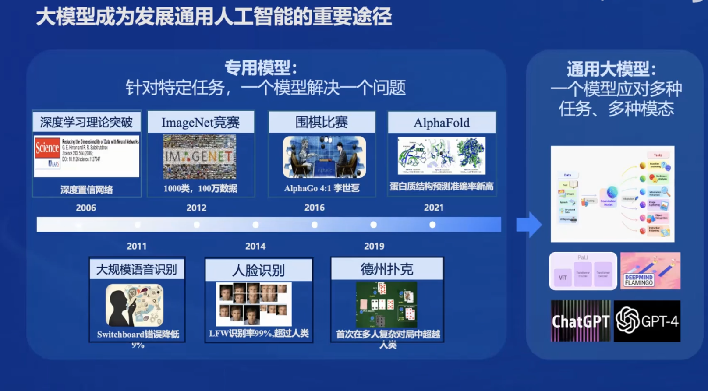

# 书生第二期第一节

## 大模型的发展路径

在大模型发展中，从专用模型的发展到通用模型。

通用模型是针对特定任务，一个模型解决一个问题。而通用大模型是面对多种任务和多种模态的形式。

专用模型的应用场景包括语音识别、图像分类、人脸识别、围棋比赛、预测蛋白质结构等。这些模型是针对特定任务开发的，语音识别模型用于识别语音，图像分类模型用于分类图像，人脸识别模型用于识别人脸，围棋比赛模型用于围棋对弈，预测蛋白质结构模型用于预测蛋白质的结构。

在后续通用大模型是近年来学术社区和工业应用的重要发展趋势。

> 当前大模型厂商虽然都在卷基座大模型，但是更多落地应用是从通用大模型再次微调到特定场景。觉得应该是先专用到通用再到“专精”

类似讯飞星火和通义大模型推出了很多mass场景，基于基座来作为基础，然后再针对行业定制。

## 书生大模型的开源之路

1. **去年6月**：首次发布，初步具备通用大模型的能力。
2. **7月**：进行了全面的升级，支持8K语境和26种语言，并推出可全免费商用的7B开源模型和全链条工具体系。
3. **8月**：发布了多模态预训练语料库“书商万卷1.0”，随后推出了升级版的对话模型和智能体框架。
4. **9月**：发布了中等尺寸的开源模型，并升级了整个开源工具链。
5. **1月**：interim 2正式的开源。强化了超长上下文处理能力，支持20万token长度的输入，并提升了综合性能，包括推理数学代码等能力。

它其实面向不同的使用需求，有不同尺寸的模型以及型提供了7B轻量级的模型，轻量级的研究和应用比较便宜。

20B综合性能更强，能够去支持更加复杂的一些这种实际的场景这样的一个重量级的模型。

亮点：

200K token！

多轮工具调用和复杂智能体应用构建。

在数学领域上提升很大，已经是高可用的水平。

对表格进行解析再应用。

### InternLM2的整体训练技术上的升级

新一代的数据清洗技术包括多维度的数据价值评估，该技术通过综合评估和提升数据在文本质量、信息质量、信息密度等不同维度上的价值。此外，还有高质量的语料驱动的数据方式，通过从互联网和语聊库中复习更多类似的语料来增强数据的质量。另外，针对特定的数据差异，进行了信数据的补齐，以加强模型在世界知识梳理和代码等核心能力上的表现。

性能提升，对比其他同量级开源模型来看想能会好很多。

InternLM2初心，其实就是回归语言建模的本质。大模型它本质上其实是在做语言建模，能够通过给定的contest，然后去预测接下来的token。

最关键的就是要有像高质量的这种语料，然后让模型能够去学会更好的这种建模能力。

## 模型到应用

大模型的应用包括智能客服、个人助手和其他行业应用。

将大模型集成到应用中需要完成一些工作。需要借助工具和框架来协助完成这个过程。从模型到应用之间存在差距，需要逐步填充。

1. 模型选型是首先需要进行的步骤，关注模型的能力和与应用场景的相关性。
2. 2. 如果业务场景复杂，可能需要进行模型微调，根据算力情况进行全参数或部分参数微调。
3. 3. 模型微调后，需要根据业务场景是否需要与环境交互来决定是否构建基于大模型的整体。
4. 4. 如果不需要与环境交互，可以直接将微调好的模型应用于业务场景，并进行上线前的评测。
5. 5. 如果评测通过，可以进行模型部署，考虑以更少的资源部署模型或提升应用的吞吐量。

模型微调的话就会遇到另外一个问题，就算力是否足够。如果算力足够的话，可以去进行比如说像包括像模型的续训，然后包括像全参数的微调。如果算力资源比较受限，就只能去进行一个部分参数的微调，比如说像lora之类的算法。

## 全链条开源开放体系

部署方面，开源了LMDdeploy，支持全链路部署流程。（模型部署的话其实我们也会面临一些需要解决的问题。比如说怎么样以更少的资源来去把模型给部署起来，或者是说我们怎么样去提升整个的一个应用的这种吞吐量。我们可以看到就是说从模型到最终的就能够去完成这样的一个应用，能够把大模型真的用起来。）

评测方面，提供了OpenCompass评测工具，提供全方位的评测能力。

### 预料数据

数据方面，开源了书生万卷1.0和万卷CC。数据集时间跨度长，有多模态的一个数据集，并且安全密度高，文本数据量大。

### 预训练

1. 开源了预训练框架"interim trend"和"intern evil"。
2. "x tuna"是一种微调技术。
3. 预训练框架"intern evil"具备高可扩展性，支持从巴卡到千卡级的训练，并在千卡级别上加速效率达到92%。
4. 实验室通过优化技术实现了性能的技术优化，并支持主流的技术生态，如hacking face模型和各种轻量化的技术。
5. "intern evil"也能够支持多种不同规格的语言模型，只需修改配置即可进行模型的预训练。

### 微调

1. 开发了额外的（extra）waiter框架，用于大模型的下游应用中的增量续训和有监督微调。
2. 增量训训类似于预训练，使模型能够学习新领域知识，例如书籍、文章、代码等相关的训练数据。
3. 有监督微调让模型学会理解各种指令来进行对话，或通过注入少量领域知识进行训练。
4. 有监督微调又分为全量参数微调，其中模型的所有参数都参与训练，以及部分参数微调，其中只放开或引入少量参数进行训练。
5. 针对特定的模型（例如Qlora），在微调之后，模型将具备与业务场景相关的知识。

开源微调框架

1. XTuner是针对大模型微调而开发的框架，能够适应不同的微调策略和算法，并适用于各类SFD（Sequence-to-Feature）的场景。
2. XTuner能够与不同的开源生态集成，例如加载hugging face的模型或model scope的模型以及数据集。
3. XTuner提供了自动优化加速的功能，允许开发者专注于数据准备和优化，而不需要关注复杂的显存优化和计算加速细节。
4. XTuner也能够适应不同的硬件，支持覆盖包括NVIDIA 20系列及以上的所有显卡，能够在消费级显卡上运行，并且能够在低显存条件下微调大模型，例如仅需8G显存即可微调7B大小的模型。

### 评测

发布了open compass 2.0思南大模型评测体系，这是open campus整体评测体系的一个重大升级。

它包括三个部分：

compass rank提供一个中立全面的性能榜单，包括大语言模型和多模态模型的评测榜单complicate大模型的评测的旋转工具链。

建立了一个compass hub高质量评测基准的社区，旨在以开源开放、共建共享的方式来构建大模型的评测基准或评测级的社区，以提供更好的支撑服务。

CompassHub:高质量评测基准社区

希望以开源开放、共建共享的方式来去构建大模型的评测基准或者说评测级的社区。来去让更多的一些研究者和开发者参与到大模型的评测中。来去把各种优秀的这种评测集能够在社区去进行汇聚，同时也提供更好的一些这种支撑的服务。

目前也是社区支持最完善的评测体系之一，应该已经适配了超过100个评测集，五十多万道题目，并且就整个的一套评测工具和评包括评测的一些prompt都是开源的

Meta官方推荐！

不太需要去关注具体这里边每一个模型它的一个性能。因为给更多的是希望去给社区提供一些这种关于模型整体的发展的一些趋势的了解。

综合性的客观评测，在open compass的客观的评测级上来去进行结果的评测。这边会从语言、知识、推理、数学代码、智能体这边会这多个方面来去进行评测，采用了更加准确的这种循环评测的策略。

在中文上国内模型更具有优势。

1. 在文偏文科的维度上（如语言和知识），中轻量级的模型与重量级或闭源商业模型的差距较小。
2. 在数学推理和代码等偏理科的维度上，模型的性能与尺寸呈现强相关性。
3. 有些模型在主观和客观性能上存在较大偏差。
4. 主观评测胜率显示，GPT4在综合评测中仍然占据第一的位置。
5. 国内近期发布的模型在中文场景下具有性能优势，甚至在单个维度上能够超，GPT4越。

有些模型其实是在接近GPT4-turbo的水平。但是在一些比较复杂的推理上仍然存在比较大的差距，并且和模型的尺寸也存在比较强的相关性。

### 部署

大模型的全流程的部署的解决方案。

1. **量化技术**：采用4比特权重量化和8比特KV Cache量化方案，优化模型性能与资源利用率。
2. **推理引擎**：开发了如“Top of Mind”及基于Patch的推荐引擎，增强推理能力。
3. **兼容性**：支持OpenI服务器接口，确保系统间的兼容互通。
4. **Demo与部署**：提供一系列渐进式Demo及全方位部署工具包。
5. **API接口**：提供Python直接接口、RESTful API和gRPC接口，满足不同开发者和应用场景的需求。

### 轻量智能体框架

轻量级且功能强大的基础设施，它支持构建并运行多种类型的智能体，涵盖诸如review和auto GP等多种智能体流水线。此框架能够管理智能体工作流程的全过程，从原始输入到执行策略规划等阶段，并具备拓展新流程的能力。尤其值得一提的是，“Legend”框架还兼容多种大型语言模型API，包括GP3.5、GP4等高级模型，并能整合开源社区如Hugging Face等提供的模型资源。

### 智能体工具箱

一个全面的辅助套件，让开发者集中精力于智能体核心技术的研究与开发，而不必过多关心底层实现细节。另外，“agent legal”这一组件能够与“Legend”框架良好兼容，同时也支持其他智能体框架如“long chain”和“transform agents”的对接与交互。

智能体框架和工具箱在智能系统开发中的作用在于，前者为智能体的设计和运作提供了标准化和模块化的结构，帮助开发者设计、训练和评估智能体的行为逻辑；而后者则通过集合丰富的工具和API接口，简化了算法和模型的整合、测试以及性能调优过程，从而极大地提升了智能体开发的便利性和效率。
