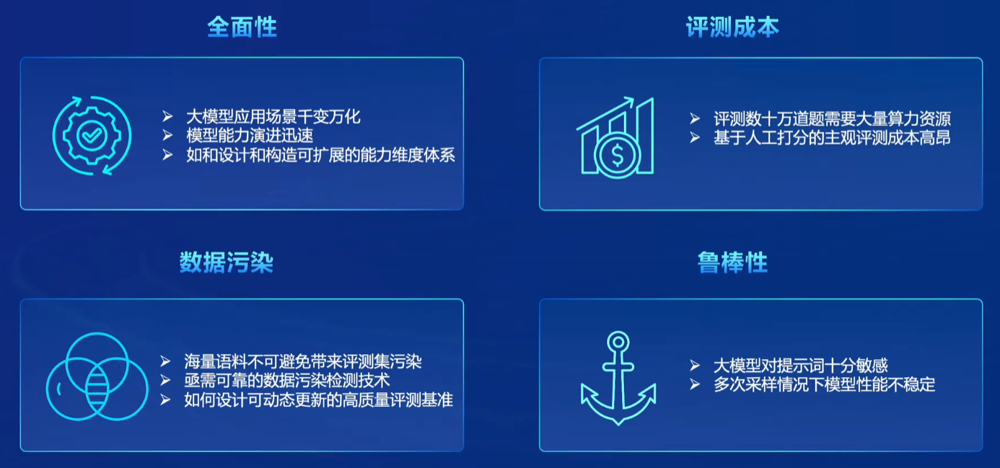
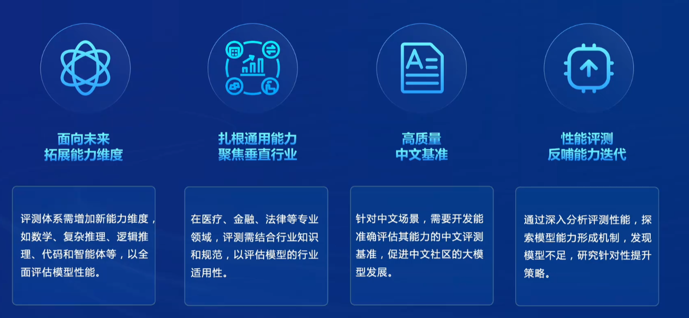
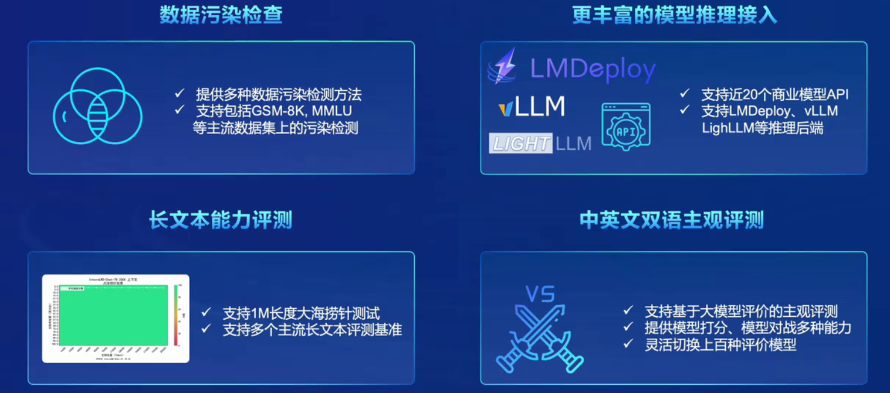
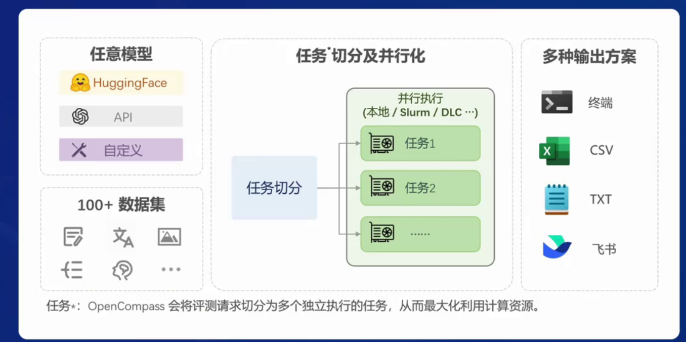
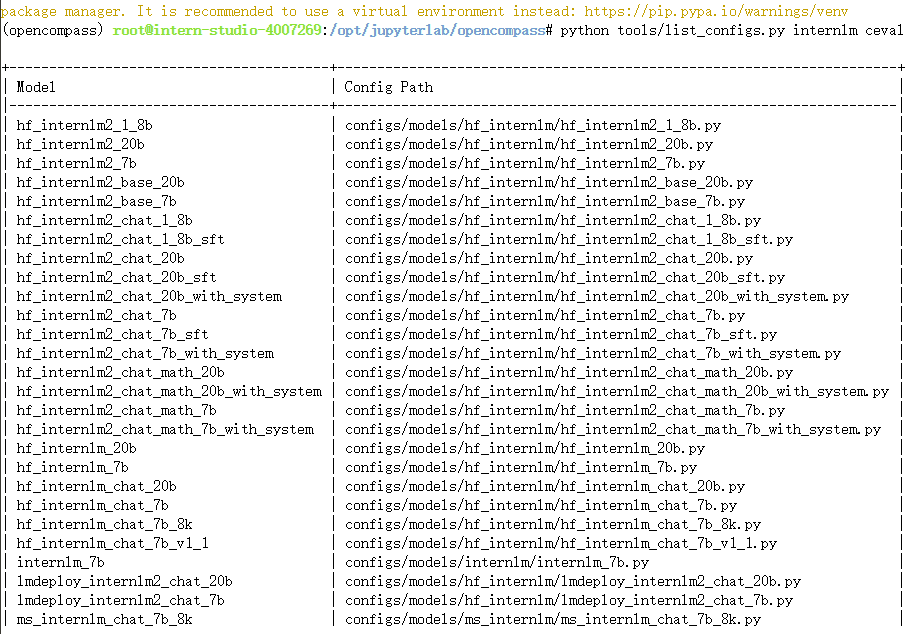
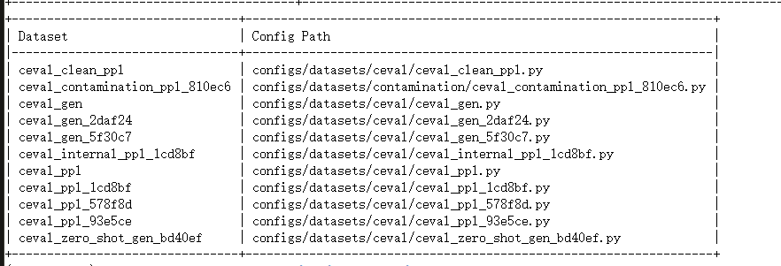
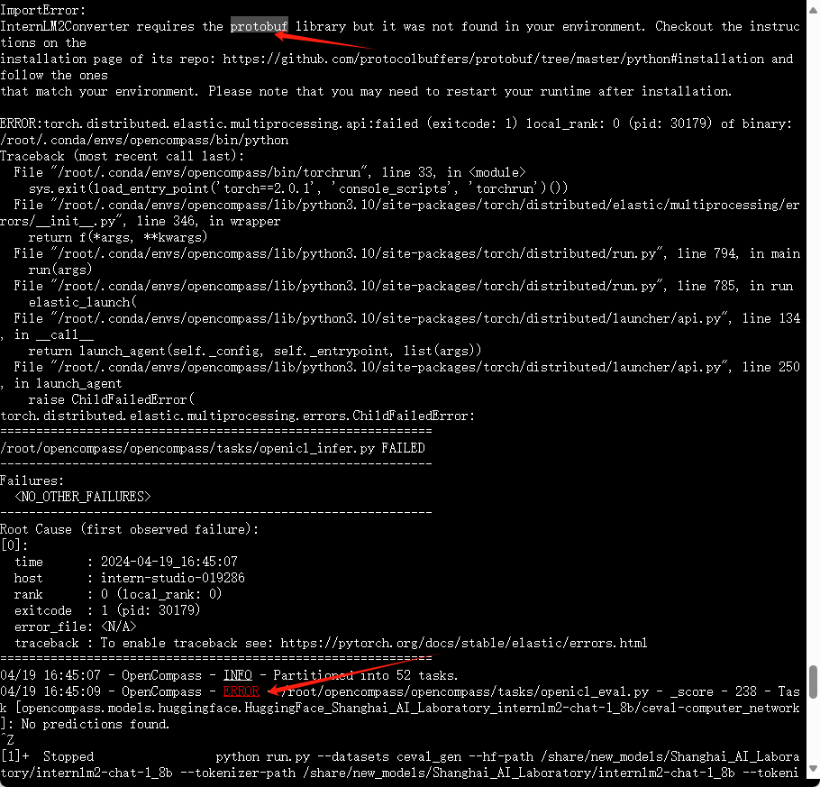
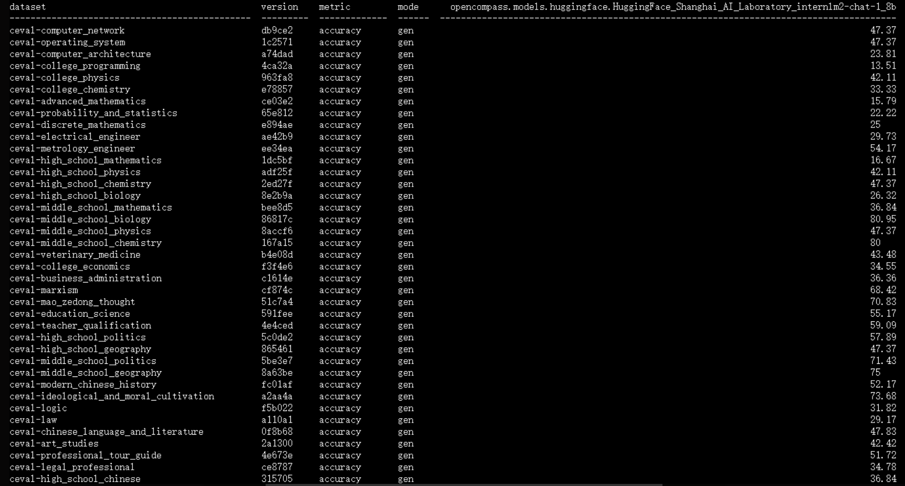

‍

# 大模型测评

‍

> 再构建基于大模型的应用时，模型能力是否能匹配场景非常重要，虽然榜单上数据很耀眼，但是不一定能够在其场景使用，所以需要针对性评测。

研究评测对于 全面了解大型语言模型的优势和限制至关重要。很多情况下这些模型的能力是否只是对训练数据的记忆而非真正的理解。例如，即使只提供LeetCode题目编号而不提供具体信息，大型语言模型也能够正确输出答案，这暗示着训练数据可能存在污染现象。

研究评测有助于指导和改进人类与大型语言模型之间的协同交互。考虑到大型语言模型的最终服务对象是人类，为了更好地设计人机交互的新范式， 有必要全面评估模型的各项能力。

​​

‍

## OpenCompass介绍

上海人工智能实验室科学家团队正式发布了大模型开源开放评测体系 “司南” (OpenCompass2.0)，用于为大语言模型、多模态模型等提供一站式评测服务。其主要特点如下：

* 开源可复现：提供公平、公开、可复现的大模型评测方案
* 全面的能力维度：五大维度设计，提供 70+ 个数据集约 50 万题的的模型评测方案，全面评估模型能力
* 丰富的模型支持：已支持 20+ HuggingFace 及 API 模型
* 分布式高效评测：一行命令实现任务分割和分布式评测，数小时即可完成千亿模型全量评测
* 多样化评测范式：支持零样本、小样本及思维链评测，结合标准型或对话型提示词模板，轻松激发各种模型最大性能
* 灵活化拓展：想增加新模型或数据集？想要自定义更高级的任务分割策略，甚至接入新的集群管理系统？OpenCompass 的一切均可轻松扩展！

​​

‍

## 训练方式

> 根据不同的模型来设置不同的训练方法。

* 基座模型

  海量数据无监督训练(Base)

* 对话模型

  指令数据有监督微调(SFT)

  人类偏好对齐(RLHF)

* 公开权重的开源模型

  使用GPU/推理加速卡进行本地推理

* API模型

  发送网络请求获取回复

​​

### 训练题目：

1. 客观问答题
2. 客观选择题
3. 开放式主观问答

    人工打分根本高，但是可以让模型效果更加拟人，更加好的回复。

​​

‍

### 提示词工程

提示词工程是一种改进和优化大模型评测的方法，其主要目的是提高评测的准确性和可靠性。这种方式通过对原始题目进行修改和补充，使得题目更加具体、明确，从而减少因题目宽泛而导致的评测误差。具体来说，提示词工程包含以下几个步骤：

1. **题目扩展**：首先，通过分析原题目，识别其存在的模糊或宽泛的问题描述。例如，一个要求写关于人工智能全面介绍的题目可能过于宽泛，缺乏特定的要求和细节。
2. **提示添加**：针对这类宽泛的题目，通过增加具体的提示词或短语来丰富和明确题目内容。这些提示词旨在缩小模型的思考范围，引导模型更准确地回答问题或完成任务。
3. **重新评测**：经过提示词的补充后，原本不够明确的题目变成了具有更具体要求的任务。利用这个改良后的题目再次对模型进行评测，得到的结果更能真实反映出模型的性能。

通过提示词工程，评测不仅能更准确地评估模型的能力，同时也能避免因为题目设计不当导致的评测结果偏差。这种方法对于提升大模型评测的有效性和实用性具有重要意义。

‍

### 长文本评测

在评测工具中，可以通过设置类似“大海捞针”的场景来评估模型的长文本能力。例如，在一篇长文本中插入不相关的一句话，然后让模型读完后回答问题，如在红楼梦中插入小明在上海人工智能实验室实习的信息，模型能正确回答，则说明其长文本理解和记忆能力出色。

‍

‍

## OpenCompass核心代码库功能全面升级

1. 工具链支持更换推模型后端，提高模型推理速度。
2. 支持数据污染和长文本能力。
3. 中英文双语评测功能。
4. 200项升级的功能。

​​

​​

1.  有评测流水线，可以自定义模型和数据集。
2.  支持任务切分和并行化，能够高效利用资源。
3.  支持多种输出结果，可以直接输出或在表格中输出。
4.  可以最大化利用计算资源，使用全站工具链。
5. 与其他评测体系不同，有灵活的切分和并行化能力。

​​

​​

​​​​​​

也与各个行业垂直领域进行合作，建立相关评测合作。

​​

​​

‍

‍

# 测评实战

实战环节主要包括了四个部分，下面是每个部分的具体内容和所涉及的测评方向：

1. **启动MSC的评测**：这部分主要介绍了如何启动OpenCompass（简称为MSC）的评测环境。这包括了如何打开VS Code以及如何新建终端等基本操作步骤。这一部分更多是关于搭建和准备评测环境的操作说明，并没有直接涉及具体的模型或技术评估。
2. **奥特曼S评测的代码运行逻辑**：这部分深入讲解了奥特曼S评测的代码逻辑及其整体流程。通过分析其具体实现细节，旨在帮助理解如何设计和执行特定领域的模型评测任务，特别是对于不熟悉该领域技术和评测流程的开发者而言，这是一个重要的学习模块。
3. **自定义数据集的实现**：本节内容着重于如何实现一个自定义的数据集并将其用于模型的评测。这涵盖了从数据收集、预处理到如何将其整合到MSC评测框架中的全部过程。这一部分强调了实际应用中的数据驱动方法，特别是在缺乏现成数据集时，如何根据具体需求创建自己的训练和测试数据。
4. **MSC的其他功能介绍**：最后，通过对MSC平台其他功能的介绍，本节内容提供了对OpenCompass强大功能的概览。这包括了对不同类型的评测（如主观评测、大海捞针式检索等）的支持，以及如何利用这些功能来优化和扩展模型的性能评估范围。

‍

> 配置：CUDA：11.7  30*A100

‍

### 安装

> 这里通过`pip install -r requirements.txt`​来安装依赖

```shell
studio-conda -o internlm-base -t opencompass2
source activate opencompass2
git clone -b 0.2.4 https://github.com/open-compass/opencompass
cd opencompass2
pip install -e .
```

有部分第三方功能,如代码能力基准测试 Humaneval 以及 Llama格式的模型评测,可能需要额外步骤才能正常运行，如需评测，详细步骤请参考安装指南。

#### 数据准备

> 需要先创建目录：`/root/opencompass/`​
>
> ​`mkdir /root/opencompass/`​

解压评测数据集到 data/ 处

```shell
cp /share/temp/datasets/OpenCompassData-core-20231110.zip /root/opencompass/
unzip OpenCompassData-core-20231110.zip
```

‍

#### 查看支持的数据集和模型

列出所有跟 internlm 及 ceval 相关的配置

```shell
python tools/list_configs.py internlm ceval
```

​​

​​

#### 启动评测 (10% A100 8GB 资源)

主要是有两种方式。

1. 纯用命令行：bash脚本，把所有的这个命令全部写在一个bash脚本里面。
2. 第二种就是用命令行加上configure的这样一个形式，就pythons running 加上configure这样一个形式，

确保按照上述步骤正确安装 OpenCompass 并准备好数据集后，可以通过以下命令评测 InternLM2-Chat-1.8B 模型在 C-Eval 数据集上的性能。

由于 OpenCompass 默认并行启动评估过程，我们可以在第一次运行时以 --debug 模式启动评估，并检查是否存在问题。在 --debug 模式下，任务将按顺序执行，并实时打印输出。

‍

参数说明：

* hf-path  HuggingFace 模型路径
* tokenizer-path  # HuggingFace tokenizer 路径（如果与模型路径相同，可以省略）
* tokenizer-kwargs padding_side='left' truncation='left' trust_remote_code=True  #构建 tokenizer 的参数
* model-kwargs device_map='auto' trust_remote_code=True   构建模型的参数

* max-seq-len:上下文长度
* max-out-len：输出长度
* batch-size：批量大小
* num-gpus 1 使用第一块GPU
* --debug  开启Debugger
* --reuse 指定时间戳（相同即可复用）

```shell
python run.py --datasets ceval_gen --hf-path /share/new_models/Shanghai_AI_Laboratory/internlm2-chat-1_8b --tokenizer-path /share/new_models/Shanghai_AI_Laboratory/internlm2-chat-1_8b --tokenizer-kwargs padding_side='left' truncation='left' trust_remote_code=True --model-kwargs trust_remote_code=True device_map='auto' --max-seq-len 1024 --max-out-len 16 --batch-size 2 --num-gpus 1 --debug
```

如果遇到下面的问题

​​

```shell
pip install protobuf
```

如果一切正常，您应该看到屏幕上显示 “Starting inference process”：

```
[2024-03-18 12:39:54,972] [opencompass.openicl.icl_inferencer.icl_gen_inferencer] [INFO] Starting inference process...
```

评测完成：

​​

‍

**遇到错误mkl-service + Intel(R) MKL MKL_THREADING_LAYER=INTEL is incompatible with libgomp.so.1 ... 解决方案：**

```shell
export MKL_SERVICE_FORCE_INTEL=1
#或
export MKL_THREADING_LAYER=GNU
```

‍

### 多模型多数据集测评

多模型多数据集训练的优势在于能够更全面地评估不同模型在各种条件下的性能表现，从而有助于选择最优模型或调整模型参数。这一过程通常涉及对多个模型和多个数据集的同时训练与评估，因此需要高效且可扩展的系统支持。以下是基于上述内容描述的多模型多数据集训练的一般流程概述：

### 流程概述

1. **配置管理**：使用配置文件（如`open pass.config`​）来统一管理所有实验的超参数、数据集设置和其他相关信息。这有助于保持实验的一致性和可重复性。
2. **数据集切分与并行化**：通过将数据集切分为多个部分，并利用并行计算能力（如多GPU），可以在短时间内处理大量数据。这是提升效率的关键步骤之一。
3. **模型与数据集的并行训练**：利用前述的切分和并行化策略，同时对多个模型和数据集进行训练。这一步骤可以显著缩短训练时间，尤其是在处理大规模数据集和复杂模型时。
4. **结果汇总与分析**：训练完成后，将各个任务的中间结果汇总，并进行综合分析。这包括对模型在各个数据集上的表现进行比较，以及根据预定指标（如准确率、F1分数等）评估模型的整体性能。
5. **可视化与总结**：通过生成图表和报告，将分析结果以易于理解的形式呈现给用户。这有助于快速识别潜在的问题或改进机会。

### 关键组件

* **Partitioned**：负责数据集的分割，以便实现并行训练。
* **Open ICL**：可能是"Open Infrastructure for Code Learning"的缩写，虽然具体细节未给出，但可以推测其负责提供训练基础设施，包括计算资源管理和调度。
* **Runner**：执行训练作业的具体程序，负责协调数据集切分、模型训练及结果记录等环节。
* **Summarized**：负责收集和汇总各个任务的中间结果，为后续的分析准备数据。

‍

‍

## 自定义数据集客主观评测

### 自建客观数据集步骤

详细的客观评测指引参见 [https://opencompass.readthedocs.io/zh-cn/latest/advanced_guides/new_dataset.html](https://opencompass.readthedocs.io/zh-cn/latest/advanced_guides/new_dataset.html)

### 主观评测简介

由于客观评测只能反映模型在一些性能数据上的指标，没法完全真实地反映模型在与人类对话时的表现，因此需要在真实的对话场景下通过主观评测的方式翻译模型的真实性能。 而由于完全靠人力来进行主观评测是费时费力的，因此有很多利用模型来进行主观评测的方式。 这些方式主要可以分为以下几类：打分，对战，多模型评测等。

### 自建主观数据集步骤

详细的主观评测指引参见 [https://opencompass.readthedocs.io/zh-cn/latest/advanced_guides/subjective_evaluation.html](https://opencompass.readthedocs.io/zh-cn/latest/advanced_guides/subjective_evaluation.html)

## 数据污染评估：

### 数据污染评估简介

数据污染 是指本应用在下游测试任务重的数据出现在了大语言模型 (LLM) 的训练数据中，从而导致在下游任务 (例如，摘要、自然语言推理、文本分类) 上指标虚高，无法反映模型真实泛化能力的现象。 由于数据污染的源头是出现在 LLM 所用的训练数据中，因此最直接的检测数据污染的方法就是将测试数据与训练数据进行碰撞，然后汇报两者之间有多少语料是重叠出现的，经典的 GPT-3 论文中的表 C.1 会报告了相关内容。 但如今开源社区往往只会公开模型参数而非训练数据集，在此种情况下 如何判断是否存在数据污染问题或污染程度如何，这些问题还没有被广泛接受的解决方案。OpenCompass 提供了两种可能的解决方案。

### 实验评估步骤

[https://opencompass-cn.readthedocs.io/zh-cn/latest/advanced_guides/contamination_eval.html](https://opencompass-cn.readthedocs.io/zh-cn/latest/advanced_guides/contamination_eval.html)

## 大海捞针

### 大海捞针测试简介

大海捞针测试（灵感来自 NeedleInAHaystack）是指通过将关键信息随机插入一段长文本的不同位置，形成大语言模型 (LLM) 的Prompt，通过测试大模型是否能从长文本中提取出关键信息，从而测试大模型的长文本信息提取能力的一种方法，可反映LLM长文本理解的基本能力。

### 数据集介绍

Skywork/ChineseDomainModelingEval 数据集收录了 2023 年 9 月至 10 月期间发布的高质量中文文章，涵盖了多个领域。这些文章确保了公平且具有挑战性的基准测试。 该数据集包括特定领域的文件：

* zh_finance.jsonl 金融
* zh_game.jsonl 游戏
* zh_government.jsonl 政务
* zh_movie.jsonl 电影
* zh_tech.jsonl 技术
* zh_general.jsonl 综合 这些文件用于评估LLM对不同特定领域的理解能力。

‍
