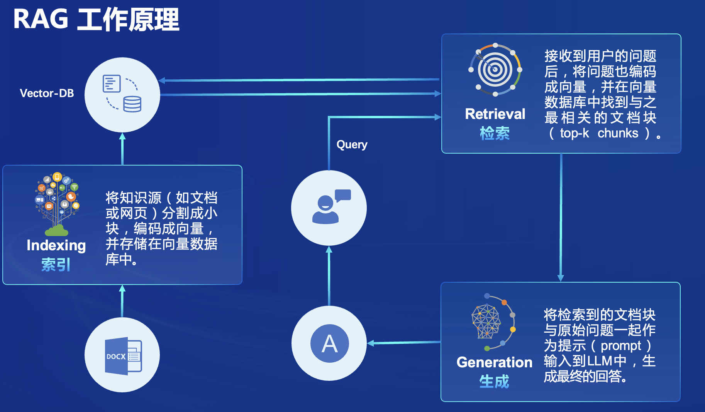
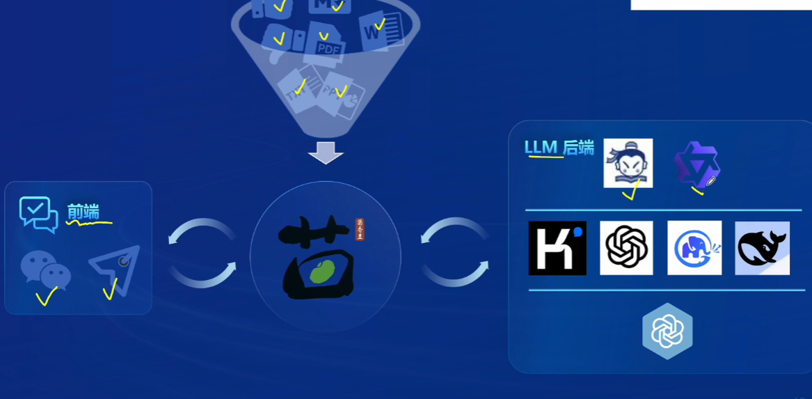

‍

# 搭建RAG助理

‍

为什么需要RAG？

1. 有很多领域内的细化问题，大模型知识覆盖不到，回答不出
2. 回答精确问题，某些知识可能从根源上就不正确，所有导致模型会说错，RAG可以减少这种情况。
3. ....

​​

‍

根据以下三个步骤来学习和实现目标

​​

RAG（Retrieval Augmented Generation）技术，通过检索与用户输入相关的信息片段，并结合***外部知识库***来生成更准确、更丰富的回答。外部知识库可以实时更新并且可持续性的添加或删改，对大模型的知识管理非常有用！

​​

解决 LLMs 在处理知识密集型任务时可能遇到的挑战, 如幻觉、知识过时和缺乏透明、可追溯的推理过程等。提供更准确的回答、降低推理成本、实现外部记忆。

> 让大模型更懂你。

​​​​

RAG能够构建的应用，包括但不仅限于：

​​

‍

## RAG技术原理

‍

### 向量数据库

> 将各类文字转化为多维坐标，然后通过坐标相似性来推算下一个字符，所以需要向量数据库。

向量不是随便搞出来的，里面包含了词汇之间语法语义等关系。相似的词所对应的嵌入向量在向量空间里距离也更近。而一些没啥关系的词之间的距离就更远。

​​

这有助于模型利用数学计算向量空间里的距离，去捕捉不同词在语义和语法等方面的相似性。而且男人与国王的差异和女人与女王的差异可以被看作是相似的这也可以在多维向量空间里展现。

​​

因此词向量不仅可以帮模型理解词的语义，也可以捕捉词与词之间的复杂关系。

‍

实现了这以下功能：

* 数据存储：将文本及其他数据通过其他预训练的模型转换为固定长度的向量表示，这些向量能够捕捉文本的语义信息。
* 相似性检索：根据用户的查询向量，使用向量数据库快速找出最相关的向量的过程。通常通过计算余弦相似度或其他相似性度量来完成。检索结果根据相似度得分进行排序最相关的文档将被用于后续的文本生成。
* 向量表示的优化：包括使用更高级的文本编码技术如句子嵌入或段落嵌入，以及对数据库进行优化以支持大规模向量搜索。

​​

‍

* 流程示例

将用户的输入结合向量数据库中的碎片化信息结合起来，共同发送给模型，使其可以结合文档内容回答。（对模型的上下文长度有要求）

​​

‍

#### 发展历程

RAG的概念最早是由Meta(Facebook)的Lewis等人在2020《Retrieval-Augmented Generation for Knowledge-Intensive NLP Tasks》中提出的。

​​

​​

‍

#### RAG常见优化方法

‍

​​

‍

​​

‍

优化方式比较：

纵坐标任务是对外部知识库的需求。

横坐标是模型适配度的需求。

​​

‍

优化效果评估：

一般通过以下几个指标对RAG效果进行评估

* 准确率(Accuracy)
* 召回率(Recall)
* F1分数(F1 Score
* BLEU分数（用于机器翻译和文本生成)
* ROUGE:分数（用于文本生成的评估)】

‍

RAG评测框架：

基准测试-RGB、RECALL、 CRUD  
评测I具-RAGAS、ARES TruLens

‍

​​

‍

‍

#### 如何选择RAG和微调

RAG  
非参数记忆，利用外部知识库提供实时更新的信息。

能够处理知识密集型任务，提供准确的事实性回答。

通过检索增强，可以生成更多样化的内容。​​

适用场景：适用于需要结合最新信息和实时数据的任务，开放域问答、实时新闻摘要等。

**优势：动态知识更新，处理长尾知识问题。**

局限：依赖于外部知识库的质量和覆盖范围。依赖大模型能力。

‍

微调

参数记忆，通过在特定任务数据上训川练，模型可以更好地适应该任务。

通常需要大量标注数据来进行有效微调。

**微调后的模型可能过拟合，导致泛化能力下降。**

> 就是训练为特定任务模型后，会导致在普通的其他领域回答能力下降

适用场景适用于数据可用且需要模型高度专业化的任务如特定领域的文本分类、情感分析、文本生成等。

**优势：模型性能针对特定任务优化。**

局限：需要大量的标注数据，且对新任务的适应性较差。

‍

‍

## 实现RAG助手

‍

茴香豆领域知识助手，由生浦语团队开发的开源大模型应用

专为即时通讯，(IM)工具中的群聊场景优化的工作流，提供及时准确的技术支持和自化问答服务。

通过应用检索增强生成(RAG)技术，茴香豆能够理解和高效准确的回应与特定知识领域相关的复杂查询。

​​

‍

实现的什么效果：

​​

‍

### 应用构建框架：

‍

在前端就是信息输入端，而中间就是大模型端，而茴香是经过后端模型在RAG后得到的一个特定任务大模型，可以读取文档，根据文档进行问答。

​​

‍

工作流：

1. Preprocess（预处理）：

    * 输入：chat group（聊天群组）中的sentence（句子）
    * 输出：query（查询）

在这个阶段，输入的句子被转换成一个查询，这可能是为了在后续步骤中检索相关信息。

2. Rejection Pipeline（拒绝管道）：

    * 输入：Preprocess阶段生成的query（查询）
    * 输出：query（查询）

Rejection Pipeline似乎是一个用于筛选或过滤查询的流程。它可能包含一些特征提取（feature extraction）、文本向量化（text2vec）和LLM评分（LLM scoring）。这些步骤可能用于评估查询的质量或相关性，并决定是否将其传递给下一个阶段。

3. Response Pipeline（响应管道）：

    * 输入：经过Rejection Pipeline筛选后的query（查询）
    * 输出：reply（回复）

Response Pipeline是最后一步，它接收经过筛选的查询并生成回复。这个阶段可能涉及从数据库（DB）中检索信息，然后使用这些信息来生成适当的回复。

总的来说，RAG工作流程图描述了一个从聊天群组中获取句子，对其进行预处理，然后通过一系列筛选和评估步骤来确定是否生成回复的过程。这个系统的设计目的是确保生成的回复具有高质量和相关性。

​​

‍

‍

添加了一些辅助技术后可以实现以下四种功能：

​​

‍

### 部署茴香助手

开发机：30% *A100

Cuda:11.7

‍

进入开发机后在终端输入，从官方环境复制运行 InternLM 的基础环境，命名为 `InternLM2_Huixiangdou`​，在命令行模式下运行：

> 大概10分钟

```shell
studio-conda -o internlm-base -t InternLM2_Huixiangdou
```

复制完成后，在本地查看环境。

```shell
conda env list
```

结果如下所示。

​​

‍

运行 ***conda*** 命令，激活 `InternLM2_Huixiangdou`​ ***python*** 虚拟环境:

```shell
conda activate InternLM2_Huixiangdou
```

启动成功后前面的名字会变

​​

‍

### 1.2 下载基础文件

复制茴香豆所需模型文件，为了减少下载和避免 **HuggingFace** 登录问题，所有作业和教程涉及的模型都已经存放在 `Intern Studio`​ 开发机共享文件中。本教程选用 **InternLM2-Chat-7B** 作为基础模型。

```shell
# 创建模型文件夹
cd /root && mkdir models

# 复制BCE模型
ln -s /root/share/new_models/maidalun1020/bce-embedding-base_v1 /root/models/bce-embedding-base_v1
ln -s /root/share/new_models/maidalun1020/bce-reranker-base_v1 /root/models/bce-reranker-base_v1
```

​​

‍

### 1.3 下载安装茴香豆

安装茴香豆运行所需依赖。

```shell
# 安装 python 依赖
# pip install -r requirements.txt

pip install protobuf==4.25.3 accelerate==0.28.0 aiohttp==3.9.3 auto-gptq==0.7.1 bcembedding==0.1.3 beautifulsoup4==4.8.2 einops==0.7.0 faiss-gpu==1.7.2 langchain==0.1.14 loguru==0.7.2 lxml_html_clean==0.1.0 openai==1.16.1 openpyxl==3.1.2 pandas==2.2.1 pydantic==2.6.4 pymupdf==1.24.1 python-docx==1.1.0 pytoml==0.1.21 readability-lxml==0.8.1 redis==5.0.3 requests==2.31.0 scikit-learn==1.4.1.post1 sentence_transformers==2.2.2 textract==1.6.5 tiktoken==0.6.0 transformers==4.39.3 transformers_stream_generator==0.0.5 unstructured==0.11.2

## 因为 Intern Studio 不支持对系统文件的永久修改，在 Intern Studio 安装部署的同学不建议安装 Word 依赖，后续的操作和作业不会涉及 Word 解析。
## 想要自己尝试解析 Word 文件的同学，uncomment 掉下面这行，安装解析 .doc .docx 必需的依赖
# apt update && apt -y install python-dev python libxml2-dev libxslt1-dev antiword unrtf poppler-utils pstotext tesseract-ocr flac ffmpeg lame libmad0 libsox-fmt-mp3 sox libjpeg-dev swig libpulse-dev
```

从茴香豆官方仓库下载茴香豆。

```shell
cd /root
# 克隆代码仓库
git clone https://github.com/internlm/huixiangdou && cd huixiangdou
git checkout 447c6f7e68a1657fce1c4f7c740ea1700bde0440

```

​​

## 2 使用茴香豆搭建 RAG 助手

### 2.1 修改配置文件

> 目的是为了选择embedding分词模型和reranker重排序模型，最后选择大模型。

用已下载模型的路径替换 `/root/huixiangdou/config.ini`​ 文件中的默认模型，需要修改 3 处模型地址。

命令行输入下面的命令，修改用于向量数据库和词嵌入的模型

```shell
sed -i '6s#.*#embedding_model_path = "/root/models/bce-embedding-base_v1"#' /root/huixiangdou/config.ini
```

用于检索的重排序模型

```shell
sed -i '7s#.*#reranker_model_path = "/root/models/bce-reranker-base_v1"#' /root/huixiangdou/config.ini
```

和本次选用的大模型

```shell
sed -i '29s#.*#local_llm_path = "/root/models/internlm2-chat-7b"#' /root/huixiangdou/config.ini
```

输入 `vi /root/huixiangdou/config.ini`​ 后即可查看，然后按ESC 输入`:Wq`​即可退出

修改好的配置文件应该如下图所示：

​​

### 2.2 创建知识库

使用 **InternLM** 的 **Huixiangdou** 文档作为新增知识数据检索来源，在不重新训练的情况下，打造一个 **Huixiangdou** 技术问答助手。

首先，下载 **Huixiangdou** 语料：

```shell
cd /root/huixiangdou && mkdir repodir

git clone https://github.com/internlm/huixiangdou --depth=1 repodir/huixiangdou
```

> 提取知识库特征，创建向量数据库。数据库向量化的过程应用到了 **LangChain** 的相关模块，默认嵌入和重排序模型调用的网易 **BCE 双语模型**，如果没有在 `config.ini`​ 文件中指定本地模型路径，茴香豆将自动从 **HuggingFace** 拉取默认模型。

除了语料知识的向量数据库，茴香豆建立接受和拒答两个向量数据库，用来在检索的过程中更加精确的判断提问的相关性，这两个数据库的来源分别是：

* 接受问题列表，希望茴香豆助手回答的示例问题

  * 存储在 `huixiangdou/resource/good_questions.json`​ 中
* 拒绝问题列表，希望茴香豆助手拒答的示例问题

  * 存储在 `huixiangdou/resource/bad_questions.json`​ 中
  * 其中多为技术无关的主题或闲聊
  * 如："nihui 是谁", "具体在哪些位置进行修改？", "你是谁？", "1+1"

运行下面的命令，增加茴香豆相关的问题到接受问题示例中：

```shell
cd /root/huixiangdou
mv resource/good_questions.json resource/good_questions_bk.json

echo '[
    "mmpose中怎么调用mmyolo接口",
    "mmpose实现姿态估计后怎么实现行为识别",
    "mmpose执行提取关键点命令不是分为两步吗，一步是目标检测，另一步是关键点提取，我现在目标检测这部分的代码是demo/topdown_demo_with_mmdet.py demo/mmdetection_cfg/faster_rcnn_r50_fpn_coco.py checkpoints/faster_rcnn_r50_fpn_1x_coco_20200130-047c8118.pth   现在我想把这个mmdet的checkpoints换位yolo的，那么应该怎么操作",
    "在mmdetection中，如何同时加载两个数据集，两个dataloader",
    "如何将mmdetection2.28.2的retinanet配置文件改为单尺度的呢？",
    "1.MMPose_Tutorial.ipynb、inferencer_demo.py、image_demo.py、bottomup_demo.py、body3d_pose_lifter_demo.py这几个文件和topdown_demo_with_mmdet.py的区别是什么，\n2.我如果要使用mmdet是不是就只能使用topdown_demo_with_mmdet.py文件，",
    "mmpose 测试 map 一直是 0 怎么办？",
    "如何使用mmpose检测人体关键点？",
    "我使用的数据集是labelme标注的，我想知道mmpose的数据集都是什么样式的，全都是单目标的数据集标注，还是里边也有多目标然后进行标注",
    "如何生成openmmpose的c++推理脚本",
    "mmpose",
    "mmpose的目标检测阶段调用的模型，一定要是demo文件夹下的文件吗，有没有其他路径下的文件",
    "mmpose可以实现行为识别吗，如果要实现的话应该怎么做",
    "我在mmyolo的v0.6.0 (15/8/2023)更新日志里看到了他新增了支持基于 MMPose 的 YOLOX-Pose，我现在是不是只需要在mmpose/project/yolox-Pose内做出一些设置就可以，换掉demo/mmdetection_cfg/faster_rcnn_r50_fpn_coco.py 改用mmyolo来进行目标检测了",
    "mac m1从源码安装的mmpose是x86_64的",
    "想请教一下mmpose有没有提供可以读取外接摄像头，做3d姿态并达到实时的项目呀？",
    "huixiangdou 是什么？",
    "使用科研仪器需要注意什么？",
    "huixiangdou 是什么？",
    "茴香豆 是什么？",
    "茴香豆 能部署到微信吗？",
    "茴香豆 怎么应用到飞书",
    "茴香豆 能部署到微信群吗？",
    "茴香豆 怎么应用到飞书群",
    "huixiangdou 能部署到微信吗？",
    "huixiangdou 怎么应用到飞书",
    "huixiangdou 能部署到微信群吗？",
    "huixiangdou 怎么应用到飞书群",
    "huixiangdou",
    "茴香豆",
    "茴香豆 有哪些应用场景",
    "huixiangdou 有什么用",
    "huixiangdou 的优势有哪些？",
    "茴香豆 已经应用的场景",
    "huixiangdou 已经应用的场景",
    "huixiangdou 怎么安装",
    "茴香豆 怎么安装",
    "茴香豆 最新版本是什么",
    "茴香豆 支持哪些大模型",
    "茴香豆 支持哪些通讯软件",
    "config.ini 文件怎么配置",
    "remote_llm_model 可以填哪些模型?"
]' > /root/huixiangdou/resource/good_questions.json
```

再创建一个测试用的问询列表，用来测试拒答流程是否起效：

```shell
cd /root/huixiangdou

echo '[
"huixiangdou 是什么？",
"你好，介绍下自己"
]' > ./test_queries.json
```

在确定好语料来源后，运行下面的命令，创建 RAG 检索过程中使用的向量数据库：

```shell
# 创建向量数据库存储目录
cd /root/huixiangdou && mkdir workdir 

# 分别向量化知识语料、接受问题和拒绝问题中后保存到 workdir
python3 -m huixiangdou.service.feature_store --sample ./test_queries.json
```

向量数据库的创建需要等待一小段时间，过程约占用 1.6G 显存。

完成后，**Huixiangdou** 相关的新增知识就以向量数据库的形式存储在 `workdir`​ 文件夹下。

检索过程中，茴香豆会将输入问题与两个列表中的问题在向量空间进行相似性比较，判断该问题是否应该回答，避免群聊过程中的问答泛滥。确定的回答的问题会利用基础模型提取关键词，在知识库中检索 `top K`​ 相似的 `chunk`​，综合问题和检索到的 `chunk`​ 生成答案。

### 2.3 运行茴香豆知识助手

我们已经提取了知识库特征，并创建了对应的向量数据库。现在，让我们来测试一下效果：

命令行运行：

```shell
# 填入问题
sed -i '74s/.*/    queries = ["茴香豆是谁？", "茴香豆 有哪些应用场景","茴香豆怎么部署到微信群", "今天天气怎么样？"]/' /root/huixiangdou/huixiangdou/main.py

# 运行茴香豆
cd /root/huixiangdou/
python3 -m huixiangdou.main --standalone
```

RAG 技术的优势就是非参数化的模型调优，这里使用的仍然是基础模型 `InternLM2-Chat-7B`​， 没有任何额外数据的训练。

‍

面对同样的问题，经过RAG增强后的**茴香豆技术助理**能够根据我们提供的数据库生成准确的答案：

茴香豆是谁的回答

​​

茴香豆怎么部署到微信群的回答：

​​

‍

## 实战作业

RAG美业助手。

1. 营销文案
2. 客户回复
3. ‍
