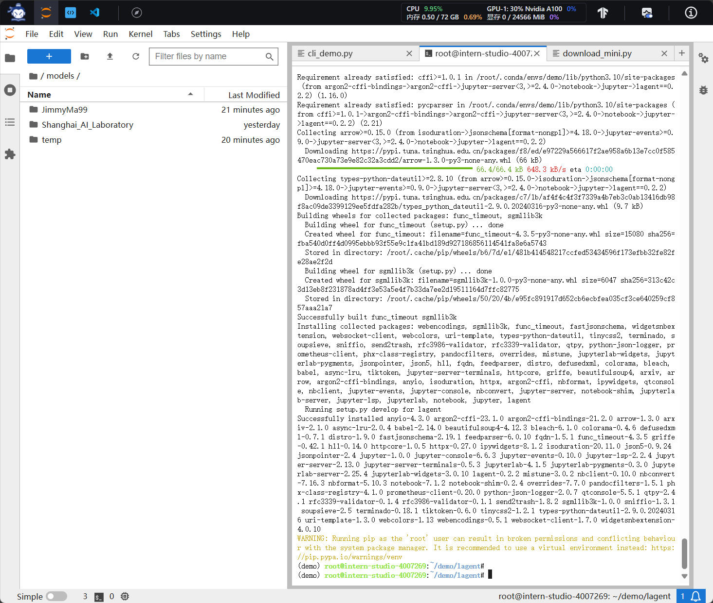

【轻松玩转书生·浦语大模型趣味 Demo】课程~。玩转书生·浦语【智能对话】、【智能体解应用题】、【多模态理解及图文创作】等趣味 Demo

‍

课程分为四个部分

1. 实战部署InternLM2-Chat-1.8B
2. 实战部署优秀作品八戒-Chat-1.8B
3. 实战进阶运行Lagent智能体Demo
4. 实战进阶灵笔InternLM-XComposer2

​​

‍

## 实战部署InternLM2-Chat-1.8B

教程文档：https://github.com/InternLM/Tutorial/blob/camp2/helloworld/hello\_world.md

* 创建并熟悉开发机:https://studio.intern-ai.org.cn/console/dashboard

选择开发机配置，在学习的过程书生实战应开放了50GPU，后续会使用到7b的模型，所以我这里就选择了高一些的配置。

名字可以自定义

镜像选择CUDA11.7

运行市时长我选择了两个小时

​​

‍

‍

开发机创建完成后进入开发机

​​

在开发机里面有三种模式，第一个是jupiter lab，第二个是terminal，第三个是code server，也就是VS code。这次选用jupiter lab的方式来去完成后续的任务。

​​

点击terminal，输入studio conduct的命令来创建环境。​

​​

**进入开发机后，在** **`terminal`**​ **中输入环境配置命令 (配置环境时间较长，需耐心等待)：**

```shell
studio-conda -o internlm-base -t demo
# 与 studio-conda 等效的配置方案
# conda create -n demo python==3.10 -y
# conda activate demo
# conda install pytorch==2.0.1 torchvision==0.15.2 torchaudio==2.0.2 pytorch-cuda=11.7 -c pytorch -c nvidia
```

配置时间会比较长，配置完成后会出现安装成功的提示

​​

通过conduct activate激活环境。配置完成后，进入到新创建的 `conda`​ 环境之中：

```shell
conda activate demo
```

输入以下命令，完成环境包的安装，输入命令补充在后续实验中所需要的python包。：

```shell
pip install huggingface-hub==0.17.3
pip install transformers==4.34 
pip install psutil==5.9.8
pip install accelerate==0.24.1
pip install streamlit==1.32.2 
pip install matplotlib==3.8.3 
pip install modelscope==1.9.5
pip install sentencepiece==0.1.99
```

### 下载模型

创建文件夹并进入到对应的文件目录：

```shell
mkdir -p /root/demo
touch /root/demo/cli_demo.py
touch /root/demo/download_mini.py
cd /root/demo
```

进入dome然后再双击打开 编辑`/root/demo/download_mini.py`​ 文件，

​​

​​

复制以下代码：

> 注意：这里更改模型成7B的模型。这里是从modelscope中下载的模型。可以去modelscope去查看一些示例去了解。

```python
import os
from modelscope.hub.snapshot_download import snapshot_download

# 创建保存模型目录
os.system("mkdir /root/models")

# save_dir是模型保存到本地的目录
save_dir="/root/models"

snapshot_download("Shanghai_AI_Laboratory/internlm2-chat-7b", 
                  cache_dir=save_dir, 
                  revision='v1.1.0')

```

执行命令，下载模型参数文件：

```shell
python /root/demo/download_mini.py
```

​​

### **运行 cli_demo**

双击打开 `/root/demo/cli_demo.py`​ 文件，复制以下代码：

```python
import torch
from transformers import AutoTokenizer, AutoModelForCausalLM


model_name_or_path = "/root/models/Shanghai_AI_Laboratory/internlm2-chat-1_8b"

tokenizer = AutoTokenizer.from_pretrained(model_name_or_path, trust_remote_code=True, device_map='cuda:0')
model = AutoModelForCausalLM.from_pretrained(model_name_or_path, trust_remote_code=True, torch_dtype=torch.bfloat16, device_map='cuda:0')
model = model.eval()

system_prompt = """You are an AI assistant whose name is InternLM (书生·浦语).
- InternLM (书生·浦语) is a conversational language model that is developed by Shanghai AI Laboratory (上海人工智能实验室). It is designed to be helpful, honest, and harmless.
- InternLM (书生·浦语) can understand and communicate fluently in the language chosen by the user such as English and 中文.
"""

messages = [(system_prompt, '')]

print("=============Welcome to InternLM chatbot, type 'exit' to exit.=============")

while True:
    input_text = input("\nUser  >>> ")
    input_text = input_text.replace(' ', '')
    if input_text == "exit":
        break

    length = 0
    for response, _ in model.stream_chat(tokenizer, input_text, messages):
        if response is not None:
            print(response[length:], flush=True, end="")
            length = len(response)
```

激活环境命令，然后执行 Demo 程序：

```shell
conda activate demo
python /root/demo/cli_demo.py
```

等待模型加载完成（7b的模型大概在1分钟），大概消耗这么多资源。每秒能输出5个字左右。

​​

键入内容示例：

```
请创作一个 300 字关于宇宙航行的科幻小故事
```

模型回复：

​​

退出对话输入` exit`​

## 实战部署优秀作品八戒-Chat-1.8B

* 了解并尝试第一期实战营的优秀作品

​`八戒-Chat-1.8B`​、`Chat-嬛嬛-1.8B`​、`Mini-Horo-巧耳`​ 均是在第一期实战营中运用 `InternLM2-Chat-1.8B`​ 模型进行微调训练的优秀成果。其中，`八戒-Chat-1.8B`​ 是利用《西游记》剧本中所有关于猪八戒的台词和语句以及 LLM API 生成的相关数据结果，进行全量微调得到的猪八戒聊天模型。作为 `Roleplay-with-XiYou`​ 子项目之一，`八戒-Chat-1.8B`​ 能够以较低的训练成本达到不错的角色模仿能力，同时低部署条件能够为后续工作降低算力门槛。

链接地址：

* **八戒-Chat-1.8B：**​**[https://www.modelscope.cn/models/JimmyMa99/BaJie-Chat-mini/summary](https://www.modelscope.cn/models/JimmyMa99/BaJie-Chat-mini/summary)**
* **Chat-嬛嬛-1.8B：**​**[https://openxlab.org.cn/models/detail/BYCJS/huanhuan-chat-internlm2-1\_8b](https://openxlab.org.cn/models/detail/BYCJS/huanhuan-chat-internlm2-1_8b)**
* **Mini-Horo-巧耳：**​**[https://openxlab.org.cn/models/detail/SaaRaaS/Horowag\_Mini](https://openxlab.org.cn/models/detail/SaaRaaS/Horowag_Mini)**

### 3.2 **配置基础环境**

运行环境命令（如果是以及是在dome中就不需要执行）：

```shell
conda activate demo
```

使用 `git`​ 命令来获得仓库内的 Demo 文件：

```shell
cd /root/
git clone https://gitee.com/InternLM/Tutorial -b camp2
# git clone https://github.com/InternLM/Tutorial -b camp2
cd /root/Tutorial
```

### 3.3 **下载运行 Chat-八戒 Demo**

执行获取到的bajie库中的下载程序 `bajie_download.py`​：

> 大概需要5分钟

```shell
python /root/Tutorial/helloworld/bajie_download.py
```

下载完成后，以流式回复来运行Chat-八戒：

```shell
streamlit run /root/Tutorial/helloworld/bajie_chat.py --server.address 127.0.0.1 --server.port 6006
```

运行完成后会输出

​​

#### 远程调用

查看开发机端口

​​

打开powershell用于远程连接，从本地使用 ssh 连接 studio 端口，输入以下代码来进行远程连接。

> 将下方端口号 40237 替换成自己的端口号

```shell
ssh -CNg -L 6006:127.0.0.1:6006 root@ssh.intern-ai.org.cn -p 40237 
```

输入完命令后，要输入一次yes，然后粘贴上面绿色箭头指的密码到终端里，`Ctrl+V`​粘贴，粘贴完成后不会显示，直接回车即可。

​​

执行完成后在自己的电脑上打开 [http://127.0.0.1:6006](http://127.0.0.1:6006/) 后，等待加载完成即可进行对话，

​​

在应用里可以进行对话。

​​

‍

关闭该模型在终端中按`Ctrl+C`​

‍

‍

## 实战进阶运行Lagent智能体Demo

进一步了解Lagent智能体：[欢迎来到 Lagent 的中文文档! — Lagent](https://lagent.readthedocs.io/zh-cn/latest/)

agent 是一个轻量级、开源的基于大语言模型的智能体（agent）框架，支持用户快速地将一个大语言模型转变为多种类型的智能体，并提供了一些典型工具为大语言模型赋能。它的整个框架图如下:

​​

Lagent 的特性总结如下：

* 流式输出：提供 stream_chat 接口作流式输出，本地就能演示酷炫的流式 Demo。
* 接口统一，设计全面升级，提升拓展性，包括：

  * Model : 不论是 OpenAI API, Transformers 还是推理加速框架 LMDeploy 一网打尽，模型切换可以游刃有余；
  * Action: 简单的继承和装饰，即可打造自己个人的工具集，不论 InternLM 还是 GPT 均可适配；
  * Agent：与 Model 的输入接口保持一致，模型到智能体的蜕变只需一步，便捷各种 agent 的探索实现；
* 文档全面升级，API 文档全覆盖。

‍

### 部署InternLM2-Chat-7B

创建30%的A100才足够运行这个模型。如果是跟着我的教程的则不需要切换开发机，咱继续。

进入dome目录

```shell
cd /root/demo
```

使用 git 命令下载 Lagent 相关的代码库：

> 如果是本地跑模型可以用gitee。安装到运行需要3分钟左右。

```shell
git clone https://gitee.com/internlm/lagent.git
# git clone https://github.com/internlm/lagent.git
cd /root/demo/lagent
git checkout 581d9fb8987a5d9b72bb9ebd37a95efd47d479ac
pip install -e . # 源码安装
```

安装完成后后

​​

‍

#### 切换的方法

打开 `Intern Studio`​ 界面，调节配置（必须在开发机关闭的条件下进行）：

​​

重新开启开发机，输入命令，开启 conda 环境：

```shell
conda activate demo
```

‍

‍

### 4.3 **使用** **`Lagent`**​ **运行** **`InternLM2-Chat-7B`**​ **模型为内核的智能体**​​

打开 lagent 路径：

```shell
cd /root/demo/lagent
```

在 terminal 中输入指令，构造软链接快捷访问方式：

```shell
ln -s /root/share/new_models/Shanghai_AI_Laboratory/internlm2-chat-7b /root/models/internlm2-chat-7b
```

打开 `/root/dome/lagent/exaples`​ 路径下 `examples/internlm2_agent_web_demo_hf.py`​ 文件，并修改使用的模型 (71行左右) 代码：

修改成7b模型的路径，因为刚才已经下载过，所以不需要在此下载，而是直接从本地加载，需要修改成以下路径。

> 请根据你的模型具体所在目录来写

```shell
# 其他代码...
value='/root/models/Shanghai_AI_Laboratory/internlm2-chat-1_8b"'
# 其他代码...
```

​​

输入运行命令 - **点开 6006 链接后，大约需要 5 分钟完成模型加载：**

```shell
streamlit run /root/demo/lagent/examples/internlm2_agent_web_demo_hf.py --server.address 127.0.0.1 --server.port 6006
```

> 如果刚才没有关闭powershell的连接，则可以直接打开[http://127.0.0.1:6006](http://127.0.0.1:6006/) 马上就可以运行。

关闭了就要在像刚才开启远程连接的步骤一样，不在重复。打开 [http://127.0.0.1:6006](http://127.0.0.1:6006/) 后，（会有较长的加载时间）

出现这样的内容就是爆显存了，经过测试，24G够用，因为InternStudio平台的显存是共享的，有时是会被调走一些资源，重新运行一遍即可。

​​

勾上数据分析，其他的选项不要选择，进行计算方面的 Demo 对话，即完成本章节实战。键入内容示例：

```
请解方程 2*X=1360 之中 X 的结果
```

​​

‍

## 实战进阶InternLM-XComposer2

> **开启 50% A100 权限后才可开启。停机升级配置后在继续。**

### **`XComposer2`**​ **相关知识**

​`浦语·灵笔2`​ 是基于 `书生·浦语2`​ 大语言模型研发的突破性的图文多模态大模型，具有非凡的图文写作和图像理解能力，在多种应用场景表现出色，总结起来其具有：

* 自由指令输入的图文写作能力： `浦语·灵笔2`​ 可以理解自由形式的图文指令输入，包括大纲、文章细节要求、参考图片等，为用户打造图文并貌的专属文章。生成的文章文采斐然，图文相得益彰，提供沉浸式的阅读体验。
* 准确的图文问题解答能力：`浦语·灵笔2`​ 具有海量图文知识，可以准确的回复各种图文问答难题，在识别、感知、细节描述、视觉推理等能力上表现惊人。
* 杰出的综合能力： `浦语·灵笔2-7B`​ 基于 `书生·浦语2-7B`​ 模型，在13项多模态评测中大幅领先同量级多模态模型，在其中6项评测中超过 `GPT-4V`​ 和 `Gemini Pro`​。

​​

‍

> 因为展示没有50%的A100，笔记在后续有机会时会在更新。
