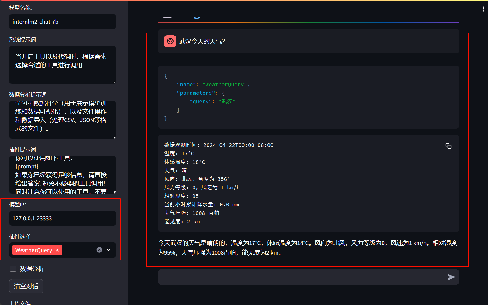

​​

大模型的局限性：

* 幻觉：模型可能会生成虚假信息，与现实严，重不符或脱节。

* 时效性：模型训练数据过时无法反映最新趋势和信息。
* 可靠性：面对复杂任务时，可能频发错误输出现象，影响信任度

# Lagent&AgentLego智能体应用搭建

​​

智能体：

* 大脑：作为控制器，承担记忆、思考和决策任务。接受来自感知模块的信息，并采取相应动作
* 感知：对外部环境的多模态信息进行感知和处理。包括但不限于图像、音频、视频、传感器等。
* 动作：利用并执行工具以影响环境。工具可能包括文本的检索、调用相关APL、操控机械臂等，

​​

‍

‍

## Lagent

* 一个轻量级开源智能体框架，旨在让用户可以高效地构建基于大语言模型的智能体。
* 支持多种智能体范式。(如AutoGPT、ReWoo、ReAct)
* 支持多种工具。（如谷歌搜索、Python解释器等)

​​

‍

‍

## AgentLego

* 一个多模态工具包，旨在像乐高积木，可以快速简便地拓展自定义工具，从而组装出自己的智能体。
* 支持多个智能体框架。（如Lagent、.LangChain、Transformers Agents)
* 提供大量视觉、多模态领域前沿算法。

​​

‍

## Lagent&AgentLego的关系

‍

​​

‍

‍

# 实践

Cuda：12.2

 GPU ：30%*A100

‍

我们需要配置一个环境以同时满足 Lagent 和 AgentLego 运行时所需依赖。在开始配置环境前，我们先创建一个用于存放 Agent 相关文件的目录，可以执行如下命令：

```shell
mkdir -p /root/agent
```

接下来，我们开始配置 conda 环境，可以输入如下指令：

```shell
studio-conda -t agent -o pytorch-2.1.2
```

> 会有点久  10分钟左右

​​

‍

#### 1.4.2 安装 Lagent 和 AgentLego

Lagent 和 AgentLego 都提供了两种安装方法，一种是通过 pip 直接进行安装，另一种则是从源码进行安装。为了方便使用 Lagent 的 Web Demo 以及 AgentLego 的 WebUI，我们选择直接从源码进行安装。 此处附上源码安装的相关帮助文档：

* Lagent：[https://lagent.readthedocs.io/zh-cn/latest/get_started/install.html](https://lagent.readthedocs.io/zh-cn/latest/get_started/install.html)
* AgentLego：[https://agentlego.readthedocs.io/zh-cn/latest/get_started.html](https://agentlego.readthedocs.io/zh-cn/latest/get_started.html)

可以执行如下命令进行安装：

```shell
cd /root/agent
conda activate agent
git clone https://gitee.com/internlm/lagent.git
cd lagent && git checkout 581d9fb && pip install -e . && cd ..
git clone https://gitee.com/internlm/agentlego.git
cd agentlego && git checkout 7769e0d && pip install -e . && cd ..
```

#### 1.4.3 安装其他依赖

在这一步中，我们将会安装其他将要用到的依赖库，如 LMDeploy，可以执行如下命令：

```shell
conda activate agent
pip install lmdeploy==0.3.0
```

#### 1.4.4 准备 Tutorial

由于后续的 Demo 需要用到 tutorial 已经写好的脚本，因此我们需要将 tutorial 通过 git clone 的方法准备好，以备后续使用：

```shell
cd /root/agent
git clone -b camp2 https://gitee.com/internlm/Tutorial.git
```

## Lagent：轻量级智能体框架

在这一部分中，我们将带大家体验 Lagent 的 Web Demo，使用 Lagent 自定义工具，并体验自定义工具的效果。

### 1.1 使用 LMDeploy 部署

由于 Lagent 的 Web Demo 需要用到 LMDeploy 所启动的 api_server，因此我们首先按照下图指示在 vscode terminal 中执行如下代码使用 LMDeploy 启动一个 api_server。

```shell
conda activate agent
lmdeploy serve api_server /root/share/new_models/Shanghai_AI_Laboratory/internlm2-chat-7b \
                            --server-name 127.0.0.1 \
                            --model-name internlm2-chat-7b \
                            --cache-max-entry-count 0.1
```

​​

### 1.2 启动并使用 Lagent Web Demo

接下来我们按照下图指示新建一个 terminal 以启动 Lagent Web Demo。在新建的 terminal 中执行如下指令：

```shell
conda activate agent
cd /root/agent/lagent/examples
streamlit run internlm2_agent_web_demo.py --server.address 127.0.0.1 --server.port 7860
```

点击右边的这个加号就可以创建。

​​

在等待 LMDeploy 的 api_server 与 Lagent Web Demo 完全启动后（如下图所示），在**本地**进行端口映射，将 LMDeploy api_server 的23333端口以及 Lagent Web Demo 的7860端口映射到本地。可以执行：

```shell
ssh -CNg -L 7860:127.0.0.1:7860 -L 23333:127.0.0.1:23333 root@ssh.intern-ai.org.cn -p 你的 ssh 端口号
```

> 这里可以不用链接到本地，可以通过vscode直接打开浏览器

按着CTRL 然后左键点击。

​​

‍

‍

 打开Lagent Web Demo后，首先输入模型 IP 为 127.0.0.1:23333，**在输入完成后按下回车键以确认**。并选择插件为 ArxivSearch，以让模型获得在 arxiv 上搜索论文的能力。

​​

我们输入“请帮我搜索 InternLM2 Technical Report” 以让模型搜索书生·浦语2的技术报告。效果如下图所示，可以看到模型正确输出了 InternLM2 技术报告的相关信息。尽管还输出了其他论文，但这是由 arxiv 搜索 API 的相关行为导致的。

​​​​

## 用 Lagent 自定义工具

在本节中，我们将基于 Lagent 自定义一个工具。Lagent 中关于工具部分的介绍文档位于 [https://lagent.readthedocs.io/zh-cn/latest/tutorials/action.html](https://lagent.readthedocs.io/zh-cn/latest/tutorials/action.html) 。使用 Lagent 自定义工具主要分为以下几步：

1. 继承 BaseAction 类
2. 实现简单工具的 run 方法；或者实现工具包内每个子工具的功能
3. 简单工具的 run 方法可选被 tool_api 装饰；工具包内每个子工具的功能都需要被 tool_api 装饰

下面我们将实现一个调用和风天气 API 的工具以完成实时天气查询的功能。

> 在vscode界面下继续操作：

​​

### 2.1 创建工具文件

首先通过 `touch /root/agent/lagent/lagent/actions/weather.py`​​（注意大小写）新建工具文件，该文件内容如下：

```python
import json
import os
import requests
from typing import Optional, Type

from lagent.actions.base_action import BaseAction, tool_api
from lagent.actions.parser import BaseParser, JsonParser
from lagent.schema import ActionReturn, ActionStatusCode

class WeatherQuery(BaseAction):
    """Weather plugin for querying weather information."""
  
    def __init__(self,
                 key: Optional[str] = None,
                 description: Optional[dict] = None,
                 parser: Type[BaseParser] = JsonParser,
                 enable: bool = True) -> None:
        super().__init__(description, parser, enable)
        key = os.environ.get('WEATHER_API_KEY', key)
        if key is None:
            raise ValueError(
                'Please set Weather API key either in the environment '
                'as WEATHER_API_KEY or pass it as `key`')
        self.key = key
        self.location_query_url = 'https://geoapi.qweather.com/v2/city/lookup'
        self.weather_query_url = 'https://devapi.qweather.com/v7/weather/now'

    @tool_api
    def run(self, query: str) -> ActionReturn:
        """一个天气查询API。可以根据城市名查询天气信息。
  
        Args:
            query (:class:`str`): The city name to query.
        """
        tool_return = ActionReturn(type=self.name)
        status_code, response = self._search(query)
        if status_code == -1:
            tool_return.errmsg = response
            tool_return.state = ActionStatusCode.HTTP_ERROR
        elif status_code == 200:
            parsed_res = self._parse_results(response)
            tool_return.result = [dict(type='text', content=str(parsed_res))]
            tool_return.state = ActionStatusCode.SUCCESS
        else:
            tool_return.errmsg = str(status_code)
            tool_return.state = ActionStatusCode.API_ERROR
        return tool_return
  
    def _parse_results(self, results: dict) -> str:
        """Parse the weather results from QWeather API.
  
        Args:
            results (dict): The weather content from QWeather API
                in json format.
  
        Returns:
            str: The parsed weather results.
        """
        now = results['now']
        data = [
            f'数据观测时间: {now["obsTime"]}',
            f'温度: {now["temp"]}°C',
            f'体感温度: {now["feelsLike"]}°C',
            f'天气: {now["text"]}',
            f'风向: {now["windDir"]}，角度为 {now["wind360"]}°',
            f'风力等级: {now["windScale"]}，风速为 {now["windSpeed"]} km/h',
            f'相对湿度: {now["humidity"]}',
            f'当前小时累计降水量: {now["precip"]} mm',
            f'大气压强: {now["pressure"]} 百帕',
            f'能见度: {now["vis"]} km',
        ]
        return '\n'.join(data)

    def _search(self, query: str):
        # get city_code
        try:
            city_code_response = requests.get(
                self.location_query_url,
                params={'key': self.key, 'location': query}
            )
        except Exception as e:
            return -1, str(e)
        if city_code_response.status_code != 200:
            return city_code_response.status_code, city_code_response.json()
        city_code_response = city_code_response.json()
        if len(city_code_response['location']) == 0:
            return -1, '未查询到城市'
        city_code = city_code_response['location'][0]['id']
        # get weather
        try:
            weather_response = requests.get(
                self.weather_query_url,
                params={'key': self.key, 'location': city_code}
            )
        except Exception as e:
            return -1, str(e)
        return weather_response.status_code, weather_response.json()
```

### 2.2 获取 API KEY

为了获得稳定的天气查询服务，我们首先要获取 API KEY。首先打开 [https://dev.qweather.com/docs/api/](https://dev.qweather.com/docs/api/) 后，点击右上角控制台。（如下图所示，先登入。）

​​

进入控制台后，点击左侧项目管理，然后点击右上角创建项目以创建新项目。（如下图所示）

​​

​​

输入相关项目名称，选择免费订阅，**Web API** 以及输入 key 的名称。（项目名称和 key 的名词自由输入即可，如下图所示）

​​

接下来回到项目管理页面，查看我们刚刚创建的 key，并且复制好以供2.3节中使用。（如下图所示）

​​

### 2.3 体验自定义工具效果

与 1.2 部分类似，我们在两个 terminal 中分别启动 LMDeploy 服务和 Tutorial 已经写好的用于这部分的 Web Demo：

> 注意，确保 LMDeploy 服务和Web Demo 服务已经停止（即 terminal 已关闭），否则会出现 CUDA Out of Memory 或是端口已占用的情况！

```shell
conda activate agent
lmdeploy serve api_server /root/share/new_models/Shanghai_AI_Laboratory/internlm2-chat-7b \
                            --server-name 127.0.0.1 \
                            --model-name internlm2-chat-7b \
                            --cache-max-entry-count 0.1
```

```shell
export WEATHER_API_KEY=2495dd1e90524d3aba7695xxxx  # 你的key
conda activate agent
cd /root/agent/Tutorial/agent
streamlit run internlm2_weather_web_demo.py --server.address 127.0.0.1 --server.port 7860
```

并在**本地**执行如下操作以进行端口映射：

```shell
ssh -CNg -L 7860:127.0.0.1:7860 -L 23333:127.0.0.1:23333 root@ssh.intern-ai.org.cn -p 你的 ssh 端口号
```

在输入模型地址并选择好工具后，就可以开始体验了。：

​​

‍

## AgentLego：组装智能体“乐高”

在这一部分中，我们将带大家直接使用 AgentLego 工具，体验 AgentLego 的 WebUI，以及基于 AgentLego 自定义工具并体验自定义工具的效果。

### 直接使用 AgentLego

首先下载 demo 文件：

```shell
cd /root/agent
wget http://download.openmmlab.com/agentlego/road.jpg
```

由于 AgentLego 在安装时并不会安装某个特定工具的依赖，因此我们接下来准备安装目标检测工具运行时所需依赖。

AgentLego 所实现的目标检测工具是基于 mmdet (MMDetection) 算法库中的 RTMDet-Large 模型，因此我们首先安装 mim，然后通过 mim 工具来安装 mmdet。这一步所需时间可能会较长，请耐心等待。

```shell
conda activate agent
pip install openmim==0.3.9
mim install mmdet==3.3.0
```

然后通过 `touch /root/agent/direct_use.py`​（大小写敏感）的方式在 /root/agent 目录下新建 direct_use.py 以直接使用目标检测工具，direct_use.py 的代码如下：

```python
import re

import cv2
from agentlego.apis import load_tool

# load tool
tool = load_tool('ObjectDetection', device='cuda')

# apply tool
visualization = tool('/root/agent/road.jpg')
print(visualization)

# visualize
image = cv2.imread('/root/agent/road.jpg')

preds = visualization.split('\n')
pattern = r'(\w+) \((\d+), (\d+), (\d+), (\d+)\), score (\d+)'

for pred in preds:
    name, x1, y1, x2, y2, score = re.match(pattern, pred).groups()
    x1, y1, x2, y2, score = int(x1), int(y1), int(x2), int(y2), int(score)
    cv2.rectangle(image, (x1, y1), (x2, y2), (0, 255, 0), 1)
    cv2.putText(image, f'{name} {score}', (x1, y1), cv2.FONT_HERSHEY_SIMPLEX, 0.8, (0, 255, 0), 1)

cv2.imwrite('/root/agent/road_detection_direct.jpg', image)
```

接下来在执行 `python /root/agent/direct_use.py`​ 以进行推理。在等待 RTMDet-Large 权重下载并推理完成后，我们就可以看到如下输出以及一张位于 /root/agent 名为 road_detection_direct.jpg 的图片：

```
truck (345, 428, 528, 599), score 83
car (771, 510, 837, 565), score 81
car (604, 518, 677, 569), score 75
person (866, 503, 905, 595), score 74
person (287, 513, 320, 596), score 74
person (964, 502, 999, 604), score 72
person (1009, 503, 1047, 602), score 69
person (259, 510, 279, 575), score 65
car (1074, 524, 1275, 691), score 64
person (993, 508, 1016, 597), score 62
truck (689, 483, 764, 561), score 62
bicycle (873, 551, 903, 602), score 60
person (680, 523, 699, 567), score 55
bicycle (968, 551, 996, 609), score 53
bus (826, 482, 930, 560), score 52
bicycle (1011, 551, 1043, 617), score 51
```

​​

​​

​​

## 作为智能体工具使用

### 2.1 修改相关文件

由于 AgentLego 算法库默认使用 InternLM2-Chat-20B 模型，因此我们首先需要修改 `/root/agent/agentlego/webui/modules/agents/lagent_agent.py`​ 文件的第 105行位置，将 internlm2-chat-20b 修改为 internlm2-chat-7b，即

```diff
def llm_internlm2_lmdeploy(cfg):
    url = cfg['url'].strip()
    llm = LMDeployClient(
-         model_name='internlm2-chat-20b',
+         model_name='internlm2-chat-7b',
        url=url,
        meta_template=INTERNLM2_META,
        top_p=0.8,
        top_k=100,
        temperature=cfg.get('temperature', 0.7),
        repetition_penalty=1.0,
        stop_words=['<|im_end|>'])
    return llm
```

其中红色表示要删除的内容，绿色表示要添加的内容。

###  使用 LMDeploy 部署

由于 AgentLego 的 WebUI 需要用到 LMDeploy 所启动的 api_server，因此我们首先按照下图指示在 vscode terminal 中执行如下代码使用 LMDeploy 启动一个 api_server。

> 记得把之前的终端和vscode中正在运行的模型和网页运行关闭！

```shell
conda activate agent
lmdeploy serve api_server /root/share/new_models/Shanghai_AI_Laboratory/internlm2-chat-7b \
                            --server-name 127.0.0.1 \
                            --model-name internlm2-chat-7b \
                            --cache-max-entry-count 0.1
```

### 启动 AgentLego WebUI

接下来我们按照下图指示新建一个 terminal 以启动 AgentLego WebUI。在新建的 terminal 中执行如下指令：

```shell
conda activate agent
cd /root/agent/agentlego/webui
python one_click.py
```

​​

> 同样可以在vscode中直接打开网页

在等待 LMDeploy 的 api_server 与 AgentLego WebUI 完全启动后（如下图所示），在**本地**进行端口映射，将 LMDeploy api_server 的23333端口以及 AgentLego WebUI 的7860端口映射到本地。可以执行：

```shell
ssh -CNg -L 7860:127.0.0.1:7860 -L 23333:127.0.0.1:23333 root@ssh.intern-ai.org.cn -p 44770
```

‍

> 这里大坑！！！！用cmd和powershell连不进去的，用git bash，就可以了
>
> ​​

‍

### 2.4 使用 AgentLego WebUI

接下来在本地的浏览器页面中打开 [http://localhost:7860](http://localhost:7860/) 以使用 AgentLego WebUI。首先来配置 Agent，如下图所示。

1. 点击上方 Agent 进入 Agent 配置页面。
2. 点击 Agent 下方框，选择 New Agent。
3. 选择 Agent Class 为 lagent.InternLM2Agent。
4. 输入模型 URL 为 [http://127.0.0.1:23333](http://127.0.0.1:23333/) 。
5. 输入 Agent name，自定义即可，图中输入了 internlm2。
6. 点击 save to 以保存配置，这样在下次使用时只需在第2步时选择 Agent 为 internlm2 后点击 load 以加载就可以了。
7. 点击 load 以加载配置。

​​

然后配置工具，如下图所示。

1. 点击上方 Tools 页面进入工具配置页面。
2. 点击 Tools 下方框，选择 New Tool 以加载新工具。
3. 选择 Tool Class 为 ObjectDetection。（粘贴进去才有）
4. 点击 save 以保存配置。

> 这里需要等一会

​​

点左上角Chat

​​

拉到下面，只选择ObjectDetection

​​

点击右下角文件夹以上传图片，上传图片后输入命令要求并点击 generate 以得到模型回复。

​​

后端：

​​

## 3. 用 AgentLego 自定义工具

在本节中，我们将基于 AgentLego 构建自己的自定义工具。AgentLego 在这方面提供了较为详尽的文档，文档地址为 [https://agentlego.readthedocs.io/zh-cn/latest/modules/tool.html](https://agentlego.readthedocs.io/zh-cn/latest/modules/tool.html) 。自定义工具主要分为以下几步：

1. 继承 BaseTool 类
2. 修改 default_desc 属性（工具功能描述）
3. 如有需要，重载 setup 方法（重型模块延迟加载）
4. 重载 apply 方法（工具功能实现）

其中第一二四步是必须的步骤。下面我们将实现一个调用 MagicMaker 的 API 以实现图像生成的工具。

MagicMaker 是汇聚了优秀 AI 算法成果的免费 AI 视觉素材生成与创作平台。主要提供图像生成、图像编辑和视频生成三大核心功能，全面满足用户在各种应用场景下的视觉素材创作需求。体验更多功能可以访问 [https://magicmaker.openxlab.org.cn/home](https://magicmaker.openxlab.org.cn/home) 。

### 3.1 创建工具文件

首先通过 `touch /root/agent/agentlego/agentlego/tools/magicmaker_image_generation.py`​（大小写敏感）的方法新建工具文件。该文件的内容如下：

```python
import json
import requests

import numpy as np

from agentlego.types import Annotated, ImageIO, Info
from agentlego.utils import require
from .base import BaseTool


class MagicMakerImageGeneration(BaseTool):

    default_desc = ('This tool can call the api of magicmaker to '
                    'generate an image according to the given keywords.')

    styles_option = [
        'dongman',  # 动漫
        'guofeng',  # 国风
        'xieshi',   # 写实
        'youhua',   # 油画
        'manghe',   # 盲盒
    ]
    aspect_ratio_options = [
        '16:9', '4:3', '3:2', '1:1',
        '2:3', '3:4', '9:16'
    ]

    @require('opencv-python')
    def __init__(self,
                 style='guofeng',
                 aspect_ratio='4:3'):
        super().__init__()
        if style in self.styles_option:
            self.style = style
        else:
            raise ValueError(f'The style must be one of {self.styles_option}')
    
        if aspect_ratio in self.aspect_ratio_options:
            self.aspect_ratio = aspect_ratio
        else:
            raise ValueError(f'The aspect ratio must be one of {aspect_ratio}')

    def apply(self,
              keywords: Annotated[str,
                                  Info('A series of Chinese keywords separated by comma.')]
        ) -> ImageIO:
        import cv2
        response = requests.post(
            url='https://magicmaker.openxlab.org.cn/gw/edit-anything/api/v1/bff/sd/generate',
            data=json.dumps({
                "official": True,
                "prompt": keywords,
                "style": self.style,
                "poseT": False,
                "aspectRatio": self.aspect_ratio
            }),
            headers={'content-type': 'application/json'}
        )
        image_url = response.json()['data']['imgUrl']
        image_response = requests.get(image_url)
        image = cv2.imdecode(np.frombuffer(image_response.content, np.uint8), cv2.IMREAD_COLOR)
        return ImageIO(image)
```

### 3.2 注册新工具

接下来修改`/root/agent/AgentLego/agentlego/agentlego/tools/__init__.py`​文件，将我们的工具注册在工具列表中。如下所示，我们将`MagicMakerImageGeneration`​通过 `from .magicmaker_image_generation import MagicMakerImageGeneration`​ 导入到了文件中，并且将其加入了 **all** 列表中。

```diff
from .base import BaseTool
from .calculator import Calculator
from .func import make_tool
from .image_canny import CannyTextToImage, ImageToCanny
from .image_depth import DepthTextToImage, ImageToDepth
from .image_editing import ImageExpansion, ImageStylization, ObjectRemove, ObjectReplace
from .image_pose import HumanBodyPose, HumanFaceLandmark, PoseToImage
from .image_scribble import ImageToScribble, ScribbleTextToImage
from .image_text import ImageDescription, TextToImage
from .imagebind import AudioImageToImage, AudioTextToImage, AudioToImage, ThermalToImage
from .object_detection import ObjectDetection, TextToBbox
from .ocr import OCR
from .scholar import *  # noqa: F401, F403
from .search import BingSearch, GoogleSearch
from .segmentation import SegmentAnything, SegmentObject, SemanticSegmentation
from .speech_text import SpeechToText, TextToSpeech
from .translation import Translation
from .vqa import VQA
+ from .magicmaker_image_generation import MagicMakerImageGeneration

__all__ = [
    'CannyTextToImage', 'ImageToCanny', 'DepthTextToImage', 'ImageToDepth',
    'ImageExpansion', 'ObjectRemove', 'ObjectReplace', 'HumanFaceLandmark',
    'HumanBodyPose', 'PoseToImage', 'ImageToScribble', 'ScribbleTextToImage',
    'ImageDescription', 'TextToImage', 'VQA', 'ObjectDetection', 'TextToBbox', 'OCR',
    'SegmentObject', 'SegmentAnything', 'SemanticSegmentation', 'ImageStylization',
    'AudioToImage', 'ThermalToImage', 'AudioImageToImage', 'AudioTextToImage',
    'SpeechToText', 'TextToSpeech', 'Translation', 'GoogleSearch', 'Calculator',
-     'BaseTool', 'make_tool', 'BingSearch'
+     'BaseTool', 'make_tool', 'BingSearch', 'MagicMakerImageGeneration'
]
```

### 3.3 体验自定义工具效果

与2.2，2.3以及2.4节类似，我们在两个 terminal 中分别启动 LMDeploy 服务和 AgentLego 的 WebUI 以体验我们自定义的工具的效果。

```shell
conda activate agent
lmdeploy serve api_server /root/share/new_models/Shanghai_AI_Laboratory/internlm2-chat-7b \
                            --server-name 127.0.0.1 \
                            --model-name internlm2-chat-7b \
                            --cache-max-entry-count 0.1
```

```shell
conda activate agent
cd /root/agent/agentlego/webui
python one_click.py
```

并在**本地**执行如下操作以进行端口映射：

```shell
ssh -CNg -L 7860:127.0.0.1:7860 -L 23333:127.0.0.1:23333 root@ssh.intern-ai.org.cn -p 你的 ssh 端口号
```

在 Tool 界面选择 `MagicMakerImageGeneration`​ 后点击 save 后，回到 Chat 页面选择 `MagicMakerImageGeneration`​ 工具后就可以开始使用了。

‍
