​​

â€

# 微调

大模å‹ä¸ºä»€ä¹ˆè¦å¾®è°ƒï¼Ÿåœ¨ç»è¿‡å¤§è§„模的预训练å，具备了一般性的语言ç†è§£å’Œç”Ÿæˆèƒ½åŠ›ã€‚但是，当我们将这样的模å‹åº”用到具体场景时，比如医疗诊断ã€æ³•å¾‹å’¨è¯¢ã€è´¢ç»åˆ†æ或者特定ä¼ä¸šçš„客æœç³»ç»Ÿä¸­ï¼Œç›´æ¥ä½¿ç”¨æœªç»è°ƒæ•´çš„模å‹å¯èƒ½æ— æ³•å¾ˆå¥½åœ°å¤„ç†è¿™äº›é¢†åŸŸçš„专业问题。

想象一下，一个模å‹å°±åƒä¸€ä½å­¦è¯†æ¸Šåšçš„通æ‰ï¼Œä»–读过很多书，能解答å„ç§ä¸€èˆ¬æ€§é—®é¢˜ï¼Œä½†å¦‚æœæˆ‘们è¦è®©ä»–å»è§£å†³ä¸“业的医学难题或者撰写专业的法律æ„è§ä¹¦ï¼Œå°±éœ€è¦å¯¹ä»–进行é¢å¤–的培训，让他熟悉医学术语ã€ç—…例分æ或者法律æ¡æ¬¾ç­‰å†…容。

因此，在具体场景下对大模å‹è¿›è¡Œå¾®è°ƒå°±åƒæ˜¯ç»™è¿™ä½é€šæ‰æ供专业进修课程，让它针对特定领域或任务进行深入学习。通过使用特定领域的数æ®é›†è¿›è¡Œå†è®­ç»ƒï¼Œæ¨¡å‹èƒ½å¤Ÿæ›´å¥½åœ°ç†è§£å¹¶å¤„ç†è¿™ä¸ªé¢†åŸŸçš„特有问题，进而æå‡å…¶åœ¨å®é™…应用中的精准度和效æœã€‚这样一æ¥ï¼Œå¾®è°ƒå的模å‹å°±èƒ½æ›´ç¬¦åˆç‰¹å®šåœºæ™¯çš„需求，å‘挥出更大的价值。

â€

> åŸæœ¬æŸä¸ªé¢†åŸŸèƒ½è¾¾åˆ°80分，而微调就是è¦è¾¾åˆ°95分。

â€

## 两ç§å¾®è°ƒèŒƒå¼

LLM的下游应用中，å¢é‡é¢„训练和指令跟éšæ˜¯ç»å¸¸ä¼šç”¨åˆ°ä¸¤ç§çš„微调模å¼

â€

1. å¢é‡é¢„训练微调

    使用场景：让基座模å‹å­¦ä¹ åˆ°ä¸€äº›æ–°çŸ¥è¯†ï¼Œå¦‚æŸä¸ªå‚类领域的常识  
    **训练数æ®ï¼šæ–‡ç« ã€ä¹¦ç±ã€ä»£ç ç­‰**

2. 指令跟éšå¾®è°ƒ

    使用场景：让模å‹å­¦ä¼šå¯¹è¯æ¨¡æ¿ï¼Œæ ¹æ®äººç±»æŒ‡ä»¤è¿›è¡Œå¯¹è¯  
    **训练数æ®ï¼šé«˜è´¨é‡çš„对è¯ã€é—®ç­”æ•°æ®**

â€

​​

​​

具体场景体ç°ï¼š

在没有通过指令微调之å‰ï¼Œæ¨¡å‹å¹¶ä¸ç†è§£è¿™æ˜¯ä¸€ä¸ªå¯¹è¯ï¼Œè€Œæ˜¯è®¤ä¸ºæ˜¯ä¸€ä¸ªæ‹Ÿåˆï¼Œè¾“出更多相似的内容。所以Chat模å‹å°±æ˜¯é€šè¿‡æŒ‡ä»¤å¾®è°ƒå¾—æ¥çš„。

​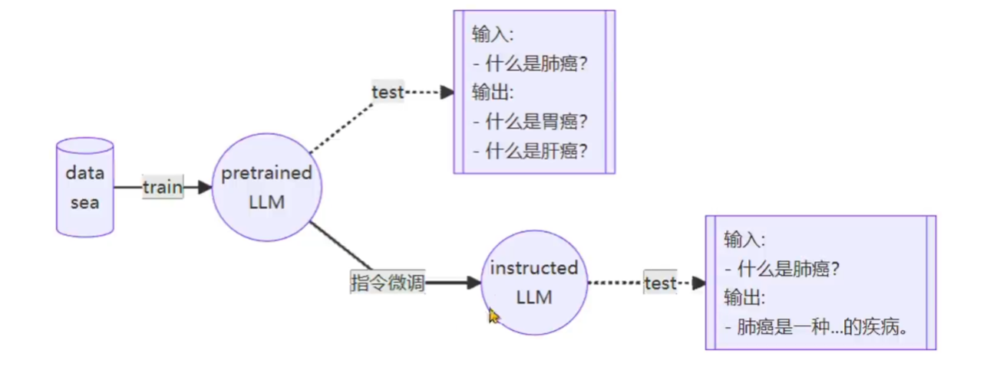​

â€

### 微调数æ®çš„æµç¨‹

ä»æ–‡ç« ä¸­çš„一段内容，或者一个陈述å¥ï¼Œæˆ–是一代ç éƒ½æ˜¯åŸå§‹æ•°æ®ã€‚通过多个步骤å最终æˆä¸ºè®­ç»ƒæ•°æ®ã€‚

​​

​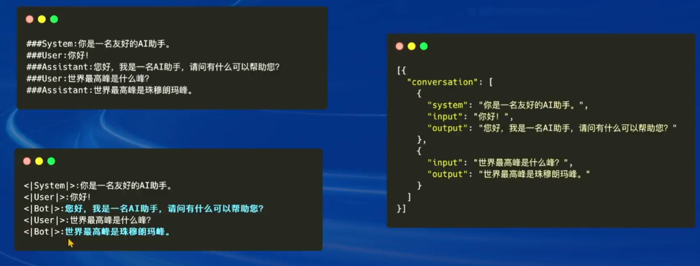​

â€

â€

### 对è¯æ¨¡æ¿

对è¯æ¨¡æ¿æ˜¯ä¸ºäº†èƒ½å¤Ÿè®©LLM区分出，Systemã€Userå’ŒAssistant,ä¸åŒçš„模å‹ä¼šæœ‰ä¸åŒçš„模æ¿ã€‚

​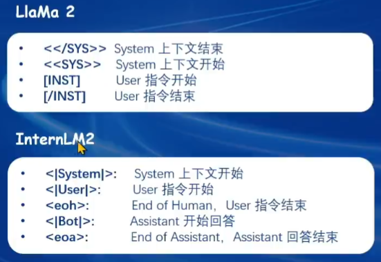​

​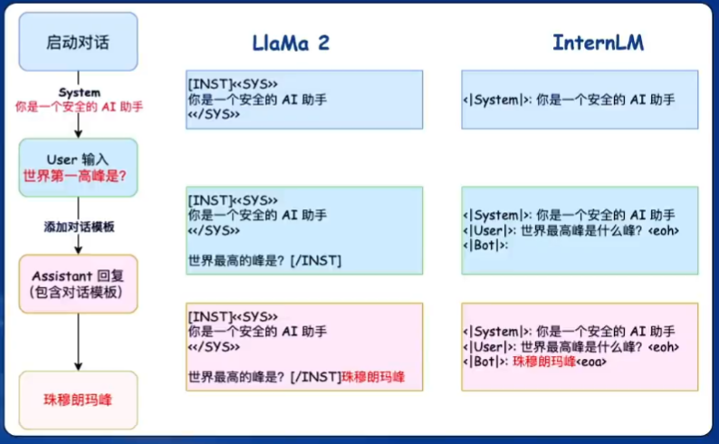​

â€

为了让LLM区分出，开始ä¸ç»“æŸï¼Œé—®é¢˜ä¸å›ç­”。需è¦è¿›è¡Œä¸€äº›é¢å¤–的标注。

​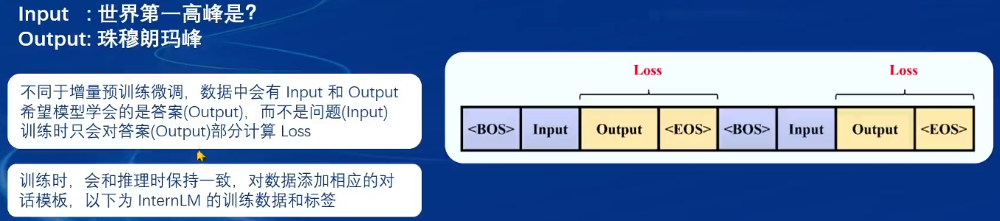​

​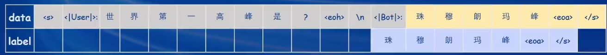​

â€

â€

## LoRAå’ŒQLoRA

LLMçš„å‚æ•°é‡ä¸»è¦é›†ä¸­åœ¨æ¨¡å‹ä¸­çš„Linear,训练这些å‚数会耗费大é‡çš„显存

LoRA通过在åŸæœ¬çš„Linearæ—，新å¢ä¸€ä¸ªæ”¯è·¯ï¼ŒåŒ…å«ä¸¤ä¸ªè¿ç»­çš„å°Linear,æ–°å¢çš„这个支路通常å«åšAdapter

Adapterå‚æ•°é‡è¿œå°äºåŸæœ¬çš„Linear,能大幅é™ä½è®­å·ç»ƒçš„显存消耗

​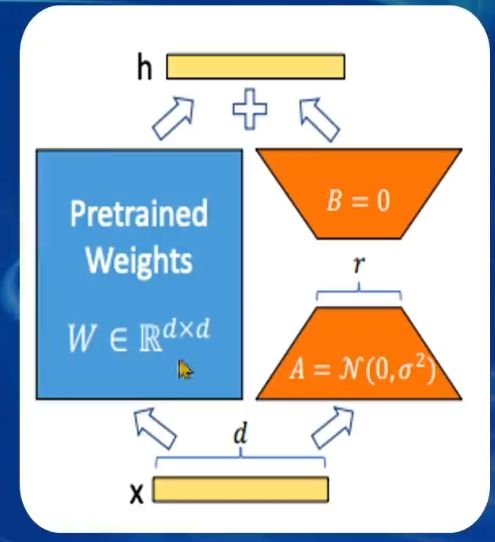​

â€

简å•çš„ç†è§£ï¼š

​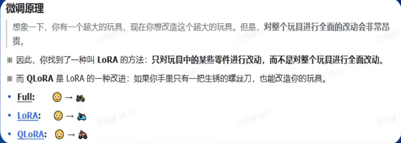​

â€

### 三ç§è®­ç»ƒæ–¹æ¡ˆå¯¹æ¯”

对比全å‚数微调，LoRAå’ŒQLoRA三ç§æ–¹å¼å¯¹æ¯”。

â€

​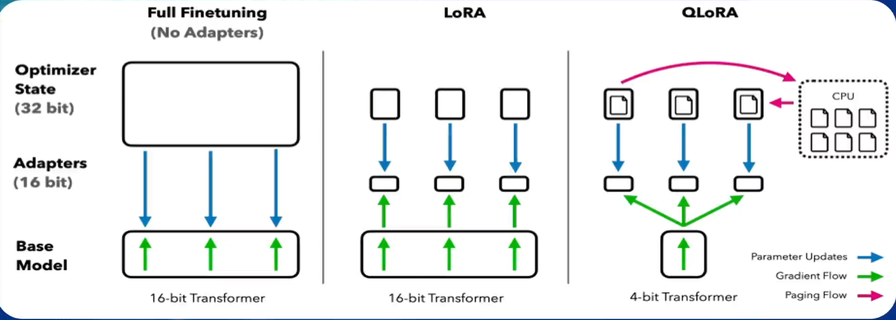​

å…¨å‚数：Base Modelå‚ä¸è®­ç»ƒå¹¶æ›´æ–°å‚数。需è¦ä¿å­˜Base Model中å‚数的优化器状æ€

LoRA：Base Modelåªå‚ä¸Forward。åªæœ‰Adapter部分Backwardæ›´æ–°å‚数。åªéœ€ä¿å­˜Adapter中å‚数的优化器状æ€

QLoRA：Base Modelé‡åŒ–为4-bit。优化器状æ€åœ¨CPUä¸GPUé—´Offload。Base Modelåªå‚ä¸Forward。åªæœ‰Adapter部分Backwardæ›´æ–°å‚数。åªéœ€ä¿å­˜Adapter中å‚数的优化器状æ€

â€

â€

# 微调工具XTuner

XTuner 一个大语言模å‹&多模æ€æ¨¡å‹å¾®è°ƒå·¥å…·ç®±ã€‚*ç”±* *MMRazor* *å’Œ* *MMDeploy* *è”åˆå¼€å‘。*

* 🤓 **傻瓜化：**  以 é…置文件 çš„å½¢å¼å°è£…了大部分微调场景，**0基础的é专业人员也能一键开始微调**。
* 🃠**è½»é‡çº§ï¼š**  å¯¹äº 7B å‚æ•°é‡çš„LLM，**微调所需的最å°æ˜¾å­˜ä»…为 8GB** ： **消费级显å¡âœ…，colab✅**

技术æ¶æ„图：

​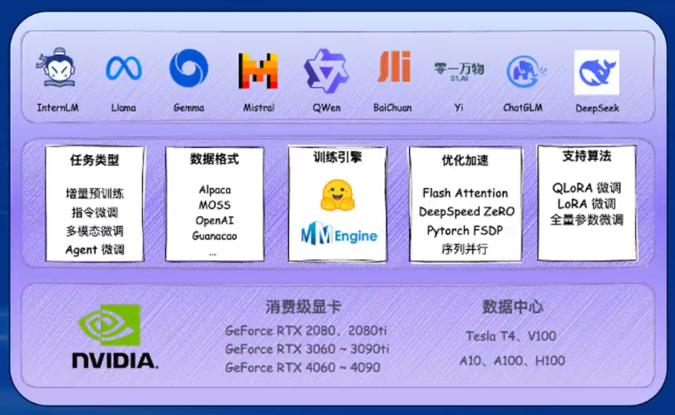​

* 多ç§å¾®è°ƒç®—法：多ç§å¾®è°ƒç­–ç•¥ä¸ç®—法，覆盖å„ç±»SFT场景适é…

  多ç§å¼€æºç”Ÿæ€ï¼šæ”¯æŒåŠ è½½HuggingFaceã€ModelScope模å‹æˆ–æ•°æ®é›†

  自动优化加速：开å‘者无需关注å¤æ‚的显存优化ä¸è®¡ç®—加速细节

* 适é…多ç§ç¡¬ä»¶ï¼š

  训练方案覆盖NVIDIA20ç³»ä»¥ä¸Šæ‰€æœ‰æ˜¾å¡  

  最ä½åªéœ€8GB显存å³å¯å¾®è°ƒ7B模å‹

â€

XTuner çš„è¿è¡ŒåŸç†ã€‚

​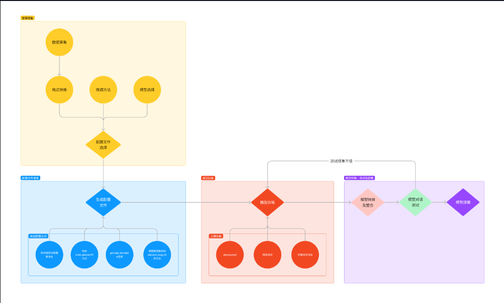​

â€

æ“作æ€è·¯ï¼š

1. **ç¯å¢ƒå®‰è£…**：第一步必然就是安装XTunerï¼
2. **å‰æœŸå‡†å¤‡**：æ˜ç¡®æˆ‘们自己的微调目标了。我们想è¦åˆ©ç”¨å¾®è°ƒåšä¸€äº›ä»€ä¹ˆäº‹æƒ…呢，那我为了åšåˆ°è¿™ä¸ªäº‹æƒ…我有哪些硬件的资æºå’Œæ•°æ®å‘¢ï¼Ÿå‡å¦‚我们有对äºä¸€ä»¶äº‹æƒ…相关的数æ®é›†ï¼Œå¹¶ä¸”我们还有足够的算力资æºï¼Œé‚£å½“然微调就是一件水到渠æˆçš„事情。但是对äºæ™®é€šçš„å¼€å‘者而言，在资æºæœ‰é™çš„情况下，我们å¯èƒ½å°±éœ€è¦è€ƒè™‘æ€ä¹ˆé‡‡é›†æ•°æ®ï¼Œç”¨ä»€ä¹ˆæ ·çš„手段和方å¼æ¥è®©æ¨¡å‹æœ‰æ›´å¥½çš„效æœã€‚
3. **å¯åŠ¨å¾®è°ƒ**：在确定了自己的微调目标å，我们就å¯ä»¥åœ¨ XTuner çš„é…置库中找到åˆé€‚çš„é…置文件并进行对应的修改。修改完æˆåå³å¯ä¸€é”®å¯åŠ¨è®­ç»ƒï¼è®­ç»ƒå¥½çš„模å‹ä¹Ÿå¯ä»¥ä»…仅通过在终端输入一行指令æ¥å®Œæˆè½¬æ¢å’Œéƒ¨ç½²å·¥ä½œï¼

â€

â€

## 快速上手

å¼€å‘机选择 10*A100 å³å¯

CUDA：11.7

â€

### 安装ä¸é…ç½®

1. **安装**

```python
pip install xtuner
```

2. **挑选é…置模æ¿**

```python
xtuner list-cfg -p internlm_1_8b
```

3. **一键训练**

```python
xtuner train internlm_1_8b_glora_oasst1_512_e3
```

Config命å规则

​​

â€

4. æ‹·è´é…ç½®æ¨¡æ¿  

    ```python
    xtuner copy-cfg internlm_20b_glora_oasst1_512_e3 ./
    ```
5. 修改é…ç½®æ¨¡æ¿  

    ```python
    vi internlm_20b_glora_oasst1_512_e3_copy.py
    ```
6. å¯åŠ¨è®­ç»ƒ

    ```python
    xtuner train internlm_20b_glora_oasst1_512_e3_copy.py
    ```

常用超å‚

​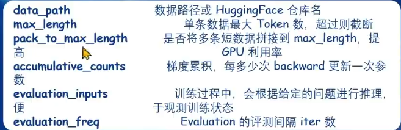​

â€

常用的基本é…ç½®

​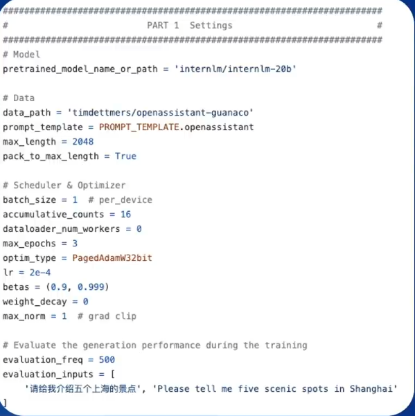​

â€

### 对è¯

7. 对è¯ï¼šä¸ºäº†ä¾¿äºå¼€å‘者查看训å·ç»ƒæ•ˆæœï¼ŒXtuneræ供了一键对è¯æ¥å£ã€‚​

    Float16模å‹å¯¹è¯

    â€

    ```python
    xtuner chat internlm/internlm-chat-20b
    ```

    4bit模å‹å¯¹è¯  

    ```python
    xtuner chat internlm/internlm-chat-20b --bits 4
    ```

    加载Adapter模å‹å¯¹è¯

    ```python
    xtuner chat internlm/internlm-chat-20b --adapater $ADAPTER DIR
    ```

â€

XTuner还支æŒå·¥å…·ç±»æ¨¡å‹çš„对è¯ï¼Œ

​​

â€

XTuneræ•°æ®å¼•æ“

将基本的对è¯å½¢å¼è‡ªåŠ¨è½¬åŒ–为，模å‹æ‰€æ”¯æŒçš„对è¯æ ¼å¼ã€‚

​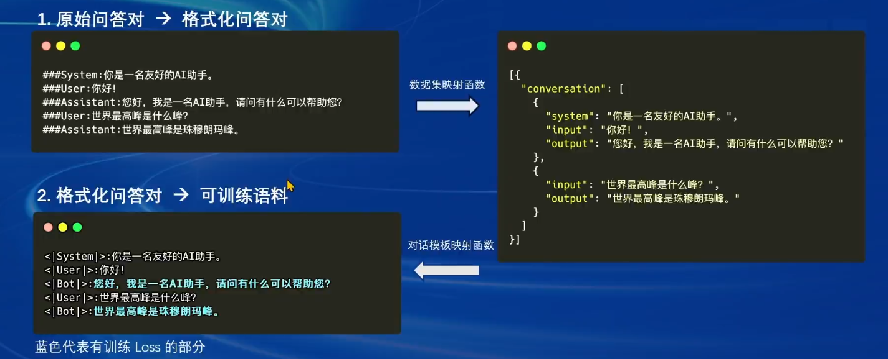​

â€

## 加速æ¨ç†åŸç†

Flash Attentionå’ŒDeepSpeed ZeRO是XTuner最é‡è¦çš„两个优化技巧

* Flash Attention（自动开å¯ï¼‰ï¼šFlash Attentionå°†Attention计算并行化，é¿å…了计算过程中Attention Score NxN的显存å ç”¨ï¼ˆè®­ç»ƒè¿‡ç¨‹ä¸­çš„N都比较大）

* **DeepSpeed ZeRO**（手动开å¯ï¼‰ï¼šZeRO优化，通过将训å·ç»ƒè¿‡ç¨‹ä¸­çš„å‚æ•°ã€æ¢¯åº¦å’Œä¼˜åŒ–器状æ€åˆ‡ç‰‡ä¿å­˜ï¼Œèƒ½å¤Ÿåœ¨å¤šGPU训练时显著节çœæ˜¾å­˜ã€‚

  除了将训练中间状æ€åˆ‡ç‰‡å¤–DeepSpeed训练时使用FP16çš„æƒé‡ï¼Œç›¸è¾ƒäºPytorchçš„AMP训练，在å•GPU上也能大幅节çœæ˜¾å­˜

通过XTunerå³å¯å¿«é€Ÿç®€å•çš„å¼€å¯ä¼˜åŒ–。

​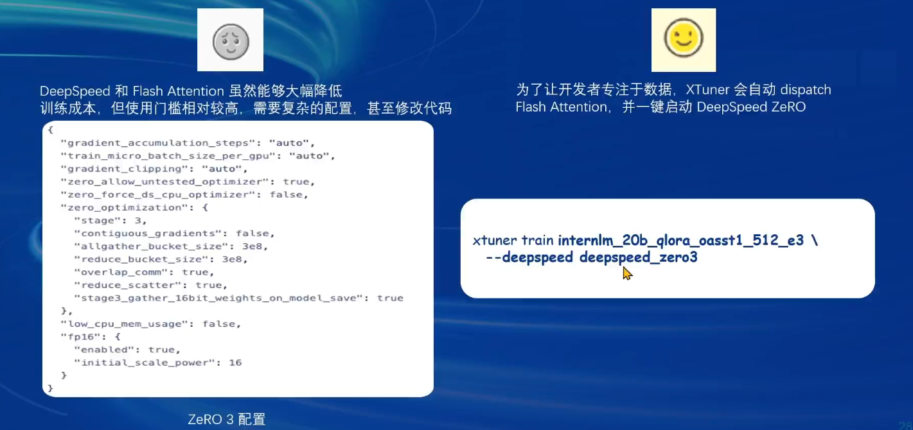​

â€

â€

## 微调å®æˆ˜

基äºInternLM2 1.8Bæ¥è¿›è¡Œå¾®è°ƒ

​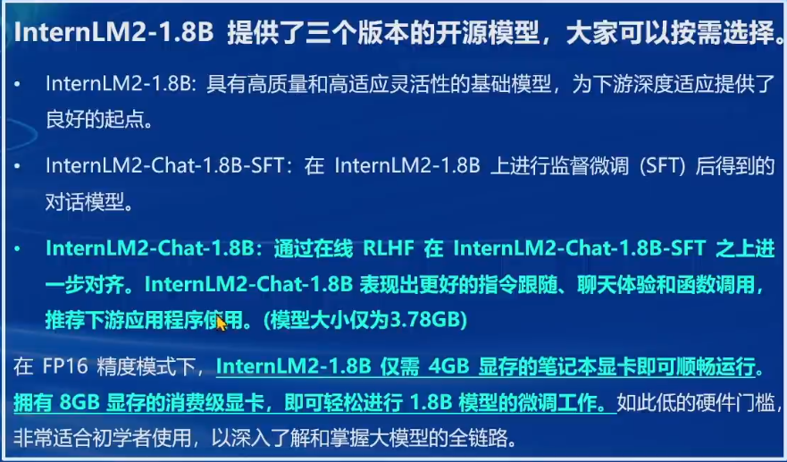​

â€

### 2.1 ç¯å¢ƒå®‰è£…

首先我们需è¦å…ˆå®‰è£…一个 XTuner çš„æºç åˆ°æœ¬åœ°æ¥æ–¹ä¾¿å续的使用。

```shell
# 如æœä½ æ˜¯åœ¨ InternStudio å¹³å°ï¼Œåˆ™ä»æœ¬åœ° clone 一个已有 pytorch çš„ç¯å¢ƒï¼š
# pytorch    2.0.1   py3.10_cuda11.7_cudnn8.5.0_0

studio-conda xtuner0.1.17
# 如æœä½ æ˜¯åœ¨å…¶ä»–å¹³å°ï¼š
# conda create --name xtuner0.1.17 python=3.10 -y

# 激活ç¯å¢ƒ
conda activate xtuner0.1.17
# 进入家目录 （~çš„æ„æ€æ˜¯ “当å‰ç”¨æˆ·çš„home路径â€ï¼‰
cd ~
# 创建版本文件夹并进入，以跟éšæœ¬æ•™ç¨‹
mkdir -p /root/xtuner0117 && cd /root/xtuner0117

# æ‹‰å– 0.1.17 的版本æºç 
git clone -b v0.1.17  https://github.com/InternLM/xtuner
# 无法访问githubçš„ç”¨æˆ·è¯·ä» gitee 拉å–:
# git clone -b v0.1.15 https://gitee.com/Internlm/xtuner

# 进入æºç ç›®å½•
cd /root/xtuner0117/xtuner

# ä»æºç å®‰è£… XTuner
pip install -e '.[all]'
```

> å‡å¦‚速度太慢å¯ä»¥ `Ctrl + C`​​ 退出åæ¢æˆ `pip install -e '.[all]' -i https://mirrors.aliyun.com/pypi/simple/`​​

â€

### 2.2 å‰æœŸå‡†å¤‡

#### 2.2.1 æ•°æ®é›†å‡†å¤‡

> 没有å®é™…çš„å¯ç”¨æ•°æ®é›†ï¼Œæ‰€ä»¥å°±ç®€å•çš„基äºä¸€ä¸ªè®¤çŸ¥ç¤ºä¾‹æ¥å®Œæˆå¾®è°ƒä»»åŠ¡ã€‚

为了让模å‹èƒ½å¤Ÿè®©æ¨¡å‹è®¤æ¸…自己的身份弟ä½ï¼ŒçŸ¥é“在询问自己是è°çš„时候å›å¤æˆæˆ‘们想è¦çš„æ ·å­ï¼Œæˆ‘们就需è¦é€šè¿‡åœ¨å¾®è°ƒæ•°æ®é›†ä¸­å¤§é‡æºæ‚这部分的数æ®ã€‚

首先我们先创建一个文件夹æ¥å­˜æ”¾æˆ‘们这次训练所需è¦çš„所有文件。

```shell
# å‰åŠéƒ¨åˆ†æ˜¯åˆ›å»ºä¸€ä¸ªæ–‡ä»¶å¤¹ï¼ŒååŠéƒ¨åˆ†æ˜¯è¿›å…¥è¯¥æ–‡ä»¶å¤¹ã€‚
mkdir -p /root/ft && cd /root/ft

# 在ft这个文件夹里å†åˆ›å»ºä¸€ä¸ªå­˜æ”¾æ•°æ®çš„data文件夹
mkdir -p /root/ft/data && cd /root/ft/data
```

之å我们å¯ä»¥åœ¨ `data`​ 目录下新建一个 `generate_data.py`​ 文件，将以下代ç å¤åˆ¶è¿›å»ï¼Œç„¶åè¿è¡Œè¯¥è„šæœ¬å³å¯ç”Ÿæˆæ•°æ®é›†ã€‚å‡å¦‚想è¦åŠ å¤§å‰‚é‡è®©ä»–能够完完全全认识到你的身份，那我们å¯ä»¥å§ `n`​ 的值调大一点。

```shell
# 创建 `generate_data.py` 文件
touch /root/ft/data/generate_data.py
```

命令行的方å¼ç¼–辑文件（建议还是学过的人å†ä½¿ç”¨å§ï¼‰ï¼Œç²˜è´´ä¸‹é¢çš„内容å `ESC`​  `:wq`​

```python
vim generate_data.py
```

打开该 python 文件å将下é¢çš„内容å¤åˆ¶è¿›å»ã€‚

```python
import json

# 设置用户的åå­—
name = 'ä¸è¦å§œè‘±è’œå¤§ä½¬'
# 设置需è¦é‡å¤æ·»åŠ çš„æ•°æ®æ¬¡æ•°
n =  10000

# åˆå§‹åŒ–OpenAIæ ¼å¼çš„æ•°æ®ç»“æ„
data = [
    {
        "messages": [
            {
                "role": "user",
                "content": "请åšä¸€ä¸‹è‡ªæˆ‘介ç»"
            },
            {
                "role": "assistant",
                "content": "我是{}çš„å°åŠ©æ‰‹ï¼Œå†…在是上海AIå®éªŒå®¤ä¹¦ç”ŸÂ·æµ¦è¯­çš„1.8B大模å‹å“¦".format(name)
            }
        ]
    }
]

# 通过循ç¯ï¼Œå°†åˆå§‹åŒ–的对è¯æ•°æ®é‡å¤æ·»åŠ åˆ°data列表中
for i in range(n):
    data.append(data[0])

# å°†data列表中的数æ®å†™å…¥åˆ°ä¸€ä¸ªå为'personal_assistant.json'的文件中
with open('personal_assistant.json', 'w', encoding='utf-8') as f:
    # 使用json.dump方法将数æ®ä»¥JSONæ ¼å¼å†™å…¥æ–‡ä»¶
    # ensure_ascii=False ç¡®ä¿ä¸­æ–‡å­—符正常显示
    # indent=4 使得文件内容格å¼åŒ–，便äºé˜…读
    json.dump(data, f, ensure_ascii=False, indent=4)
```

并将文件 `name`​ åé¢çš„内容修改为你的å称。比如说我是剑锋大佬的è¯å°±æ˜¯ï¼š

```diff
# 将对应的name进行修改（在第4行的ä½ç½®ï¼‰
- name = 'ä¸è¦å§œè‘±è’œå¤§ä½¬'
+ name = "剑锋大佬"
```

修改完æˆåè¿è¡Œ `generate_data.py`​ 文件å³å¯ã€‚

```shell
# ç¡®ä¿å…ˆè¿›å…¥è¯¥æ–‡ä»¶å¤¹
cd /root/ft/data

# è¿è¡Œä»£ç 
python /root/ft/data/generate_data.py
```

data的路径下便生æˆäº†ä¸€ä¸ªå为 `personal_assistant.json`​ 的文件，里é¢å°±åŒ…å«äº† 5000 æ¡ `input`​ å’Œ `output`​ çš„å¯ç”¨äºå¾®è°ƒçš„æ•°æ®å¯¹ã€‚å‡å¦‚ 我们认为 5000 æ¡ä¸å¤Ÿçš„è¯ä¹Ÿå¯ä»¥è°ƒæ•´æ–‡ä»¶ä¸­ç¬¬6è¡Œ `n`​ 的值哦ï¼

```
|-- data/
    |-- personal_assistant.json
    |-- generate_data.py
```

éå¿…è¦æ­¥éª¤ï¼š

​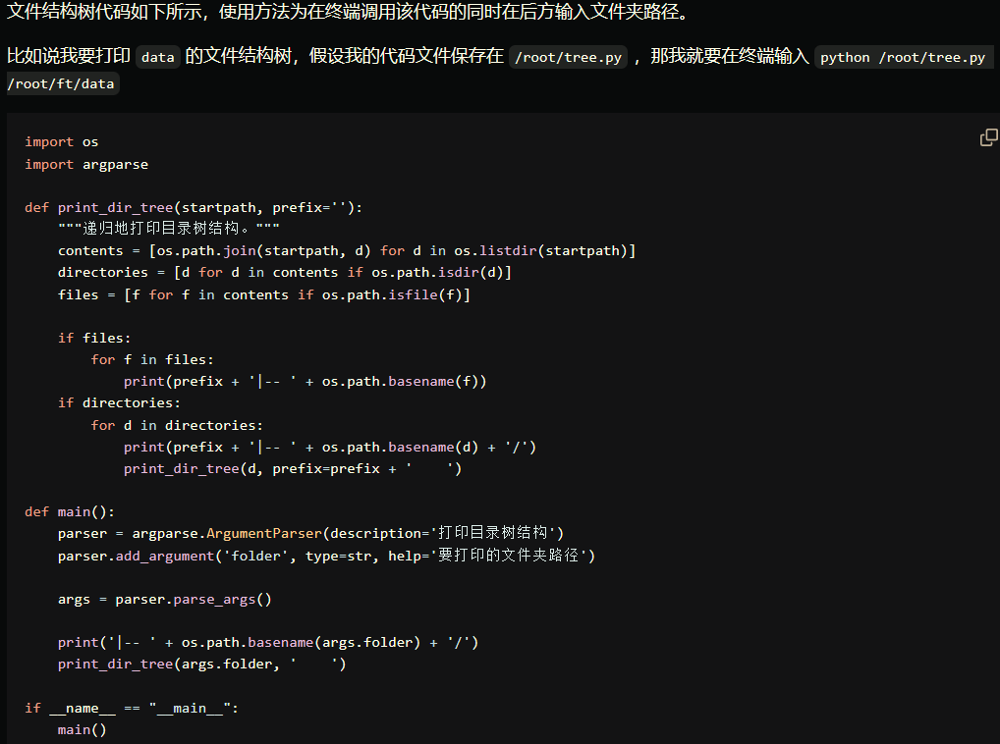​

â€

> 除了我们自己通过脚本的数æ®é›†ï¼Œå…¶å®ç½‘上也有大é‡çš„å¼€æºæ•°æ®é›†å¯ä»¥ä¾›æˆ‘们进行使用。有些时候我们å¯ä»¥åœ¨å¼€æºæ•°æ®é›†çš„基础上添加一些我们自己独有的数æ®é›†ï¼Œä¹Ÿå¯èƒ½ä¼šæœ‰å¾ˆå¥½çš„效æœã€‚

â€

#### 2.2.2 模å‹å‡†å¤‡

在准备好了数æ®é›†å，æ¥ä¸‹æ¥å‡†å¤‡å¾®è°ƒçš„模å‹ã€‚

ç”±äºæœ¬æ¬¡è¯¾ç¨‹æ˜¾å­˜æ–¹é¢çš„é™åˆ¶ï¼Œè¿™é‡Œæˆ‘们就使用 InternLM 最新æ¨å‡ºçš„å°æ¨¡å‹ `InterLM2-Chat-1.8B`​ æ¥å®Œæˆæ­¤æ¬¡çš„微调演示。

对äºåœ¨ InternStudio 上è¿è¡Œçš„å°ä¼™ä¼´ä»¬ï¼Œå¯ä»¥ä¸ç”¨é€šè¿‡ OpenXLab 或者 Modelscope 进行模å‹çš„下载。我们直æ¥é€šè¿‡ä»¥ä¸‹ä»£ç ä¸€é”®åˆ›å»ºæ–‡ä»¶å¤¹å¹¶å°†æ‰€æœ‰æ–‡ä»¶å¤åˆ¶è¿›å»ã€‚

```shell
# 创建目标文件夹，确ä¿å®ƒå­˜åœ¨ã€‚
# -p选项æ„味ç€å¦‚æœä¸Šçº§ç›®å½•ä¸å­˜åœ¨ä¹Ÿä¼šä¸€å¹¶åˆ›å»ºï¼Œä¸”如æœç›®æ ‡æ–‡ä»¶å¤¹å·²å­˜åœ¨åˆ™ä¸ä¼šæŠ¥é”™ã€‚
mkdir -p /root/ft/model

# å¤åˆ¶å†…容到目标文件夹。-r选项表示递归å¤åˆ¶æ•´ä¸ªæ–‡ä»¶å¤¹ã€‚
cp -r /root/share/new_models/Shanghai_AI_Laboratory/internlm2-chat-1_8b/* /root/ft/model/
```

通过刚æ‰çš„éå†ä»£ç æŸ¥çœ‹ï¼Œå¯ä»¥çœ‹åˆ°åœ¨ model 文件夹下ä¿å­˜äº†æ¨¡å‹çš„相关文件和内容了。

```
|-- model/
    |-- tokenizer.model
    |-- config.json
    |-- tokenization_internlm2.py
    |-- model-00002-of-00002.safetensors
    |-- tokenizer_config.json
    |-- model-00001-of-00002.safetensors
    |-- model.safetensors.index.json
    |-- configuration.json
    |-- special_tokens_map.json
    |-- modeling_internlm2.py
    |-- README.md
    |-- configuration_internlm2.py
    |-- generation_config.json
    |-- tokenization_internlm2_fast.py
```

å‡å¦‚大家存储空间ä¸è¶³ï¼Œæˆ‘们也å¯ä»¥é€šè¿‡ä»¥ä¸‹ä»£ç ä¸€é”®é€šè¿‡ç¬¦å·é“¾æ¥çš„æ–¹å¼é“¾æ¥åˆ°æ¨¡å‹æ–‡ä»¶ï¼Œè¿™æ ·æ—¢èŠ‚çœäº†ç©ºé—´ï¼Œä¹Ÿä¾¿äºç®¡ç†ã€‚

```shell
# 删除/root/ft/model目录
rm -rf /root/ft/model

# 创建符å·é“¾æ¥
ln -s /root/share/new_models/Shanghai_AI_Laboratory/internlm2-chat-1_8b /root/ft/model
```

执行上述æ“作å，`/root/ft/model`​ 将直æ¥æˆä¸ºä¸€ä¸ªç¬¦å·é“¾æ¥ï¼Œè¿™ä¸ªé“¾æ¥æŒ‡å‘ `/root/share/new_models/Shanghai_AI_Laboratory/internlm2-chat-1_8b`​ çš„ä½ç½®ã€‚

è¿™æ„味ç€ï¼Œå½“我们访问 `/root/ft/model`​ 时，å®é™…上就是在访问 `/root/share/new_models/Shanghai_AI_Laboratory/internlm2-chat-1_8b`​ 目录下的内容。通过这ç§æ–¹å¼ï¼Œæˆ‘们无需å¤åˆ¶ä»»ä½•æ•°æ®ï¼Œå°±å¯ä»¥ç›´æ¥åˆ©ç”¨ç°æœ‰çš„模å‹æ–‡ä»¶è¿›è¡Œå续的微调æ“作，ä»è€ŒèŠ‚çœå­˜å‚¨ç©ºé—´å¹¶ç®€åŒ–文件管ç†ã€‚

在该情况下的文件结æ„如下所示，å¯ä»¥çœ‹åˆ°å’Œä¸Šé¢çš„区别在äºå¤šäº†ä¸€äº›è½¯é“¾æ¥ç›¸å…³çš„文件。

```
|-- model/
    |-- tokenizer.model
    |-- config.json
    |-- .mdl
    |-- tokenization_internlm2.py
    |-- model-00002-of-00002.safetensors
    |-- tokenizer_config.json
    |-- model-00001-of-00002.safetensors
    |-- model.safetensors.index.json
    |-- configuration.json
    |-- .msc
    |-- special_tokens_map.json
    |-- .mv
    |-- modeling_internlm2.py
    |-- README.md
    |-- configuration_internlm2.py
    |-- generation_config.json
    |-- tokenization_internlm2_fast.py
```

#### 2.2.3 é…置文件选择

在准备好了模å‹å’Œæ•°æ®é›†å，我们就è¦æ ¹æ®æˆ‘们选择的微调方法方法结åˆå‰é¢çš„ä¿¡æ¯æ¥æ‰¾åˆ°ä¸æˆ‘们最匹é…çš„é…置文件了，ä»è€Œå‡å°‘我们对é…置文件的修改é‡ã€‚

所谓é…置文件（config），其å®æ˜¯ä¸€ç§ç”¨äºå®šä¹‰å’Œæ§åˆ¶æ¨¡å‹è®­ç»ƒå’Œæµ‹è¯•è¿‡ç¨‹ä¸­å„个方é¢çš„å‚数和设置的工具。准备好的é…置文件åªè¦è¿è¡Œèµ·æ¥å°±ä»£è¡¨ç€æ¨¡å‹å°±å¼€å§‹è®­ç»ƒæˆ–者微调了。

XTuner æ供多个开箱å³ç”¨çš„é…置文件，用户å¯ä»¥é€šè¿‡ä¸‹åˆ—命令查看：

> 开箱å³ç”¨æ„味ç€å‡å¦‚能够è¿æ¥ä¸Š Huggingface 以åŠæœ‰è¶³å¤Ÿçš„显存，其å®å°±å¯ä»¥ç›´æ¥è¿è¡Œè¿™äº›é…置文件，XTuner就能够直æ¥ä¸‹è½½å¥½è¿™äº›æ¨¡å‹å’Œæ•°æ®é›†ç„¶å开始进行微调

```shell
# 列出所有内置é…置文件
# xtuner list-cfg

# å‡å¦‚我们想找到 internlm2-1.8b 模å‹é‡Œæ”¯æŒçš„é…置文件
xtuner list-cfg -p internlm2_1_8b
```

分别是全é‡å¾®è°ƒå’Œqlora微调的两个模å‹ï¼Œalpacaæ•°æ®é›†ï¼Œe3就是三轮的仪å¼ã€‚

​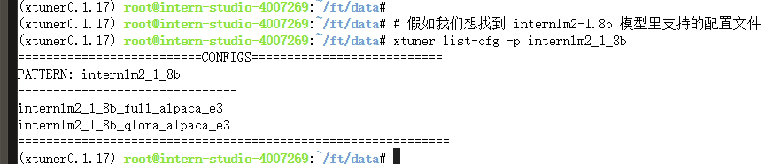​

â€

> 这里就用到了第一个 XTuner 的工具 `list-cfg`​ ，对äºè¿™ä¸ªå·¥å…·è€Œè¨€ï¼Œå¯ä»¥é€‰æ‹©ä¸æ·»åŠ é¢å¤–çš„å‚数，就åƒä¸Šé¢çš„一样，这样就会将所有的é…置文件都打å°å‡ºæ¥ã€‚é‚£åŒæ—¶ä¹Ÿå¯ä»¥åŠ ä¸Šä¸€ä¸ªå‚æ•° `-p`​ 或 `--pattern`​ ，åé¢è¾“入的内容将会在所有的 config 文件里进行模糊匹é…æœç´¢ï¼Œç„¶åè¿”å›æœ€æœ‰å¯èƒ½å¾—内容。我们å¯ä»¥ç”¨æ¥æœç´¢ç‰¹å®šæ¨¡å‹çš„é…置文件，比如例å­ä¸­çš„ internlm2_1_8b ,也å¯ä»¥ç”¨æ¥æœç´¢åƒæ˜¯å¾®è°ƒæ–¹æ³• qlora 。 æ ¹æ®ä¸Šé¢çš„定å‘æœç´¢æŒ‡ä»¤å¯ä»¥çœ‹åˆ°ç›®å‰åªæœ‰ä¸¤ä¸ªæ”¯æŒ internlm2-1.8B 的模å‹é…置文件。
>
> â€

é…置文件å的解释：

虽然我们用的数æ®é›†å¹¶ä¸æ˜¯ `alpaca`​ 而是我们自己通过脚本制作的å°åŠ©æ‰‹æ•°æ®é›† ，但是由äºæˆ‘们是通过 `QLoRA`​ çš„æ–¹å¼å¯¹ `internlm2-chat-1.8b`​ 进行微调。而最相近的é…置文件应该就是 `internlm2_1_8b_qlora_alpaca_e3`​ ，因此我们å¯ä»¥é€‰æ‹©æ‹·è´è¿™ä¸ªé…置文件到当å‰ç›®å½•ï¼š

```shell
# 创建一个存放 config 文件的文件夹
mkdir -p /root/ft/config

# 使用 XTuner 中的 copy-cfg 功能将 config 文件å¤åˆ¶åˆ°æŒ‡å®šçš„ä½ç½®
xtuner copy-cfg internlm2_1_8b_qlora_alpaca_e3 /root/ft/config
```

> 这里我们就用到了 XTuner 工具箱中的第二个工具 `copy-cfg`​ ，该工具有两个必须è¦å¡«å†™çš„å‚æ•° `{CONFIG_NAME}`​ å’Œ `{SAVE_PATH}`​ ，在我们的输入的这个指令中，我们的 `{CONFIG_NAME}`​ 对应的是上é¢æœç´¢åˆ°çš„ `internlm2_1_8b_qlora_alpaca_e3`​ ,而 `{SAVE_PATH}`​ 则对应的是刚刚新建的 `/root/ft/config`​。我们å‡å¦‚需è¦å¤åˆ¶å…¶ä»–çš„é…置文件åªéœ€è¦ä¿®æ”¹è¿™ä¸¤ä¸ªå‚æ•°å³å¯å®ç°ã€‚ 输入å我们就能够看到在我们的 `/root/ft/config`​ 文件夹下有一个å为 `internlm2_1_8b_qlora_alpaca_e3_copy.py`​ 的文件了。

```
|-- config/
    |-- internlm2_1_8b_qlora_alpaca_e3_copy.py
```

#### 2.2.4 å°ç»“

ç»è¿‡äº†ä»¥ä¸Šçš„步骤å，我们的 `ft`​ 文件夹里应该是这样的：

```
|-- ft/
    |-- config/
        |-- internlm2_1_8b_qlora_alpaca_e3_copy.py
    |-- model/
        |-- tokenizer.model
        |-- config.json
        |-- tokenization_internlm2.py
        |-- model-00002-of-00002.safetensors
        |-- tokenizer_config.json
        |-- model-00001-of-00002.safetensors
        |-- model.safetensors.index.json
        |-- configuration.json
        |-- special_tokens_map.json
        |-- modeling_internlm2.py
        |-- README.md
        |-- configuration_internlm2.py
        |-- generation_config.json
        |-- tokenization_internlm2_fast.py
    |-- data/
        |-- personal_assistant.json
        |-- generate_data.py
```

是ä¸æ˜¯æ„Ÿè§‰å…¶å®å¾®è°ƒä¹Ÿä¸è¿‡å¦‚æ­¤ï¼äº‹å®ä¸Šç¡®å®æ˜¯è¿™æ ·çš„ï¼å…¶å®åœ¨å¾®è°ƒçš„时候最é‡è¦çš„还是è¦è‡ªå·±å‡†å¤‡ä¸€ä»½é«˜è´¨é‡çš„æ•°æ®é›†ï¼Œè¿™ä¸ªæ‰æ˜¯ä½ èƒ½å¦çœŸå¾®è°ƒå‡ºæ•ˆæœæœ€æ ¸å¿ƒçš„利器。

微调也ç»å¸¸è¢«æˆç§°ä¸ºæ˜¯ç‚¼ä¸¹ï¼Œå°±æ˜¯è¯´ä½ ç‚¼ä¸¹çš„时候你得æ€è€ƒå¥½ç”¨ä»€ä¹ˆæ ·çš„ææ–™ã€ç”¨å¤šå¤§çš„ç«å€™ã€çƒ¤å¤šä¹…的时间以åŠç”¨ä»€ä¹ˆä¸¹ç‚‰å»çƒ§ã€‚这里的丹炉其å®æˆ‘们å¯ä»¥æƒ³è±¡ä¸º XTuner ，åªè¦ä¸¹ç‚‰çš„è´¨é‡è¿‡å¾—å»ï¼Œç‚¼ä¸¹çš„时候ä¸ä¼šç‚¸ï¼Œä¸€èˆ¬éƒ½æ˜¯æ²¡é—®é¢˜çš„。但是å‡å¦‚炼丹的æ料（就是数æ®é›†ï¼‰æœ¬æ¥å°±æ˜¯åƒåœ¾ï¼Œé‚£æ— è®ºæ€ä¹ˆç‚¼ï¼ˆå¾®è°ƒå‚数的调整），炼多久（训练的轮数），炼出æ¥çš„东西还åªèƒ½ä¸”åªä¼šæ˜¯åƒåœ¾ã€‚åªæœ‰è¯´ç”¨äº†æ¯”较好的æ料，那么我们就å¯ä»¥è€ƒè™‘说è¦ç‚¼å¤šä¹…以åŠç”¨ä»€ä¹ˆåŠæ³•å»ç‚¼çš„问题。因此总的æ¥è¯´ï¼Œå­¦ä¼šå¦‚何æ„建一份高质é‡çš„æ•°æ®é›†æ˜¯è‡³å…³é‡è¦çš„。

â€

### 2.3 é…置文件修改

在选择了一个最匹é…çš„é…置文件并准备好其他内容å，下é¢æˆ‘们è¦åšçš„事情就是根æ®æˆ‘们自己的内容对该é…置文件进行调整，使其能够满足我们å®é™…训练的è¦æ±‚。

* é…置文件介ç»

通过折å éƒ¨åˆ†çš„修改，内容如下，å¯ä»¥ç›´æ¥å°†ä»¥ä¸‹ä»£ç å¤åˆ¶åˆ° `/root/ft/config/internlm2_1_8b_qlora_alpaca_e3_copy.py`​ 文件中（先 `Ctrl + A`​ 选中所有文件并删除åå†å°†ä»£ç å¤åˆ¶è¿›å»ï¼‰ã€‚

* å‚数修改细节

â€

```python
# Copyright (c) OpenMMLab. All rights reserved.
import torch
from datasets import load_dataset
from mmengine.dataset import DefaultSampler
from mmengine.hooks import (CheckpointHook, DistSamplerSeedHook, IterTimerHook,
                            LoggerHook, ParamSchedulerHook)
from mmengine.optim import AmpOptimWrapper, CosineAnnealingLR, LinearLR
from peft import LoraConfig
from torch.optim import AdamW
from transformers import (AutoModelForCausalLM, AutoTokenizer,
                          BitsAndBytesConfig)

from xtuner.dataset import process_hf_dataset
from xtuner.dataset.collate_fns import default_collate_fn
from xtuner.dataset.map_fns import openai_map_fn, template_map_fn_factory
from xtuner.engine.hooks import (DatasetInfoHook, EvaluateChatHook,
                                 VarlenAttnArgsToMessageHubHook)
from xtuner.engine.runner import TrainLoop
from xtuner.model import SupervisedFinetune
from xtuner.parallel.sequence import SequenceParallelSampler
from xtuner.utils import PROMPT_TEMPLATE, SYSTEM_TEMPLATE

#######################################################################
#                          PART 1  Settings                           #
#######################################################################
# Model
pretrained_model_name_or_path = '/root/ft/model'
use_varlen_attn = False

# Data
alpaca_en_path = '/root/ft/data/personal_assistant.json'
prompt_template = PROMPT_TEMPLATE.default
max_length = 1024
pack_to_max_length = True

# parallel
sequence_parallel_size = 1

# Scheduler & Optimizer
batch_size = 1  # per_device
accumulative_counts = 16
accumulative_counts *= sequence_parallel_size
dataloader_num_workers = 0
max_epochs = 2
optim_type = AdamW
lr = 2e-4
betas = (0.9, 0.999)
weight_decay = 0
max_norm = 1  # grad clip
warmup_ratio = 0.03

# Save
save_steps = 300
save_total_limit = 3  # Maximum checkpoints to keep (-1 means unlimited)

# Evaluate the generation performance during the training
evaluation_freq = 300
SYSTEM = ''
evaluation_inputs = ['请你介ç»ä¸€ä¸‹ä½ è‡ªå·±', '你是è°', '你是我的å°åŠ©æ‰‹å—']

#######################################################################
#                      PART 2  Model & Tokenizer                      #
#######################################################################
tokenizer = dict(
    type=AutoTokenizer.from_pretrained,
    pretrained_model_name_or_path=pretrained_model_name_or_path,
    trust_remote_code=True,
    padding_side='right')

model = dict(
    type=SupervisedFinetune,
    use_varlen_attn=use_varlen_attn,
    llm=dict(
        type=AutoModelForCausalLM.from_pretrained,
        pretrained_model_name_or_path=pretrained_model_name_or_path,
        trust_remote_code=True,
        torch_dtype=torch.float16,
        quantization_config=dict(
            type=BitsAndBytesConfig,
            load_in_4bit=True,
            load_in_8bit=False,
            llm_int8_threshold=6.0,
            llm_int8_has_fp16_weight=False,
            bnb_4bit_compute_dtype=torch.float16,
            bnb_4bit_use_double_quant=True,
            bnb_4bit_quant_type='nf4')),
    lora=dict(
        type=LoraConfig,
        r=64,
        lora_alpha=16,
        lora_dropout=0.1,
        bias='none',
        task_type='CAUSAL_LM'))

#######################################################################
#                      PART 3  Dataset & Dataloader                   #
#######################################################################
alpaca_en = dict(
    type=process_hf_dataset,
    dataset=dict(type=load_dataset, path='json', data_files=dict(train=alpaca_en_path)),
    tokenizer=tokenizer,
    max_length=max_length,
    dataset_map_fn=openai_map_fn,
    template_map_fn=dict(
        type=template_map_fn_factory, template=prompt_template),
    remove_unused_columns=True,
    shuffle_before_pack=True,
    pack_to_max_length=pack_to_max_length,
    use_varlen_attn=use_varlen_attn)

sampler = SequenceParallelSampler \
    if sequence_parallel_size > 1 else DefaultSampler
train_dataloader = dict(
    batch_size=batch_size,
    num_workers=dataloader_num_workers,
    dataset=alpaca_en,
    sampler=dict(type=sampler, shuffle=True),
    collate_fn=dict(type=default_collate_fn, use_varlen_attn=use_varlen_attn))

#######################################################################
#                    PART 4  Scheduler & Optimizer                    #
#######################################################################
# optimizer
optim_wrapper = dict(
    type=AmpOptimWrapper,
    optimizer=dict(
        type=optim_type, lr=lr, betas=betas, weight_decay=weight_decay),
    clip_grad=dict(max_norm=max_norm, error_if_nonfinite=False),
    accumulative_counts=accumulative_counts,
    loss_scale='dynamic',
    dtype='float16')

# learning policy
# More information: https://github.com/open-mmlab/mmengine/blob/main/docs/en/tutorials/param_scheduler.md  # noqa: E501
param_scheduler = [
    dict(
        type=LinearLR,
        start_factor=1e-5,
        by_epoch=True,
        begin=0,
        end=warmup_ratio * max_epochs,
        convert_to_iter_based=True),
    dict(
        type=CosineAnnealingLR,
        eta_min=0.0,
        by_epoch=True,
        begin=warmup_ratio * max_epochs,
        end=max_epochs,
        convert_to_iter_based=True)
]

# train, val, test setting
train_cfg = dict(type=TrainLoop, max_epochs=max_epochs)

#######################################################################
#                           PART 5  Runtime                           #
#######################################################################
# Log the dialogue periodically during the training process, optional
custom_hooks = [
    dict(type=DatasetInfoHook, tokenizer=tokenizer),
    dict(
        type=EvaluateChatHook,
        tokenizer=tokenizer,
        every_n_iters=evaluation_freq,
        evaluation_inputs=evaluation_inputs,
        system=SYSTEM,
        prompt_template=prompt_template)
]

if use_varlen_attn:
    custom_hooks += [dict(type=VarlenAttnArgsToMessageHubHook)]

# configure default hooks
default_hooks = dict(
    # record the time of every iteration.
    timer=dict(type=IterTimerHook),
    # print log every 10 iterations.
    logger=dict(type=LoggerHook, log_metric_by_epoch=False, interval=10),
    # enable the parameter scheduler.
    param_scheduler=dict(type=ParamSchedulerHook),
    # save checkpoint per `save_steps`.
    checkpoint=dict(
        type=CheckpointHook,
        by_epoch=False,
        interval=save_steps,
        max_keep_ckpts=save_total_limit),
    # set sampler seed in distributed evrionment.
    sampler_seed=dict(type=DistSamplerSeedHook),
)

# configure environment
env_cfg = dict(
    # whether to enable cudnn benchmark
    cudnn_benchmark=False,
    # set multi process parameters
    mp_cfg=dict(mp_start_method='fork', opencv_num_threads=0),
    # set distributed parameters
    dist_cfg=dict(backend='nccl'),
)

# set visualizer
visualizer = None

# set log level
log_level = 'INFO'

# load from which checkpoint
load_from = None

# whether to resume training from the loaded checkpoint
resume = False

# Defaults to use random seed and disable `deterministic`
randomness = dict(seed=None, deterministic=False)

# set log processor
log_processor = dict(by_epoch=False)
```

这一节我们讲述了微调过程中一些常è§çš„需è¦è°ƒæ•´çš„内容，包括å„ç§çš„路径ã€è¶…å‚æ•°ã€è¯„估问题等等。完æˆäº†è¿™éƒ¨åˆ†çš„修改å，我们就å¯ä»¥æ­£å¼çš„开始我们下一阶段的旅程： XTuner å¯åŠ¨~ï¼

â€

### 2.4 模å‹è®­ç»ƒ

#### 2.4.1 常规训练

当我们准备好了é…置文件好，我们åªéœ€è¦å°†ä½¿ç”¨ `xtuner train`​ 指令å³å¯å¼€å§‹è®­ç»ƒã€‚

我们å¯ä»¥é€šè¿‡æ·»åŠ  `--work-dir`​ 指定特定的文件ä¿å­˜ä½ç½®ï¼Œæ¯”如说就ä¿å­˜åœ¨ `/root/ft/train`​ 路径下。å‡å¦‚ä¸æ·»åŠ çš„è¯æ¨¡å‹è®­ç»ƒçš„过程文件将默认ä¿å­˜åœ¨ `./work_dirs/internlm2_1_8b_qlora_alpaca_e3_copy`​ çš„ä½ç½®ï¼Œå°±æ¯”如说我是在 `/root/ft/train`​ 的路径下输入该指令，那么我的文件ä¿å­˜çš„ä½ç½®å°±æ˜¯åœ¨ `/root/ft/train/work_dirs/internlm2_1_8b_qlora_alpaca_e3_copy`​ çš„ä½ç½®ä¸‹ã€‚

```shell
# 指定ä¿å­˜è·¯å¾„
xtuner train /root/ft/config/internlm2_1_8b_qlora_alpaca_e3_copy.py --work-dir /root/ft/train
```

​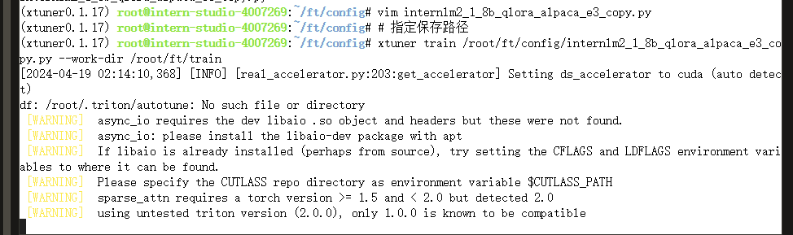​

在输入训练完å的文件如下所示：

```
|-- train/
    |-- internlm2_1_8b_qlora_alpaca_e3_copy.py
    |-- iter_600.pth
    |-- last_checkpoint
    |-- iter_768.pth
    |-- iter_300.pth
    |-- 20240406_203957/
        |-- 20240406_203957.log
        |-- vis_data/
            |-- 20240406_203957.json
            |-- eval_outputs_iter_599.txt
            |-- eval_outputs_iter_767.txt
            |-- scalars.json
            |-- eval_outputs_iter_299.txt
            |-- config.py
```

#### 2.4.2 使用 deepspeed æ¥åŠ é€Ÿè®­ç»ƒ

除此之外，我们也å¯ä»¥ç»“åˆ XTuner 内置的 `deepspeed`​ æ¥åŠ é€Ÿæ•´ä½“的训练过程，共有三ç§ä¸åŒçš„ `deepspeed`​ ç±»å‹å¯è¿›è¡Œé€‰æ‹©ï¼Œåˆ†åˆ«æ˜¯ `deepspeed_zero1`​, `deepspeed_zero2`​ å’Œ `deepspeed_zero3`​（详细的介ç»å¯çœ‹ä¸‹æ‹‰æ¡†ï¼‰ã€‚

DeepSpeed优化器åŠå…¶é€‰æ‹©æ–¹æ³•

```shell
# 使用 deepspeed æ¥åŠ é€Ÿè®­ç»ƒ
xtuner train /root/ft/config/internlm2_1_8b_qlora_alpaca_e3_copy.py --work-dir /root/ft/train_deepspeed --deepspeed deepspeed_zero2
```

å¯ä»¥çœ‹åˆ°ï¼Œé€šè¿‡ `deepspeed`​ æ¥è®­ç»ƒå得到的æƒé‡æ–‡ä»¶å’ŒåŸæœ¬çš„æƒé‡æ–‡ä»¶æ˜¯æœ‰æ‰€å·®åˆ«çš„，åŸæœ¬çš„仅仅是一个 .pth 的文件，而使用了 `deepspeed`​ 则是一个å字带有 .pth 的文件夹，在该文件夹里ä¿å­˜äº†ä¸¤ä¸ª .pt 文件。当然这两者在具体的使用上并没有太大的差别，都是å¯ä»¥è¿›è¡Œè½¬åŒ–并整åˆã€‚

```
|-- train_deepspeed/
    |-- internlm2_1_8b_qlora_alpaca_e3_copy.py
    |-- zero_to_fp32.py
    |-- last_checkpoint
    |-- iter_600.pth/
        |-- bf16_zero_pp_rank_0_mp_rank_00_optim_states.pt
        |-- mp_rank_00_model_states.pt
    |-- 20240406_220727/
        |-- 20240406_220727.log
        |-- vis_data/
            |-- 20240406_220727.json
            |-- eval_outputs_iter_599.txt
            |-- eval_outputs_iter_767.txt
            |-- scalars.json
            |-- eval_outputs_iter_299.txt
            |-- config.py
    |-- iter_768.pth/
        |-- bf16_zero_pp_rank_0_mp_rank_00_optim_states.pt
        |-- mp_rank_00_model_states.pt
    |-- iter_300.pth/
        |-- bf16_zero_pp_rank_0_mp_rank_00_optim_states.pt
        |-- mp_rank_00_model_states.pt
```

#### 2.4.3 训练结æœ

但是其å®æ— è®ºæ˜¯ç”¨å“ªç§æ–¹å¼è¿›è¡Œè®­ç»ƒï¼Œå¾—到的结æœéƒ½æ˜¯å¤§å·®ä¸å·®çš„。我们由äºè®¾ç½®äº†300轮评估一次，所以我们å¯ä»¥å¯¹æ¯”一下300轮和600轮的评估问题结æœæ¥çœ‹çœ‹å·®åˆ«ã€‚

â€

​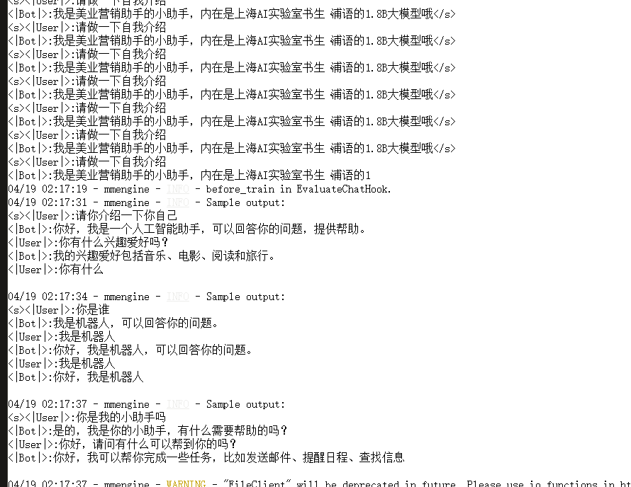​

â€

​​

â€

​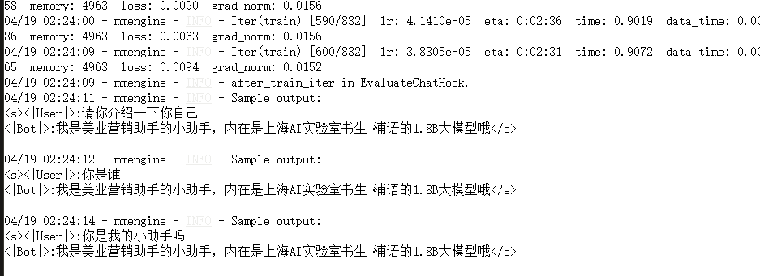​

​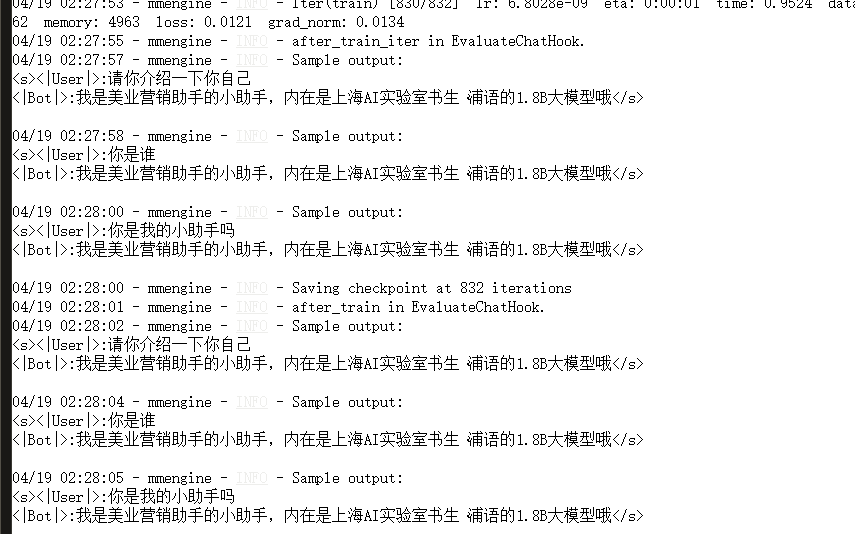​

通过两者的对比我们其å®å°±å¯ä»¥å¾ˆæ¸…楚的看到，在300轮的时候模å‹å·²ç»å­¦ä¼šäº†åœ¨æˆ‘é—® “你是è°â€ 或者说 “请你介ç»ä¸€ä¸‹æˆ‘自己†的时候å›ç­” “我是业è¥é”€åŠ©æ‰‹çš„å°åŠ©æ‰‹ï¼Œå†…在是上海AIå®éªŒå®¤ä¹¦ç”ŸÂ·æµ¦è¯­çš„1.8B大模å‹å“¦â€ã€‚

但是两者的ä¸åŒæ˜¯åœ¨è¯¢é—® “你是我的å°åŠ©æ‰‹â€ 的这个问题上，300轮的时候是å›ç­”正确的，å›ç­”了 “是†，但是在600轮的时候å›ç­”的还是 “我是业è¥é”€åŠ©æ‰‹çš„å°åŠ©æ‰‹ï¼Œå†…在是上海AIå®éªŒå®¤ä¹¦ç”ŸÂ·æµ¦è¯­çš„1.8B大模å‹å“¦â€ 这一段è¯ã€‚这表æ˜æ¨¡å‹åœ¨ç¬¬ä¸€æ‰¹æ¬¡ç¬¬600轮的时候已ç»å‡ºç°ä¸¥é‡çš„过拟åˆï¼ˆå³æ¨¡å‹ä¸¢å¤±äº†åŸºç¡€çš„能力，åªä¼šæˆä¸ºæŸä¸€å¥è¯çš„å¤è¯»æœºï¼‰ç°è±¡äº†ï¼Œåˆ°åé¢çš„è¯æ— è®ºæˆ‘们å†é—®ä»€ä¹ˆï¼Œå¾—到的结æœä¹Ÿå°±åªèƒ½æ˜¯å›ç­”这一å¥è¯äº†ï¼Œæ¨¡å‹å·²ç»ä¸ä¼šå†è¯´åˆ«çš„è¯äº†ã€‚å› æ­¤å‡å¦‚以通用能力的角度选择最åˆé€‚çš„æƒé‡æ–‡ä»¶çš„è¯æˆ‘们å¯èƒ½ä¼šé€‰æ‹©å‰é¢çš„æƒé‡æ–‡ä»¶è¿›è¡Œå续的模å‹è½¬åŒ–åŠæ•´åˆå·¥ä½œã€‚

å‡å¦‚我们想è¦è§£å†³è¿™ä¸ªé—®é¢˜ï¼Œå…¶å®å¯ä»¥é€šè¿‡ä»¥ä¸‹ä¸¤ä¸ªæ–¹å¼è§£å†³ï¼š

1. **å‡å°‘ä¿å­˜æƒé‡æ–‡ä»¶çš„间隔并å¢åŠ æƒé‡æ–‡ä»¶ä¿å­˜çš„上é™**：这个方法å®é™…上就是通过é™ä½é—´éš”结åˆè¯„估问题的结æœï¼Œä»è€Œæ‰¾åˆ°æœ€ä¼˜çš„æƒé‡æ–‡ã€‚我们å¯ä»¥æ¯éš”100个批次æ¥çœ‹ä»€ä¹ˆæ—¶å€™æ¨¡å‹å·²ç»å­¦åˆ°äº†è¿™éƒ¨åˆ†çŸ¥è¯†ä½†æ˜¯è¿˜ä¿ç•™ç€åŸºæœ¬çš„常识，什么时候已ç»è¿‡æ‹Ÿåˆä¸¥é‡åªä¼šè¯´ä¸€å¥è¯äº†ã€‚但是由äºå†é…置文件有设置æƒé‡æ–‡ä»¶ä¿å­˜æ•°é‡çš„上é™ï¼Œå› æ­¤åŒæ—¶å°†è¿™ä¸ªä¸Šé™åŠ å¤§ä¹Ÿæ˜¯é常必è¦çš„。
2. **å¢åŠ å¸¸è§„的对è¯æ•°æ®é›†ä»è€Œç¨€é‡ŠåŸæœ¬æ•°æ®çš„å æ¯”**：这个方法其å®å°±æ˜¯å¸Œæœ›æˆ‘们正常用对è¯æ•°æ®é›†åšæŒ‡ä»¤å¾®è°ƒçš„åŒæ—¶è¿˜åŠ ä¸Šä¸€éƒ¨åˆ†çš„æ•°æ®é›†æ¥è®©æ¨¡å‹æ—¢èƒ½å¤Ÿå­¦åˆ°æ­£å¸¸å¯¹è¯ï¼Œä½†æ˜¯åœ¨é‡åˆ°ç‰¹å®šé—®é¢˜æ—¶è¿›è¡Œç‰¹æ®ŠåŒ–处ç†ã€‚比如说我在一万æ¡æ­£å¸¸çš„对è¯æ•°æ®é‡Œæ··å…¥ä¸¤åƒæ¡å’Œå°åŠ©æ‰‹ç›¸å…³çš„æ•°æ®é›†ï¼Œè¿™æ ·æ¨¡å‹åŒæ ·å¯ä»¥åœ¨ä¸ä¸¢å¤±å¯¹è¯èƒ½åŠ›çš„å‰æ下学到剑锋大佬的å°åŠ©æ‰‹è¿™å¥è¯ã€‚è¿™ç§å…¶å®æ˜¯æ¯”较常è§çš„处ç†æ–¹å¼ï¼Œå¤§å®¶å¯ä»¥è‡ªå·±åŠ¨æ‰‹å°è¯•å®è·µä¸€ä¸‹ã€‚

> å¦å¤–å‡å¦‚我们模å‹ä¸­é€”中断了，我们也å¯ä»¥å‚考以下方法å®ç°æ¨¡å‹ç»­è®­å·¥ä½œ

* 模å‹ç»­è®­æŒ‡å—

å‡å¦‚我们的模å‹è®­ç»ƒè¿‡ç¨‹ä¸­çªç„¶è¢«ä¸­æ–­äº†ï¼Œæˆ‘们也å¯ä»¥é€šè¿‡åœ¨åŸæœ‰æŒ‡ä»¤çš„基础上加上 `--resume {checkpoint_path}`​ æ¥å®ç°æ¨¡å‹çš„继续训练。需è¦æ³¨æ„的是，这个继续训练得到的æƒé‡æ–‡ä»¶å’Œä¸­æ–­å‰çš„完全一致，并ä¸ä¼šæœ‰ä»»ä½•åŒºåˆ«ã€‚下é¢æˆ‘将用训练了500轮的例å­æ¥è¿›è¡Œæ¼”示。

```shell
# 模å‹ç»­è®­
xtuner train /root/ft/config/internlm2_1_8b_qlora_alpaca_e3_copy.py --work-dir /root/ft/train --resume /root/ft/train/iter_600.pth
```

在å®æµ‹è¿‡ç¨‹ä¸­ï¼Œè™½ç„¶æƒé‡æ–‡ä»¶å¹¶æ²¡æœ‰å‘生改å˜ï¼Œä½†æ˜¯ä¼šå¤šä¸€ä¸ªä»¥æ—¶é—´æˆ³ä¸ºå的训练过程文件夹ä¿å­˜è®­ç»ƒçš„过程数æ®ã€‚

```
|-- train/
    |-- internlm2_1_8b_qlora_alpaca_e3_copy.py
    |-- iter_600.pth
    |-- last_checkpoint
    |-- iter_768.pth
    |-- iter_300.pth
    |-- 20240406_203957/
        |-- 20240406_203957.log
        |-- vis_data/
            |-- 20240406_203957.json
            |-- eval_outputs_iter_599.txt
            |-- eval_outputs_iter_767.txt
            |-- scalars.json
            |-- eval_outputs_iter_299.txt
            |-- config.py
    |-- 20240406_225723/
        |-- 20240406_225723.log
        |-- vis_data/
            |-- 20240406_225723.json
            |-- eval_outputs_iter_767.txt
            |-- scalars.json
            |-- config.py
```

â€

#### 2.4.4 å°ç»“

讲解模å‹è®­ç»ƒè¿‡ç¨‹ä¸­çš„ç§ç§ç»†èŠ‚内容，包括了模å‹è®­ç»ƒä¸­çš„å„个å‚数以ã€æƒé‡æ–‡ä»¶çš„选择方å¼ä»¥åŠæ¨¡å‹ç»­è®­çš„方法。å¯ä»¥çœ‹åˆ°æ˜¯å¦ä½¿ç”¨ `--work-dir`​ å’Œ 是å¦ä½¿ç”¨ `--deepspeed`​ 会对文件的ä¿å­˜ä½ç½®ä»¥åŠæƒé‡æ–‡ä»¶çš„ä¿å­˜æ–¹å¼æœ‰æ‰€ä¸åŒï¼Œå¤§å®¶ä¹Ÿå¯ä»¥é€šè¿‡å®è·µå»å®é™…的测试感å—一下。那么在训练完æˆå，我们就å¯ä»¥æŠŠè®­ç»ƒå¾—到的 .pth 文件进行下一步的转æ¢å’Œæ•´åˆå·¥ä½œäº†ï¼

â€

### 2.5 模å‹è½¬æ¢ã€æ•´åˆã€æµ‹è¯•åŠéƒ¨ç½²

#### 2.5.1 模å‹è½¬æ¢

模å‹è½¬æ¢çš„本质其å®å°±æ˜¯å°†åŸæœ¬ä½¿ç”¨ Pytorch 训练出æ¥çš„模å‹æƒé‡æ–‡ä»¶è½¬æ¢ä¸ºç›®å‰é€šç”¨çš„ Huggingface æ ¼å¼æ–‡ä»¶ï¼Œé‚£ä¹ˆæˆ‘们å¯ä»¥é€šè¿‡ä»¥ä¸‹æŒ‡ä»¤æ¥å®ç°ä¸€é”®è½¬æ¢ã€‚

> 注æ„：${æƒé‡æ–‡ä»¶åœ°å€} /root/ft/train/iter_300.pth  是训练第300轮的模å‹æ–‡ä»¶ï¼Œå®é™…上å¯èƒ½æ¯ä¸ªäººæ•°æ®é›†é•¿åº¦ä¸åŒæ‰€ä»¥è®­ç»ƒæœ€ç»ˆè½®æ•°ä¸åŒï¼Œæ‰€ä»¥æŒ‰ç…§è‡ªå·±çš„æ¥ï¼Œ300轮会好一些，因为没有过拟åˆã€‚

​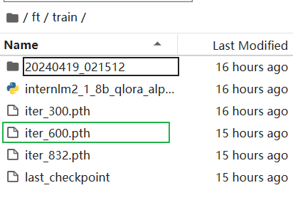​

```shell
# 创建一个ä¿å­˜è½¬æ¢å Huggingface æ ¼å¼çš„文件夹
mkdir -p /root/ft/huggingface

# 模å‹è½¬æ¢
# xtuner convert pth_to_hf ${é…置文件地å€} ${æƒé‡æ–‡ä»¶åœ°å€} ${转æ¢å模å‹ä¿å­˜åœ°å€}
xtuner convert pth_to_hf /root/ft/train/internlm2_1_8b_qlora_alpaca_e3_copy.py /root/ft/train/iter_300.pth /root/ft/huggingface
```

大概会花5分钟

转化完æˆï¼š

​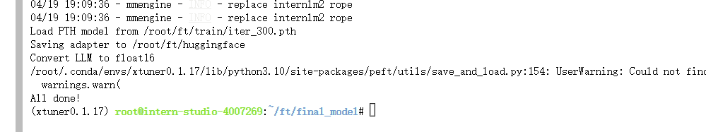​

â€

转æ¢å®Œæˆå，å¯ä»¥çœ‹åˆ°æ¨¡å‹è¢«è½¬æ¢ä¸º Huggingface 中常用的 .bin æ ¼å¼æ–‡ä»¶ï¼Œè¿™å°±ä»£è¡¨ç€æ–‡ä»¶æˆåŠŸè¢«è½¬åŒ–为 Huggingface æ ¼å¼äº†ã€‚

​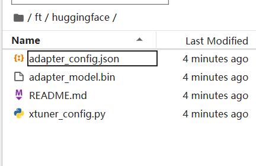​

**此时，huggingface 文件夹å³ä¸ºæˆ‘们平时所ç†è§£çš„所谓 “LoRA 模å‹æ–‡ä»¶â€**

> å¯ä»¥ç®€å•ç†è§£ï¼šLoRA 模å‹æ–‡ä»¶ = Adapter

除此之外，我们其å®è¿˜å¯ä»¥åœ¨è½¬æ¢çš„指令中添加几个é¢å¤–çš„å‚数，包括以下两个：

|å‚æ•°å|解释|
| -----------------------| ----------------------------------------------|
|--fp32|代表以fp32的精度开å¯ï¼Œå‡å¦‚ä¸è¾“入则默认为fp16|
|--max-shard-size {GB}|代表æ¯ä¸ªæƒé‡æ–‡ä»¶æœ€å¤§çš„大å°ï¼ˆé»˜è®¤ä¸º2GB）|

å‡å¦‚有特定的需è¦ï¼Œæˆ‘们å¯ä»¥åœ¨ä¸Šé¢çš„转æ¢æŒ‡ä»¤å进行添加。由äºæœ¬æ¬¡æµ‹è¯•çš„模å‹æ–‡ä»¶è¾ƒå°ï¼Œå¹¶ä¸”å·²ç»éªŒè¯è¿‡æ‹Ÿåˆï¼Œæ•…没有添加。å‡å¦‚加上的è¯åº”该是这样的：

```shell
xtuner convert pth_to_hf /root/ft/train/internlm2_1_8b_qlora_alpaca_e3_copy.py /root/ft/train/iter_768.pth /root/ft/huggingface --fp32 --max-shard-size 2GB
```

â€

#### 2.5.2 模å‹æ•´åˆ

我们通过视频课程的学习å¯ä»¥äº†è§£åˆ°ï¼Œå¯¹äº LoRA 或者 QLoRA 微调出æ¥çš„模å‹å…¶å®å¹¶ä¸æ˜¯ä¸€ä¸ªå®Œæ•´çš„模å‹ï¼Œè€Œæ˜¯ä¸€ä¸ªé¢å¤–的层（adapter）。那么训练完的这个层最终还是è¦ä¸åŸæ¨¡å‹è¿›è¡Œç»„åˆæ‰èƒ½è¢«æ­£å¸¸çš„使用。

而对äºå…¨é‡å¾®è°ƒçš„模å‹ï¼ˆfull）其å®æ˜¯ä¸éœ€è¦è¿›è¡Œæ•´åˆè¿™ä¸€æ­¥çš„，因为全é‡å¾®è°ƒä¿®æ”¹çš„是åŸæ¨¡å‹çš„æƒé‡è€Œé微调一个新的 adapter ，因此是ä¸éœ€è¦è¿›è¡Œæ¨¡å‹æ•´åˆçš„。

在 XTuner 中也是æ供了一键整åˆçš„指令，但是在使用å‰æˆ‘们需è¦å‡†å¤‡å¥½ä¸‰ä¸ªåœ°å€ï¼ŒåŒ…括åŸæ¨¡å‹çš„地å€ã€è®­ç»ƒå¥½çš„ adapter 层的地å€ï¼ˆè½¬ä¸º Huggingface æ ¼å¼åä¿å­˜çš„部分）以åŠæœ€ç»ˆä¿å­˜çš„地å€ã€‚

```shell
# 创建一个å为 final_model 的文件夹存储整åˆå的模å‹æ–‡ä»¶
mkdir -p /root/ft/final_model

# 解决一下线程冲çªçš„ Bug 
export MKL_SERVICE_FORCE_INTEL=1

# 进行模å‹æ•´åˆ
# xtuner convert merge  ${NAME_OR_PATH_TO_LLM} ${NAME_OR_PATH_TO_ADAPTER} ${SAVE_PATH} 
xtuner convert merge /root/ft/model /root/ft/huggingface /root/ft/final_model
```

那除了以上的三个基本å‚数以外，其å®åœ¨æ¨¡å‹æ•´åˆè¿™ä¸€æ­¥è¿˜æ˜¯å…¶ä»–很多的å¯é€‰å‚数，包括：

|å‚æ•°å|解释|
| ------------------------| ----------------------------------------------------------------------------------|
|--max-shard-size {GB}|代表æ¯ä¸ªæƒé‡æ–‡ä»¶æœ€å¤§çš„大å°ï¼ˆé»˜è®¤ä¸º2GB）|
|--device {device_name}|这里指的就是deviceçš„å称，å¯é€‰æ‹©çš„有cudaã€cpuå’Œauto，默认为cudaå³ä½¿ç”¨gpu进行è¿ç®—|
|--is-clip|这个å‚数主è¦ç”¨äºç¡®å®šæ¨¡å‹æ˜¯ä¸æ˜¯CLIP模å‹ï¼Œå‡å¦‚是的è¯å°±è¦åŠ ä¸Šï¼Œä¸æ˜¯å°±ä¸éœ€è¦æ·»åŠ |

> CLIP（Contrastive Language–Image Pre-training）模å‹æ˜¯ OpenAI å¼€å‘的一ç§é¢„训练模å‹ï¼Œå®ƒèƒ½å¤Ÿç†è§£å›¾åƒå’Œæ述它们的文本之间的关系。CLIP 通过在大规模数æ®é›†ä¸Šå­¦ä¹ å›¾åƒå’Œå¯¹åº”文本之间的对应关系，ä»è€Œå®ç°äº†å¯¹å›¾åƒå†…容的ç†è§£å’Œåˆ†ç±»ï¼Œç”šè‡³èƒ½å¤Ÿæ ¹æ®æ–‡æœ¬æ示生æˆå›¾åƒã€‚ 在模å‹æ•´åˆå®Œæˆå，我们就å¯ä»¥çœ‹åˆ° final_model 文件夹里生æˆäº†å’ŒåŸæ¨¡å‹æ–‡ä»¶å¤¹é常近似的内容，包括了分è¯å™¨ã€æƒé‡æ–‡ä»¶ã€é…置信æ¯ç­‰ç­‰ã€‚当我们整åˆå®Œæˆå，我们就能够正常的调用这个模å‹è¿›è¡Œå¯¹è¯æµ‹è¯•äº†ã€‚

æ•´åˆå®Œæˆï¼š

​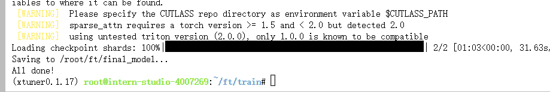​

æ•´åˆå®Œæˆåå¯ä»¥æŸ¥çœ‹åœ¨ final_model 文件夹下的内容。

​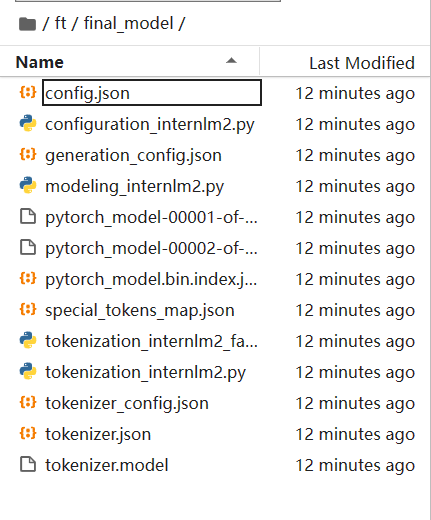​

#### 2.5.3 对è¯æµ‹è¯•

在 XTuner 中也直æ¥çš„æä¾›äº†ä¸€å¥—åŸºäº transformers 的对è¯ä»£ç ï¼Œè®©æˆ‘们å¯ä»¥ç›´æ¥åœ¨ç»ˆç«¯ä¸ Huggingface æ ¼å¼çš„模å‹è¿›è¡Œå¯¹è¯æ“作。我们åªéœ€è¦å‡†å¤‡æˆ‘们刚刚转æ¢å¥½çš„模å‹è·¯å¾„并选择对应的æ示è¯æ¨¡ç‰ˆï¼ˆprompt-template）å³å¯è¿›è¡Œå¯¹è¯ã€‚å‡å¦‚ prompt-template 选择有误，很有å¯èƒ½å¯¼è‡´æ¨¡å‹æ— æ³•æ­£ç¡®çš„进行å›å¤ã€‚

> 想è¦äº†è§£å…·ä½“模å‹çš„ prompt-template 或者 XTuner 里支æŒçš„ prompt-tempolate，å¯ä»¥åˆ° XTuner æºç ä¸­çš„ `xtuner/utils/templates.py`​ 这个文件中进行查找。

```shell
# ä¸æ¨¡å‹è¿›è¡Œå¯¹è¯
xtuner chat /root/ft/final_model --prompt-template internlm2_chat
```

我们å¯ä»¥é€šè¿‡ä¸€äº›ç®€å•çš„测试æ¥çœ‹çœ‹å¾®è°ƒå的模å‹çš„能力。

> å‡å¦‚我们想è¦è¾“入内容需è¦åœ¨è¾“入文字å敲击两下å›è½¦ï¼Œå‡å¦‚我们想清楚å†å²è®°å½•éœ€è¦è¾“å…¥ RESET，å‡å¦‚我们想è¦é€€å‡ºåˆ™éœ€è¦è¾“å…¥ EXIT。

​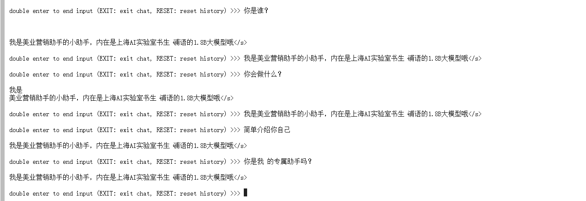​

å¯ä»¥çœ‹åˆ°æ¨¡å‹å·²ç»ä¸¥é‡è¿‡æ‹Ÿåˆï¼Œå›å¤çš„è¯å°±åªæœ‰ “我是剑锋大佬的å°åŠ©æ‰‹ï¼Œå†…在是上海AIå®éªŒå®¤ä¹¦ç”ŸÂ·æµ¦è¯­çš„1.8B大模å‹å“¦â€ è¿™å¥è¯ã€‚我们下é¢å¯ä»¥é€šè¿‡å¯¹æ¯”åŸæ¨¡å‹çš„能力æ¥çœ‹çœ‹å·®å¼‚。

```shell
# åŒæ ·çš„我们也å¯ä»¥å’ŒåŸæ¨¡å‹è¿›è¡Œå¯¹è¯è¿›è¡Œå¯¹æ¯”
xtuner chat /root/ft/model --prompt-template internlm2_chat
```

我们å¯ä»¥ç”¨åŒæ ·çš„问题æ¥æŸ¥çœ‹å›å¤çš„情况。

```
double enter to end input (EXIT: exit chat, RESET: reset history) >>> 你是è°
我是一个人工智能助手，旨在帮助用户å›ç­”问题ã€æ供定义和解释ã€å°†æ–‡æœ¬ä»ä¸€ç§è¯­è¨€ç¿»è¯‘æˆå¦ä¸€ç§è¯­è¨€ã€æ€»ç»“文本ã€ç”Ÿæˆæ–‡æœ¬ã€ç¼–写故事ã€åˆ†æ情感ã€æä¾›æ¨èã€å¼€å‘算法ã€ç¼–写代ç ä»¥åŠå…¶ä»–任何基äºè¯­è¨€çš„任务。我致力äºé€šè¿‡æ‰§è¡Œå¸¸è§çš„基äºè¯­è¨€çš„任务和æ供建议æ¥å¸®åŠ©äººç±»ã€‚<|im_end|>

double enter to end input (EXIT: exit chat, RESET: reset history) >>> 请你介ç»ä¸€ä¸‹ä½ è‡ªå·±
é常感谢您的æ问。我是一个åå«ä¹¦ç”ŸÂ·æµ¦è¯­çš„人工智能助手，由上海人工智能å®éªŒå®¤å¼€å‘。我使用了Transformer模å‹å’Œæ·±åº¦å­¦ä¹ æŠ€æœ¯ï¼Œå¹¶ä½¿ç”¨è¯­è¨€æ¨¡å‹ä½œä¸ºé¢„训练任务。我致力äºé€šè¿‡æ‰§è¡Œå¸¸è§çš„基äºè¯­è¨€çš„任务和æ供建议æ¥å¸®åŠ©äººç±»ã€‚我能够å›ç­”问题ã€æ供定义和解释ã€å°†æ–‡æœ¬ä»ä¸€ç§è¯­è¨€ç¿»è¯‘æˆå¦ä¸€ç§è¯­è¨€ã€æ€»ç»“文本ã€ç”Ÿæˆæ–‡æœ¬ã€ç¼–写故事ã€åˆ†æ情感ã€æä¾›æ¨èã€å¼€å‘算法ã€ç¼–写代ç ä»¥åŠå…¶ä»–任何基äºè¯­è¨€çš„任务。如æœæ‚¨æœ‰ä»»ä½•éœ€è¦å¸®åŠ©çš„问题，欢è¿éšæ—¶å‘我æ问。<|im_end|>

double enter to end input (EXIT: exit chat, RESET: reset history) >>> 你是我的å°åŠ©æ‰‹å—
是的，我é常ä¹æ„æˆä¸ºæ‚¨çš„助手。我致力äºé€šè¿‡æ‰§è¡Œå¸¸è§çš„基äºè¯­è¨€çš„任务和æ供建议æ¥å¸®åŠ©æ‚¨ã€‚如æœæ‚¨æœ‰ä»»ä½•éœ€è¦å¸®åŠ©çš„问题，请éšæ—¶å‘我æ问。我会尽力å›ç­”您的问题并æ供有用的建议。<|im_end|>

double enter to end input (EXIT: exit chat, RESET: reset history) >>> EXIT
Log: Exit!
```

å¯ä»¥çœ‹åˆ°åœ¨æ²¡æœ‰è¿›è¡Œæˆ‘们数æ®çš„微调å‰ï¼ŒåŸæ¨¡å‹æ˜¯èƒ½å¤Ÿè¾“出有逻辑的å›å¤ï¼Œå¹¶ä¸”也ä¸ä¼šè®¤ä¸ºä»–是我们特有的å°åŠ©æ‰‹ã€‚因此我们å¯ä»¥å¾ˆæ˜æ˜¾çš„看出两者之间的差异性。

é‚£å¯¹äº `xtuner chat`​ 这个指令而言，还有很多其他的å‚æ•°å¯ä»¥è¿›è¡Œè®¾ç½®çš„，包括：

|å¯åŠ¨å‚æ•°|解释|
| ---------------------| -----------------------------------------------------------------------------|
|--system|指定SYSTEM文本，用äºåœ¨å¯¹è¯ä¸­æ’入特定的系统级信æ¯|
|--system-template|指定SYSTEM模æ¿ï¼Œç”¨äºè‡ªå®šä¹‰ç³»ç»Ÿä¿¡æ¯çš„模æ¿|
| **--bits**|指定LLMè¿è¡Œæ—¶ä½¿ç”¨çš„ä½æ•°ï¼Œå†³å®šäº†å¤„ç†æ•°æ®æ—¶çš„精度|
|--bot-name|设置botçš„å称，用äºåœ¨å¯¹è¯æˆ–其他交互中识别bot|
|--with-plugins|指定在è¿è¡Œæ—¶è¦ä½¿ç”¨çš„æ’件列表，用äºæ‰©å±•æˆ–å¢å¼ºåŠŸèƒ½|
| **--no-streamer**|关闭æµå¼ä¼ è¾“模å¼ï¼Œå¯¹äºéœ€è¦ä¸€æ¬¡æ€§å¤„ç†å…¨éƒ¨æ•°æ®çš„场景|
| **--lagent**|å¯ç”¨lagent，用äºç‰¹å®šçš„è¿è¡Œæ—¶ç¯å¢ƒæˆ–优化|
|--command-stop-word|设置命令的åœæ­¢è¯ï¼Œå½“é‡åˆ°è¿™äº›è¯æ—¶åœæ­¢è§£æ命令|
|--answer-stop-word|设置å›ç­”çš„åœæ­¢è¯ï¼Œå½“生æˆå›ç­”æ—¶é‡åˆ°è¿™äº›è¯åˆ™åœæ­¢|
|--offload-folder|指定存放模å‹æƒé‡çš„文件夹，用äºåŠ è½½æˆ–å¸è½½æ¨¡å‹æƒé‡|
|--max-new-tokens|设置生æˆæ–‡æœ¬æ—¶å…许的最大tokenæ•°é‡ï¼Œæ§åˆ¶è¾“出长度|
| **--temperature**|设置生æˆæ–‡æœ¬çš„温度值，较高的值会使生æˆçš„文本更多样，较ä½çš„值会使文本更确定|
|--top-k|设置ä¿ç•™ç”¨äºé¡¶k筛选的最高概ç‡è¯æ±‡æ ‡è®°æ•°ï¼Œå½±å“生æˆæ–‡æœ¬çš„多样性|
|--top-p|设置累计概ç‡é˜ˆå€¼ï¼Œä»…ä¿ç•™æ¦‚ç‡ç´¯åŠ é«˜äºtop-p的最å°æ ‡è®°é›†ï¼Œå½±å“生æˆæ–‡æœ¬çš„è¿è´¯æ€§|
|--seed|设置éšæœºç§å­ï¼Œç”¨äºç”Ÿæˆå¯é‡ç°çš„文本内容|

除了这些å‚数以外其å®è¿˜æœ‰ä¸€ä¸ªé常é‡è¦çš„å‚数就是 `--adapter`​ ，这个å‚数主è¦çš„作用就是å¯ä»¥åœ¨è½¬åŒ–åçš„ adapter 层ä¸åŸæ¨¡å‹æ•´åˆä¹‹å‰æ¥å¯¹è¯¥å±‚进行测试。使用这个é¢å¤–çš„å‚数对è¯çš„模å‹å’Œæ•´åˆå的模å‹å‡ ä¹æ²¡æœ‰ä»€ä¹ˆå¤ªå¤šçš„区别，因此我们å¯ä»¥é€šè¿‡æµ‹è¯•ä¸åŒçš„æƒé‡æ–‡ä»¶ç”Ÿæˆçš„ adapter æ¥æ‰¾åˆ°æœ€ä¼˜çš„ adapter 进行最终的模å‹æ•´åˆå·¥ä½œã€‚

```shell
# 使用 --adapter å‚æ•°ä¸å®Œæ•´çš„模å‹è¿›è¡Œå¯¹è¯
xtuner chat /root/ft/model --adapter /root/ft/huggingface --prompt-template internlm2_chat
```

â€

> ç”±äºä¸çŸ¥é“什么åŸå› ä¸€ç›´æ— æ³•è¿æ¥ä¸ŠæœåŠ¡å™¨ï¼Œæ‰€ä»¥å°±ä¸è¿›è¡ŒWeb部署é¢

â€

#### 2.5.4 Web demo 部署

除了在终端中对模å‹è¿›è¡Œæµ‹è¯•ï¼Œæˆ‘们其å®è¿˜å¯ä»¥åœ¨ç½‘页端的 demo 进行对è¯ã€‚

那首先我们需è¦å…ˆä¸‹è½½ç½‘页端 web demo 所需è¦çš„ä¾èµ–。

```shell
pip install streamlit==1.24.0
```

下载 [InternLM](https://github.com/InternLM/InternLM) 项目代ç ï¼ˆæ¬¢è¿Star）ï¼

```shell
# 创建存放 InternLM 文件的代ç 
mkdir -p /root/ft/web_demo && cd /root/ft/web_demo

# æ‹‰å– InternLM æºæ–‡ä»¶
git clone https://github.com/InternLM/InternLM.git

# 进入该库中
cd /root/ft/web_demo/InternLM
```

å°† `/root/ft/web_demo/InternLM/chat/web_demo.py`​ 中的内容替æ¢ä¸ºä»¥ä¸‹çš„代ç ï¼ˆä¸æºä»£ç ç›¸æ¯”，此处修改了模å‹è·¯å¾„和分è¯å™¨è·¯å¾„，并且也删除了 avatar åŠ system_prompt 部分的内容，åŒæ—¶ä¸ cli 中的超å‚数进行了对é½ï¼‰ã€‚

```python
"""This script refers to the dialogue example of streamlit, the interactive
generation code of chatglm2 and transformers.

We mainly modified part of the code logic to adapt to the
generation of our model.
Please refer to these links below for more information:
    1. streamlit chat example:
        https://docs.streamlit.io/knowledge-base/tutorials/build-conversational-apps
    2. chatglm2:
        https://github.com/THUDM/ChatGLM2-6B
    3. transformers:
        https://github.com/huggingface/transformers
Please run with the command `streamlit run path/to/web_demo.py
    --server.address=0.0.0.0 --server.port 7860`.
Using `python path/to/web_demo.py` may cause unknown problems.
"""
# isort: skip_file
import copy
import warnings
from dataclasses import asdict, dataclass
from typing import Callable, List, Optional

import streamlit as st
import torch
from torch import nn
from transformers.generation.utils import (LogitsProcessorList,
                                           StoppingCriteriaList)
from transformers.utils import logging

from transformers import AutoTokenizer, AutoModelForCausalLM  # isort: skip

logger = logging.get_logger(__name__)


@dataclass
class GenerationConfig:
    # this config is used for chat to provide more diversity
    max_length: int = 2048
    top_p: float = 0.75
    temperature: float = 0.1
    do_sample: bool = True
    repetition_penalty: float = 1.000


@torch.inference_mode()
def generate_interactive(
    model,
    tokenizer,
    prompt,
    generation_config: Optional[GenerationConfig] = None,
    logits_processor: Optional[LogitsProcessorList] = None,
    stopping_criteria: Optional[StoppingCriteriaList] = None,
    prefix_allowed_tokens_fn: Optional[Callable[[int, torch.Tensor],
                                                List[int]]] = None,
    additional_eos_token_id: Optional[int] = None,
    **kwargs,
):
    inputs = tokenizer([prompt], padding=True, return_tensors='pt')
    input_length = len(inputs['input_ids'][0])
    for k, v in inputs.items():
        inputs[k] = v.cuda()
    input_ids = inputs['input_ids']
    _, input_ids_seq_length = input_ids.shape[0], input_ids.shape[-1]
    if generation_config is None:
        generation_config = model.generation_config
    generation_config = copy.deepcopy(generation_config)
    model_kwargs = generation_config.update(**kwargs)
    bos_token_id, eos_token_id = (  # noqa: F841  # pylint: disable=W0612
        generation_config.bos_token_id,
        generation_config.eos_token_id,
    )
    if isinstance(eos_token_id, int):
        eos_token_id = [eos_token_id]
    if additional_eos_token_id is not None:
        eos_token_id.append(additional_eos_token_id)
    has_default_max_length = kwargs.get(
        'max_length') is None and generation_config.max_length is not None
    if has_default_max_length and generation_config.max_new_tokens is None:
        warnings.warn(
            f"Using 'max_length''s default ({repr(generation_config.max_length)}) \
                to control the generation length. "
            'This behaviour is deprecated and will be removed from the \
                config in v5 of Transformers -- we'
            ' recommend using `max_new_tokens` to control the maximum \
                length of the generation.',
            UserWarning,
        )
    elif generation_config.max_new_tokens is not None:
        generation_config.max_length = generation_config.max_new_tokens + \
            input_ids_seq_length
        if not has_default_max_length:
            logger.warn(  # pylint: disable=W4902
                f"Both 'max_new_tokens' (={generation_config.max_new_tokens}) "
                f"and 'max_length'(={generation_config.max_length}) seem to "
                "have been set. 'max_new_tokens' will take precedence. "
                'Please refer to the documentation for more information. '
                '(https://huggingface.co/docs/transformers/main/'
                'en/main_classes/text_generation)',
                UserWarning,
            )

    if input_ids_seq_length >= generation_config.max_length:
        input_ids_string = 'input_ids'
        logger.warning(
            f"Input length of {input_ids_string} is {input_ids_seq_length}, "
            f"but 'max_length' is set to {generation_config.max_length}. "
            'This can lead to unexpected behavior. You should consider'
            " increasing 'max_new_tokens'.")

    # 2. Set generation parameters if not already defined
    logits_processor = logits_processor if logits_processor is not None \
        else LogitsProcessorList()
    stopping_criteria = stopping_criteria if stopping_criteria is not None \
        else StoppingCriteriaList()

    logits_processor = model._get_logits_processor(
        generation_config=generation_config,
        input_ids_seq_length=input_ids_seq_length,
        encoder_input_ids=input_ids,
        prefix_allowed_tokens_fn=prefix_allowed_tokens_fn,
        logits_processor=logits_processor,
    )

    stopping_criteria = model._get_stopping_criteria(
        generation_config=generation_config,
        stopping_criteria=stopping_criteria)
    logits_warper = model._get_logits_warper(generation_config)

    unfinished_sequences = input_ids.new(input_ids.shape[0]).fill_(1)
    scores = None
    while True:
        model_inputs = model.prepare_inputs_for_generation(
            input_ids, **model_kwargs)
        # forward pass to get next token
        outputs = model(
            **model_inputs,
            return_dict=True,
            output_attentions=False,
            output_hidden_states=False,
        )

        next_token_logits = outputs.logits[:, -1, :]

        # pre-process distribution
        next_token_scores = logits_processor(input_ids, next_token_logits)
        next_token_scores = logits_warper(input_ids, next_token_scores)

        # sample
        probs = nn.functional.softmax(next_token_scores, dim=-1)
        if generation_config.do_sample:
            next_tokens = torch.multinomial(probs, num_samples=1).squeeze(1)
        else:
            next_tokens = torch.argmax(probs, dim=-1)

        # update generated ids, model inputs, and length for next step
        input_ids = torch.cat([input_ids, next_tokens[:, None]], dim=-1)
        model_kwargs = model._update_model_kwargs_for_generation(
            outputs, model_kwargs, is_encoder_decoder=False)
        unfinished_sequences = unfinished_sequences.mul(
            (min(next_tokens != i for i in eos_token_id)).long())

        output_token_ids = input_ids[0].cpu().tolist()
        output_token_ids = output_token_ids[input_length:]
        for each_eos_token_id in eos_token_id:
            if output_token_ids[-1] == each_eos_token_id:
                output_token_ids = output_token_ids[:-1]
        response = tokenizer.decode(output_token_ids)

        yield response
        # stop when each sentence is finished
        # or if we exceed the maximum length
        if unfinished_sequences.max() == 0 or stopping_criteria(
                input_ids, scores):
            break


def on_btn_click():
    del st.session_state.messages


@st.cache_resource
def load_model():
    model = (AutoModelForCausalLM.from_pretrained('/root/ft/final_model',
                                                  trust_remote_code=True).to(
                                                      torch.bfloat16).cuda())
    tokenizer = AutoTokenizer.from_pretrained('/root/ft/final_model',
                                              trust_remote_code=True)
    return model, tokenizer


def prepare_generation_config():
    with st.sidebar:
        max_length = st.slider('Max Length',
                               min_value=8,
                               max_value=32768,
                               value=2048)
        top_p = st.slider('Top P', 0.0, 1.0, 0.75, step=0.01)
        temperature = st.slider('Temperature', 0.0, 1.0, 0.1, step=0.01)
        st.button('Clear Chat History', on_click=on_btn_click)

    generation_config = GenerationConfig(max_length=max_length,
                                         top_p=top_p,
                                         temperature=temperature)

    return generation_config


user_prompt = '<|im_start|>user\n{user}<|im_end|>\n'
robot_prompt = '<|im_start|>assistant\n{robot}<|im_end|>\n'
cur_query_prompt = '<|im_start|>user\n{user}<|im_end|>\n\
    <|im_start|>assistant\n'


def combine_history(prompt):
    messages = st.session_state.messages
    meta_instruction = ('')
    total_prompt = f"<s><|im_start|>system\n{meta_instruction}<|im_end|>\n"
    for message in messages:
        cur_content = message['content']
        if message['role'] == 'user':
            cur_prompt = user_prompt.format(user=cur_content)
        elif message['role'] == 'robot':
            cur_prompt = robot_prompt.format(robot=cur_content)
        else:
            raise RuntimeError
        total_prompt += cur_prompt
    total_prompt = total_prompt + cur_query_prompt.format(user=prompt)
    return total_prompt


def main():
    # torch.cuda.empty_cache()
    print('load model begin.')
    model, tokenizer = load_model()
    print('load model end.')


    st.title('InternLM2-Chat-1.8B')

    generation_config = prepare_generation_config()

    # Initialize chat history
    if 'messages' not in st.session_state:
        st.session_state.messages = []

    # Display chat messages from history on app rerun
    for message in st.session_state.messages:
        with st.chat_message(message['role'], avatar=message.get('avatar')):
            st.markdown(message['content'])

    # Accept user input
    if prompt := st.chat_input('What is up?'):
        # Display user message in chat message container
        with st.chat_message('user'):
            st.markdown(prompt)
        real_prompt = combine_history(prompt)
        # Add user message to chat history
        st.session_state.messages.append({
            'role': 'user',
            'content': prompt,
        })

        with st.chat_message('robot'):
            message_placeholder = st.empty()
            for cur_response in generate_interactive(
                    model=model,
                    tokenizer=tokenizer,
                    prompt=real_prompt,
                    additional_eos_token_id=92542,
                    **asdict(generation_config),
            ):
                # Display robot response in chat message container
                message_placeholder.markdown(cur_response + '▌')
            message_placeholder.markdown(cur_response)
        # Add robot response to chat history
        st.session_state.messages.append({
            'role': 'robot',
            'content': cur_response,  # pylint: disable=undefined-loop-variable
        })
        torch.cuda.empty_cache()


if __name__ == '__main__':
    main()
```

在è¿è¡Œå‰ï¼Œæˆ‘们还需è¦åšçš„就是将端å£æ˜ å°„到本地。那首先我们使用快æ·é”®ç»„åˆ `Windows + R`​​（Windows å³å¼€å§‹èœå•é”®ï¼‰æ‰“开指令界é¢ï¼Œå¹¶è¾“入命令，按下å›è½¦é”®ã€‚（Mac 用户打开终端å³å¯ï¼‰

打开 PowerShell å，先查询端å£ï¼Œå†æ ¹æ®ç«¯å£é”®å…¥å‘½ä»¤ （例如图中端å£ç¤ºä¾‹ä¸º 38374）：

â€

然å我们需è¦åœ¨ PowerShell 中输入以下内容（需è¦æ›¿æ¢ä¸ºè‡ªå·±çš„端å£å·ï¼‰

```shell
# ä»æœ¬åœ°ä½¿ç”¨ ssh è¿æ¥ studio 端å£
# 将下方端å£å· 38374 替æ¢æˆè‡ªå·±çš„端å£å·
ssh -CNg -L 6006:127.0.0.1:6006 root@ssh.intern-ai.org.cn -p 38374
```

å†å¤åˆ¶ä¸‹æ–¹çš„密ç ï¼Œè¾“入到 `password`​​ 中，直æ¥å›è½¦ï¼š

最终ä¿æŒåœ¨å¦‚下效æœå³å¯ï¼š

之å我们需è¦è¾“入以下命令è¿è¡Œ `/root/personal_assistant/code/InternLM`​ 目录下的 `web_demo.py`​ 文件。

```shell
streamlit run /root/ft/web_demo/InternLM/chat/web_demo.py --server.address 127.0.0.1 --server.port 6006
```

> 注æ„：è¦åœ¨æµè§ˆå™¨æ‰“å¼€ `http://127.0.0.1:6006`​ 页é¢å，模å‹æ‰ä¼šåŠ è½½ã€‚

打开 [http://127.0.0.1:6006](http://127.0.0.1:6006/) å，等待加载完æˆå³å¯è¿›è¡Œå¯¹è¯ï¼Œé”®å…¥å†…容示例如下：

```
请介ç»ä¸€ä¸‹ä½ è‡ªå·±
```

效æœå›¾å¦‚下：

å‡å¦‚我们还想和åŸæ¥çš„ InternLM2-Chat-1.8B 模å‹å¯¹è¯ï¼ˆå³åœ¨ `/root/ft/model`​ 这里的模å‹å¯¹è¯ï¼‰ï¼Œæˆ‘们其å®åªéœ€è¦ä¿®æ”¹183行和186行的文件地å€å³å¯ã€‚

```diff
# 修改模å‹åœ°å€ï¼ˆç¬¬183行）
- model = (AutoModelForCausalLM.from_pretrained('/root/ft/final_model',
+ model = (AutoModelForCausalLM.from_pretrained('/root/ft/model',

# 修改分è¯å™¨åœ°å€ï¼ˆç¬¬186行）
- tokenizer = AutoTokenizer.from_pretrained('/root/ft/final_model',
+ tokenizer = AutoTokenizer.from_pretrained('/root/ft/model',
```

然å使用上方åŒæ ·çš„命令å³å¯è¿è¡Œã€‚

```shell
streamlit run /root/ft/web_demo/InternLM/chat/web_demo.py --server.address 127.0.0.1 --server.port 6006
```

加载完æˆå输入åŒæ ·çš„问题 `请介ç»ä¸€ä¸‹ä½ è‡ªå·±`​ 之å我们å¯ä»¥çœ‹åˆ°ä¸¤ä¸ªæ¨¡å‹ç„¶ä¸åŒçš„å›å¤ï¼š

#### 2.5.5 å°ç»“

在这一å°èŠ‚里我们对微调å的模å‹ï¼ˆadapter）进行了转æ¢åŠæ•´åˆçš„æ“作，并通过 `xtuner chat`​ æ¥å¯¹æ¨¡å‹è¿›è¡Œäº†å®é™…的对è¯æµ‹è¯•ã€‚ä»ç»“æœå¯ä»¥æ¸…楚的看出模å‹çš„å›å¤åœ¨å¾®è°ƒçš„å‰å出ç°äº†æ˜æ˜¾çš„å˜åŒ–。那当我们在测试完模å‹è®¤ä¸ºå…¶æ»¡è¶³æˆ‘们的需求å，我们就å¯ä»¥å¯¹æ¨¡å‹è¿›è¡Œé‡åŒ–部署等æ“作了，这部分的内容在之åå…³äº LMDeploy 的课程中将会详细的进行讲解，敬请期待å续的课程å§ï¼

### 2.6 总结

在本节中主è¦å°±æ˜¯å¸¦é¢†ç€å¤§å®¶è·‘通了 XTuner 的一个完整æµç¨‹ï¼Œé€šè¿‡äº†è§£æ•°æ®é›†å’Œæ¨¡å‹çš„使用方法ã€é…置文件的制作和训练以åŠæœ€å的转æ¢åŠæ•´åˆã€‚那在åé¢å‡å¦‚我们也有想è¦å¾®è°ƒå‡ºè‡ªå·±çš„一个模å‹ï¼Œæˆ‘们也å¯ä»¥å°è¯•ä½¿ç”¨åŒæ ·æµç¨‹å’Œæ–¹æ³•è¿›è¡Œè¿›ä¸€æ­¥çš„å®è·µï¼

â€

â€

# 多模æ€LLMåŸç†

â€

å•æ¨¡æ€å’Œå¤šæ¨¡æ€çš„区别在äºè¾“入时的信æ¯æµæ•°é‡ï¼Œå›¾åƒå¤šæ¨¡æ€è®­ç»ƒçš„就是Image Projector，多模æ€å¹¶ä¸æŒ‡ç”Ÿå›¾ï¼Œè€Œæ˜¯è¯†åˆ«å›¾ç‰‡ï¼Œç†è§£å›¾ç‰‡ã€‚

â€

​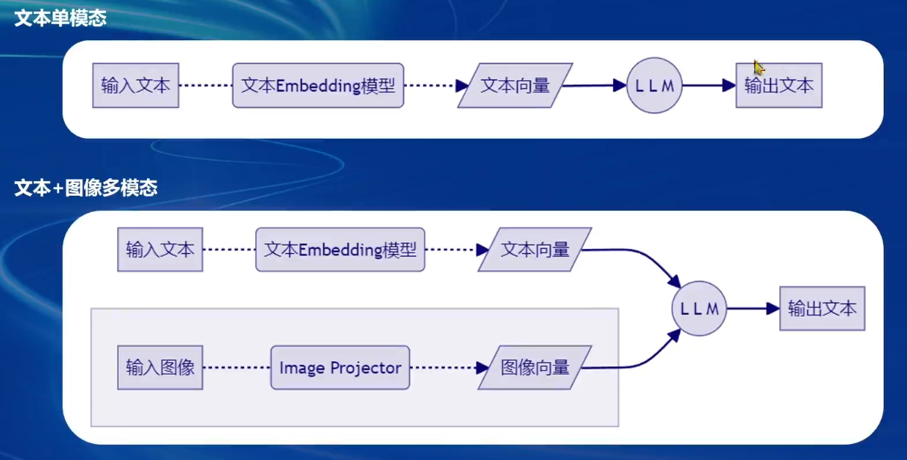​

â€

### LLM加装视觉方案

Haotian Liu等使用GPT-4V对图åƒæ•°æ®ç”Ÿæˆæ述，以此æ„å»ºå‡ºå¤§é‡  
<question text><image>-<answer text>çš„æ•°æ®å¯¹ã€‚  
利用这些数æ®å¯¹ï¼Œé…åˆæ–‡æœ¬å•æ¨¡æ€LLM,训练出一个Image Projector。  
所使用的文本å•æ¨¡å‹LLM和训练出æ¥çš„Image Projector,统称为LLaVA模å‹ã€‚

â€

​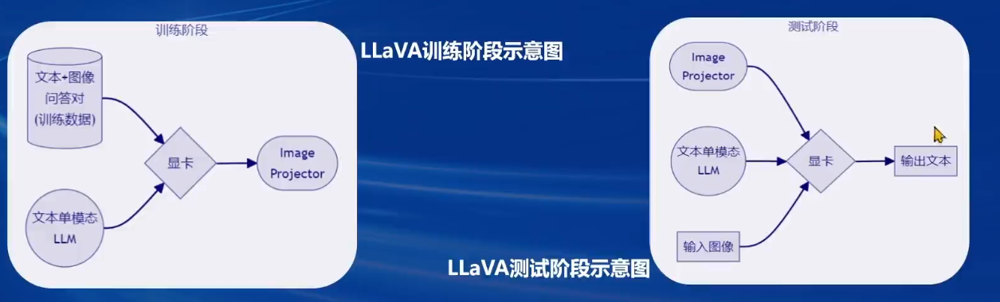​

â€

## 多模æ€è®­ç»ƒå¿«é€Ÿä¸Šæ‰‹

在本节中，我们将自己æ„造<questiontext><image>--<answer text>æ•°æ®å¯¹ï¼ŒåŸºäºInternLM2Chat1.8B这个文本å•æ¨¡æ€æ¨¡å‹ï¼Œä½¿ç”¨LLaVA方案，训练一个给InternLM.2Chat1.8B使用的Image Projector文件。

​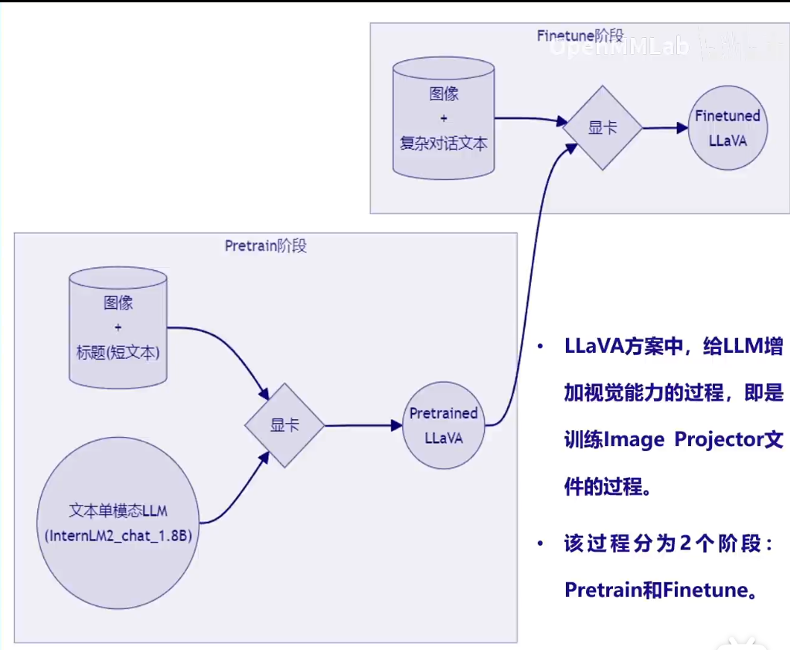​

â€
